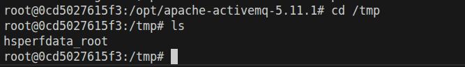
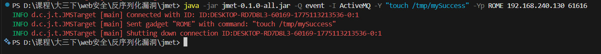
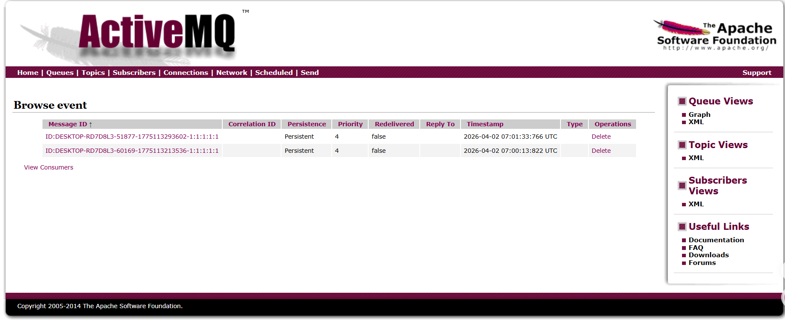
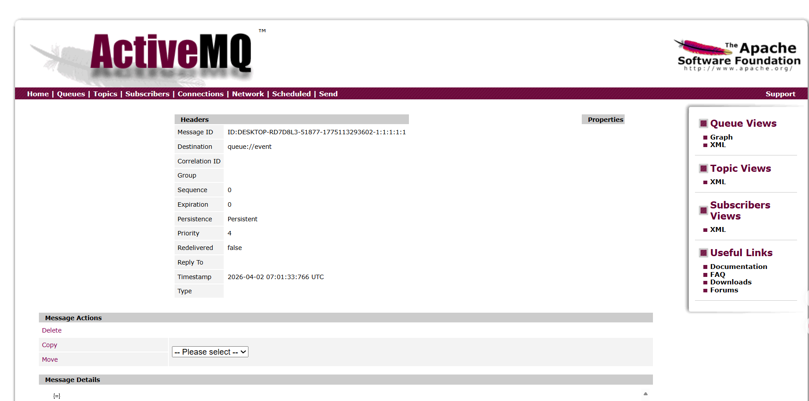
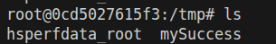

# 一、漏洞原理
在调用`ObjectInputStream.readObject()`前没有对序列化数据进行类检查，只要目标 JVM classpath 上存在某些危险 gadget 类，`readObject()` 重建对象图时就可能触发链式执行。

在`activemq-client\src\main\java\org\apache\activemq\command\ActiveMQObjectMessage.java`中，`getObject()`函数中在调用`ObjectInputStream.readObject()`前没有对序列化数据进行类检查。

```java
    public Serializable getObject() throws JMSException {
        if (object == null && getContent() != null) {
            try {
                ByteSequence content = getContent();
                InputStream is = new ByteArrayInputStream(content);
                if (isCompressed()) {
                    is = new InflaterInputStream(is);
                }
                DataInputStream dataIn = new DataInputStream(is);
                ClassLoadingAwareObjectInputStream objIn = new ClassLoadingAwareObjectInputStream(dataIn);
                try {
                    object = (Serializable)objIn.readObject();
                } catch (ClassNotFoundException ce) {
                    throw JMSExceptionSupport.create("Failed to build body from content. Serializable class not available to broker. Reason: " + ce, ce);
                } finally {
                    dataIn.close();
                }
            } catch (IOException e) {
                throw JMSExceptionSupport.create("Failed to build body from bytes. Reason: " + e, e);
            }
        }
        return this.object;
    }
```

在`ClassLoadingAwareObjectInputStream`类中解析类的时候，没有对类检查：

```java
    protected Class<?> resolveClass(ObjectStreamClass classDesc) throws IOException, ClassNotFoundException {
        ClassLoader cl = Thread.currentThread().getContextClassLoader();
        return load(classDesc.getName(), cl, inLoader);
    }
```

这样就导致了序列化数据对于攻击者来说是可控的，就可以针对某些公共库利用JVM的反射机制来构造payload，从而实现RCE。

详见[Java反序列化漏洞原理解析](https://xz.aliyun.com/news/6391)

检索何处调用了`ObjectMessage.getObject()`，发现这里调用了：

```java
    protected void writeMessageResponse(PrintWriter writer, Message message, String id, String destinationName) throws JMSException, IOException {
        writer.print("<response id='");
        writer.print(id);
        writer.print("'");
        if (destinationName != null) {
            writer.print(" destination='" + destinationName + "' ");
        }
        writer.print(">");
        if (message instanceof TextMessage) {
            TextMessage textMsg = (TextMessage)message;
            String txt = textMsg.getText();
            if (txt != null) {
                if (txt.startsWith("<?")) {
                    txt = txt.substring(txt.indexOf("?>") + 2);
                }
                writer.print(txt);
            }
        } else if (message instanceof ObjectMessage) {
            ObjectMessage objectMsg = (ObjectMessage)message;
            Object object = objectMsg.getObject();
            if (object != null) {
                writer.print(object.toString());
            }
        }
        writer.println("</response>");
    }
```

所以当访问web管理页面，读取消息时，会触发payload的执行。

# 二、漏洞复现

1. 先查看靶机中不存在mySuccess:



2. 使用jmet工具进行攻击，jmet原理是使用ysoserial生成Payload并发送（其jar内自带ysoserial，无需再自己下载），所以我们需要在ysoserial是gadget中选择一个可以使用的，比如ROME。



3. 打开Web界面，读取消息，触发payload:





4. 验证payload执行：



# 三、总结

1. 学习了反序列化漏洞的一般原理
2. 了解了一些反序列化漏洞利用的工具

2026/4/2-15:04