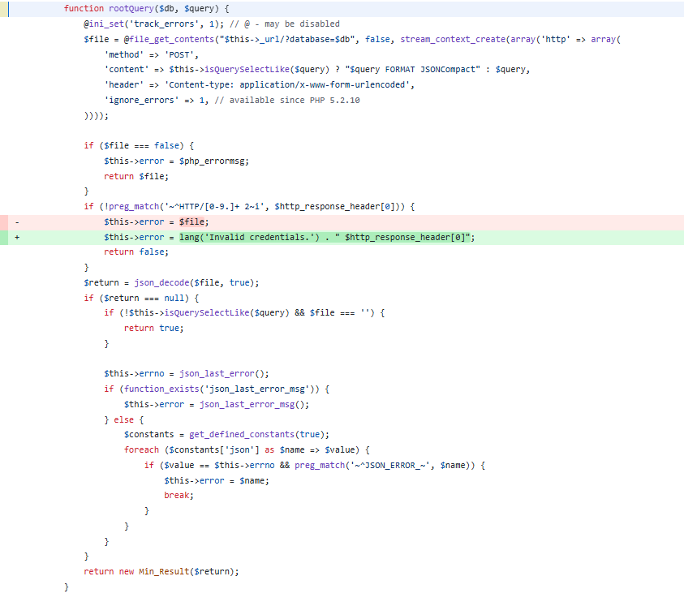
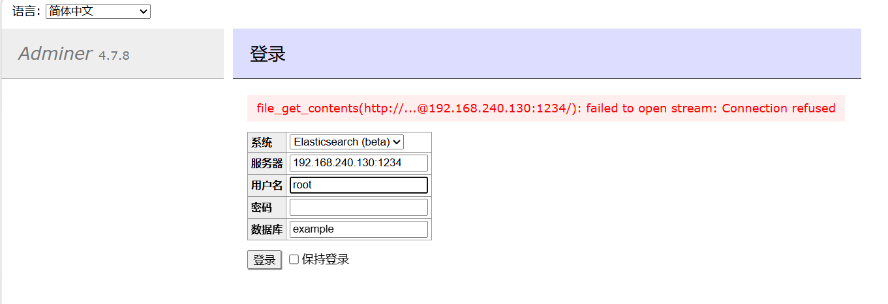
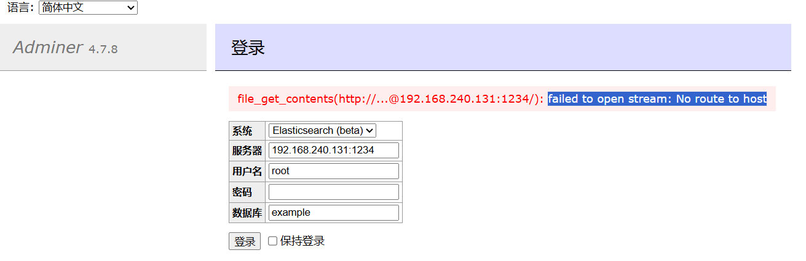
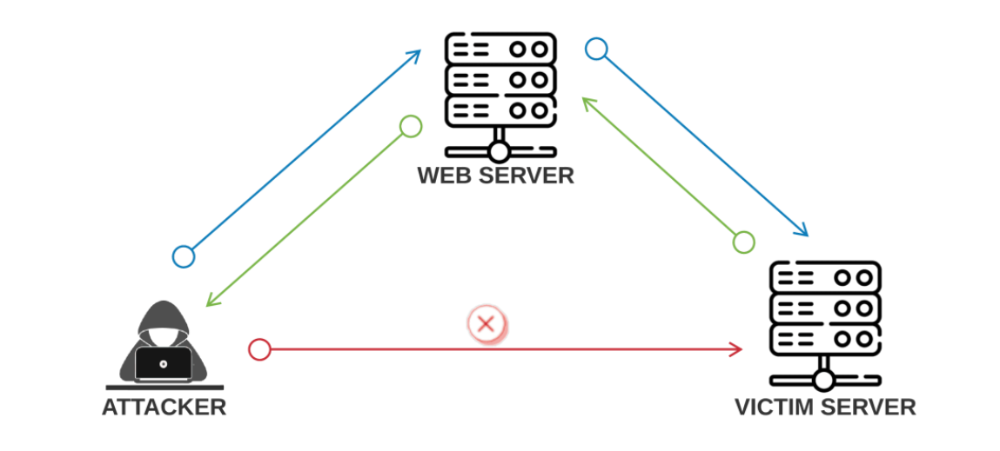

# 一、漏洞分析
漏洞产生的原因是file_get_contents 的参数 $this->_url 是可控的，且$this->error = $file这一行将盲SSRF变为了有回显的SSRF，从而使攻击者可以通过此来搜集内网信息。
**在PHP中file_get_contents函数是极其容易出现漏洞的。**
```
		function rootQuery($db, $query) {
			@ini_set('track_errors', 1); // @ - may be disabled
			$file = @file_get_contents("$this->_url/?database=$db", false, stream_context_create(array('http' => array(
				'method' => 'POST',
				'content' => $this->isQuerySelectLike($query) ? "$query FORMAT JSONCompact" : $query,
				'header' => 'Content-type: application/x-www-form-urlencoded',
				'ignore_errors' => 1, // available since PHP 5.2.10
			))));

			if ($file === false) {
				$this->error = $php_errormsg;
				return $file;
			}
			if (!preg_match('~^HTTP/[0-9.]+ 2~i', $http_response_header[0])) {
				$this->error = $file;
				$this->error = lang('Invalid credentials.') . " //官方修改$http_response_header[0]";
				return false;
			}
			$return = json_decode($file, true);
			if ($return === null) {
				if (!$this->isQuerySelectLike($query) && $file === '') {
					return true;
				}

				$this->errno = json_last_error();
				if (function_exists('json_last_error_msg')) {
					$this->error = json_last_error_msg();
				} else {
					$constants = get_defined_constants(true);
					foreach ($constants['json'] as $name => $value) {
						if ($value == $this->errno && preg_match('~^JSON_ERROR_~', $name)) {
							$this->error = $name;
							break;
						}
					}
				}
			}
			return new Min_Result($return);
		}
```



官方修改是当返回码不是200时，不打印出返回的信息，防止泄露内网信息。
# 二、漏洞复现
对于内网中存在的主机，返回failed to open stream: Connection refused：



对于内网中不存在的主机，返回failed to open stream: No route to host：



对于其他特定的URL，如果返回值中包含敏感信息，危害会更大。
# 三、总结
1. 学习了SSRF漏洞的原理，即：
一般情况下，SSRF攻击的目的是访问外网无法访问的内网系统。利用存在缺陷的Web应用（服务器，记作A）作为代理，攻击与A在同一内网中的服务器。



2. 在PHP中容易出现SSRF漏洞的函数：
    * file_get_contents()
    * sockopen()
    * curl_exec()

2026/3/19/10:00