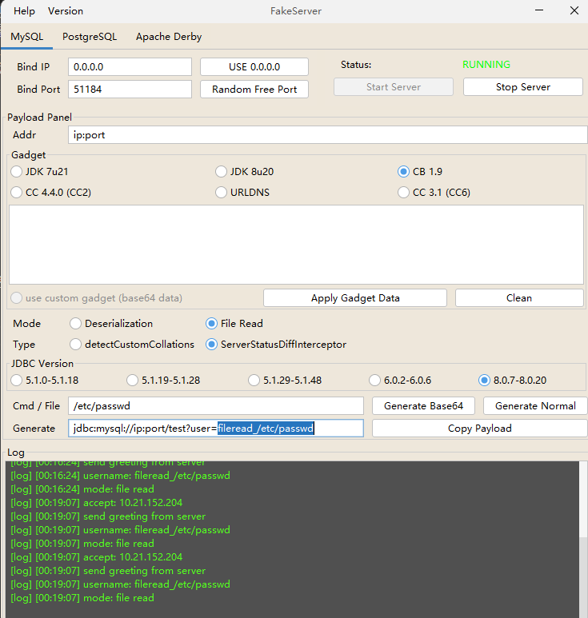
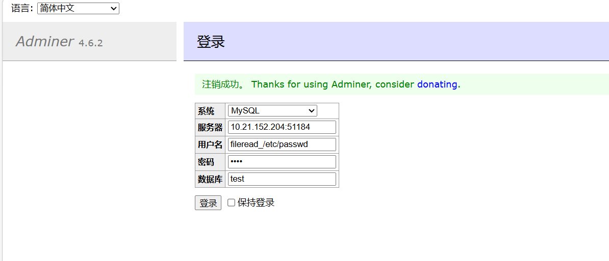
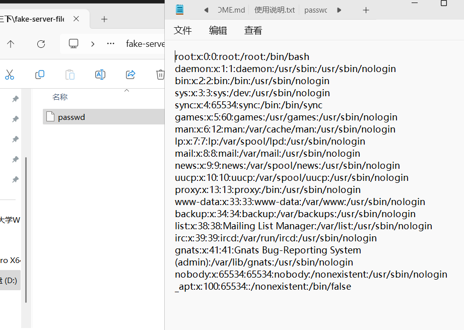

# 一、漏洞分析
漏洞的形成原因是*访问控制*的疏忽，它允许数据库服务器通过adminer请求数据（adminer所在的主机的数据）。如果数据库服务器是受攻击者完全控制的，那么攻击者就可以使用部署在受害者上的adminer远程连接受控的数据库，使用这个数据库请求受害者的数据保存到受控的数据库中。攻击在即可在受自己控制的数据库中查看被请求的数据。

**关键在于数据库URL可控。**

https://podalirius.net/en/articles/writing-an-exploit-for-adminer-4.6.2-arbitrary-file-read-vulnerability/

# 二、漏洞复现
## （一）下载恶意SQL数据库
https://github.com/4ra1n/mysql-fake-server/releases/tag/0.0.4
## （二）配置恶意数据库相关选项

## （三）使用adminer登录恶意数据库

## （四）在fake-server-files目录下查看读取文件

# 四、总结
1. 当数据库URL可控时，攻击者可以构造恶意数据库来进行攻击。
2. 积累了恶意数据库工具。

2026/3/20-0:28