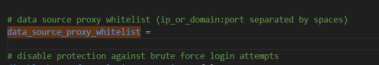
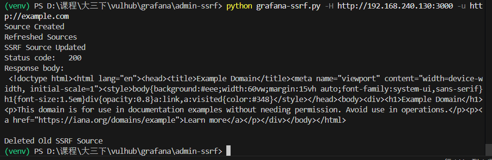

# 一、漏洞原理
```go
		apiRoute.Any("/datasources/proxy/:id/*", authorize(reqSignedIn, ac.EvalPermission(datasources.ActionQuery)), hs.ProxyDataSourceRequest)
		apiRoute.Any("/datasources/proxy/:id", authorize(reqSignedIn, ac.EvalPermission(datasources.ActionQuery)), hs.ProxyDataSourceRequest)
```
找到ProxyDataSourceRequest

```go 
func (p *DataSourceProxyService) ProxyDatasourceRequestWithID(c *models.ReqContext, dsID int64) {
	c.TimeRequest(metrics.MDataSourceProxyReqTimer)

	ds, err := p.DataSourceCache.GetDatasource(c.Req.Context(), dsID, c.SignedInUser, c.SkipCache)
	if err != nil {
		if errors.Is(err, models.ErrDataSourceAccessDenied) {
			c.JsonApiErr(http.StatusForbidden, "Access denied to datasource", err)
			return
		}
		if errors.Is(err, models.ErrDataSourceNotFound) {
			c.JsonApiErr(http.StatusNotFound, "Unable to find datasource", err)
			return
		}
		c.JsonApiErr(http.StatusInternalServerError, "Unable to load datasource meta data", err)
		return
	}

	err = p.PluginRequestValidator.Validate(ds.Url, c.Req)
	if err != nil {
		c.JsonApiErr(http.StatusForbidden, "Access denied", err)
		return
	}

	// find plugin
	plugin, exists := p.pluginStore.Plugin(c.Req.Context(), ds.Type)
	if !exists {
		c.JsonApiErr(http.StatusNotFound, "Unable to find datasource plugin", err)
		return
	}

	proxyPath := getProxyPath(c)
	proxy, err := pluginproxy.NewDataSourceProxy(ds, plugin.Routes, c, proxyPath, p.Cfg, p.HTTPClientProvider,
		p.OAuthTokenService, p.DataSourcesService, p.tracer, p.secretsService)
	if err != nil {
		if errors.Is(err, datasource.URLValidationError{}) {
			c.JsonApiErr(http.StatusBadRequest, fmt.Sprintf("Invalid data source URL: %q", ds.Url), err)
		} else {
			c.JsonApiErr(http.StatusInternalServerError, "Failed creating data source proxy", err)
		}
		return
	}
	proxy.HandleRequest()
}
```
其中p.PluginRequestValidator.Validate实现为空
```go 
err = p.PluginRequestValidator.Validate(ds.Url, c.Req)


func (*OSSPluginRequestValidator) Validate(string, *http.Request) error {
	return nil
}

```
找到NewDataSourceProxy 将targetURL=ds.Url
```go
func NewDataSourceProxy(ds *models.DataSource, pluginRoutes []*plugins.Route, ctx *models.ReqContext,
	proxyPath string, cfg *setting.Cfg, clientProvider httpclient.Provider,
	oAuthTokenService oauthtoken.OAuthTokenService, dsService datasources.DataSourceService,
	tracer tracing.Tracer, secretsService secrets.Service) (*DataSourceProxy, error) {
	targetURL, err := datasource.ValidateURL(ds.Type, ds.Url)
	if err != nil {
		return nil, err
	}

	return &DataSourceProxy{
		ds:                 ds,
		pluginRoutes:       pluginRoutes,
		ctx:                ctx,
		proxyPath:          proxyPath,
		targetUrl:          targetURL,
		cfg:                cfg,
		clientProvider:     clientProvider,
		oAuthTokenService:  oAuthTokenService,
		dataSourcesService: dsService,
		tracer:             tracer,
		secretsService:     secretsService,
	}, nil
}
```
其中targetURL, err := datasource.ValidateURL(ds.Type, ds.Url)并没有起到验证作用，只是在URL之前加http协议。

```go
func ValidateURL(typeName, urlStr string) (*url.URL, error) {
	// Check for empty URLs
	if _, exists := requiredURL[typeName]; exists && strings.TrimSpace(urlStr) == "" {
		return nil, URLValidationError{Err: errors.New("empty URL string"), URL: ""}
	}

	var u *url.URL
	var err error
	switch strings.ToLower(typeName) {
	case "mssql":
		u, err = mssql.ParseURL(urlStr)
	default:
		logger.Debug("Applying default URL parsing for this data source type", "type", typeName, "url", urlStr)

		// Make sure the URL starts with a protocol specifier, so parsing is unambiguous
		if !reURL.MatchString(urlStr) {
			logger.Debug(
				"Data source URL doesn't specify protocol, so prepending it with http:// in order to make it unambiguous",
				"type", typeName, "url", urlStr)
			urlStr = fmt.Sprintf("http://%s", urlStr)
		}
		u, err = url.Parse(urlStr)
	}
	if err != nil {
		return nil, URLValidationError{Err: err, URL: urlStr}
	}

	return u, nil
}
```
最终ProxyDataSourceRequest调用proxy.HandleRequest()

在proxy.HandleRequest()中

```go
func (proxy *DataSourceProxy) HandleRequest() {
	if err := proxy.validateRequest(); err != nil {
		proxy.ctx.JsonApiErr(403, err.Error(), nil)
		return
	}

```
其中validateRequest()先检查白名单，再检查方法。
```go
func (proxy *DataSourceProxy) validateRequest() error {
	if !checkWhiteList(proxy.ctx, proxy.targetUrl.Host) {
		return errors.New("target URL is not a valid target")
	}

	if proxy.ds.Type == models.DS_ES {
		if proxy.ctx.Req.Method == "DELETE" {
			return errors.New("deletes not allowed on proxied Elasticsearch datasource")
		}
		if proxy.ctx.Req.Method == "PUT" {
			return errors.New("puts not allowed on proxied Elasticsearch datasource")
		}
		if proxy.ctx.Req.Method == "POST" && proxy.proxyPath != "_msearch" {
			return errors.New("posts not allowed on proxied Elasticsearch datasource except on /_msearch")
		}
	}

	// found route if there are any
	for _, route := range proxy.pluginRoutes {
		// method match
		if route.Method != "" && route.Method != "*" && route.Method != proxy.ctx.Req.Method {
			continue
		}

		// route match
		if !strings.HasPrefix(proxy.proxyPath, route.Path) {
			continue
		}

		if route.ReqRole.IsValid() {
			if !proxy.ctx.HasUserRole(route.ReqRole) {
				return errors.New("plugin proxy route access denied")
			}
		}

		proxy.matchedRoute = route
		return nil
	}

	// Trailing validation below this point for routes that were not matched
	if proxy.ds.Type == models.DS_PROMETHEUS {
		if proxy.ctx.Req.Method == "DELETE" {
			return errors.New("non allow-listed DELETEs not allowed on proxied Prometheus datasource")
		}
		if proxy.ctx.Req.Method == "PUT" {
			return errors.New("non allow-listed PUTs not allowed on proxied Prometheus datasource")
		}
		if proxy.ctx.Req.Method == "POST" {
			return errors.New("non allow-listed POSTs not allowed on proxied Prometheus datasource")
		}
	}

	return nil
}
```
看其如何检测白名单，就是检测设置中的白名单中是否有相应表项，**注意：当白名单为空时不进行检查**,但合格的管理员都会修改这个默认配置，是否可以绕过？可以。

```go 
func checkWhiteList(c *models.ReqContext, host string) bool {
	if host != "" && len(setting.DataProxyWhiteList) > 0 {
		if _, exists := setting.DataProxyWhiteList[host]; !exists {
			c.JsonApiErr(403, "Data proxy hostname and ip are not included in whitelist", nil)
			return false
		}
	}

	return true
}
```
这个白名单从何而来？就是读配置文件中的data_source_proxy_whitelist字段值：
```go
	// read data source proxy whitelist
	DataProxyWhiteList = make(map[string]bool)
	securityStr := valueAsString(security, "data_source_proxy_whitelist", "")

	for _, hostAndIP := range util.SplitString(securityStr) {
		DataProxyWhiteList[hostAndIP] = true
	}
```
发现默认配置为空：



分析至此，好像没有SSRF漏洞？不，接着看proxy.HandleRequest()

```go
func (proxy *DataSourceProxy) HandleRequest() {
	if err := proxy.validateRequest(); err != nil {
		proxy.ctx.JsonApiErr(403, err.Error(), nil)
		return
	}

	proxyErrorLogger := logger.New(
		"userId", proxy.ctx.UserId,
		"orgId", proxy.ctx.OrgId,
		"uname", proxy.ctx.Login,
		"path", proxy.ctx.Req.URL.Path,
		"remote_addr", proxy.ctx.RemoteAddr(),
		"referer", proxy.ctx.Req.Referer(),
	)

	transport, err := proxy.dataSourcesService.GetHTTPTransport(proxy.ds, proxy.clientProvider)
	if err != nil {
		proxy.ctx.JsonApiErr(400, "Unable to load TLS certificate", err)
		return
	}

	modifyResponse := func(resp *http.Response) error {
		if resp.StatusCode == 401 {
			// The data source rejected the request as unauthorized, convert to 400 (bad request)
			body, err := ioutil.ReadAll(resp.Body)
			if err != nil {
				return fmt.Errorf("failed to read data source response body: %w", err)
			}
			_ = resp.Body.Close()

			proxyErrorLogger.Info("Authentication to data source failed", "body", string(body), "statusCode",
				resp.StatusCode)
			msg := "Authentication to data source failed"
			*resp = http.Response{
				StatusCode:    400,
				Status:        "Bad Request",
				Body:          ioutil.NopCloser(strings.NewReader(msg)),
				ContentLength: int64(len(msg)),
				Header:        http.Header{},
			}
		}
		return nil
	}

	reverseProxy := proxyutil.NewReverseProxy(
		proxyErrorLogger,
		proxy.director,
		proxyutil.WithTransport(transport),
		proxyutil.WithModifyResponse(modifyResponse),
	)

	proxy.logRequest()
	ctx, span := proxy.tracer.Start(proxy.ctx.Req.Context(), "datasource reverse proxy")
	defer span.End()

	proxy.ctx.Req = proxy.ctx.Req.WithContext(ctx)

	span.SetAttributes("datasource_name", proxy.ds.Name, attribute.Key("datasource_name").String(proxy.ds.Name))
	span.SetAttributes("datasource_type", proxy.ds.Type, attribute.Key("datasource_type").String(proxy.ds.Type))
	span.SetAttributes("user", proxy.ctx.SignedInUser.Login, attribute.Key("user").String(proxy.ctx.SignedInUser.Login))
	span.SetAttributes("org_id", proxy.ctx.SignedInUser.OrgId, attribute.Key("org_id").Int64(proxy.ctx.SignedInUser.OrgId))

	proxy.addTraceFromHeaderValue(span, "X-Panel-Id", "panel_id")
	proxy.addTraceFromHeaderValue(span, "X-Dashboard-Id", "dashboard_id")

	proxy.tracer.Inject(ctx, proxy.ctx.Req.Header, span)

	reverseProxy.ServeHTTP(proxy.ctx.Resp, proxy.ctx.Req)
}
```
反向代理对象reverseProxy在NEW时调用了'proxyutil.NewReverseProxy()'
```go 
// NewReverseProxy creates a new httputil.ReverseProxy with sane default configuration.
func NewReverseProxy(logger glog.Logger, director func(*http.Request), opts ...ReverseProxyOption) *httputil.ReverseProxy {
	if logger == nil {
		panic("logger cannot be nil")
	}

	if director == nil {
		panic("director cannot be nil")
	}

	p := &httputil.ReverseProxy{
		FlushInterval: time.Millisecond * 200,
		ErrorHandler:  errorHandler(logger),
		ErrorLog:      log.New(&logWrapper{logger: logger}, "", 0),
		Director:      director,
	}

	for _, opt := range opts {
		opt(p)
	}

	origDirector := p.Director
	p.Director = wrapDirector(origDirector)

	if p.ModifyResponse == nil {
		// nolint:bodyclose
		p.ModifyResponse = modifyResponse(logger)
	} else {
		modResponse := p.ModifyResponse
		p.ModifyResponse = func(resp *http.Response) error {
			if err := modResponse(resp); err != nil {
				return err
			}

			// nolint:bodyclose
			return modifyResponse(logger)(resp)
		}
	}

	return p
}

// wrapDirector wraps a director and adds additional functionality.
func wrapDirector(d func(*http.Request)) func(req *http.Request) {
	return func(req *http.Request) {
		d(req)
		PrepareProxyRequest(req)

		// Clear Origin and Referer to avoid CORS issues
		req.Header.Del("Origin")
		req.Header.Del("Referer")
	}
}
```

可见将proxy.director这个函数通过wrapDirector进行包装了之后放在了reverseProxy的Director字段，当调用reverseProxy.ServeHTTP(proxy.ctx.Resp, proxy.ctx.Req)时，会回调这个被包装过的director函数。
```go
func (proxy *DataSourceProxy) director(req *http.Request) {
	req.URL.Scheme = proxy.targetUrl.Scheme
	req.URL.Host = proxy.targetUrl.Host
	req.Host = proxy.targetUrl.Host

	reqQueryVals := req.URL.Query()

	switch proxy.ds.Type {
	case models.DS_INFLUXDB_08:
		req.URL.RawPath = util.JoinURLFragments(proxy.targetUrl.Path, "db/"+proxy.ds.Database+"/"+proxy.proxyPath)
		reqQueryVals.Add("u", proxy.ds.User)
		reqQueryVals.Add("p", proxy.dataSourcesService.DecryptedPassword(proxy.ds))
		req.URL.RawQuery = reqQueryVals.Encode()
	case models.DS_INFLUXDB:
		req.URL.RawPath = util.JoinURLFragments(proxy.targetUrl.Path, proxy.proxyPath)
		req.URL.RawQuery = reqQueryVals.Encode()
		if !proxy.ds.BasicAuth {
			req.Header.Set(
				"Authorization",
				util.GetBasicAuthHeader(proxy.ds.User, proxy.dataSourcesService.DecryptedPassword(proxy.ds)),
			)
		}
	default:
		req.URL.RawPath = util.JoinURLFragments(proxy.targetUrl.Path, proxy.proxyPath)
	}

	unescapedPath, err := url.PathUnescape(req.URL.RawPath)
	if err != nil {
		logger.Error("Failed to unescape raw path", "rawPath", req.URL.RawPath, "error", err)
		return
	}

	req.URL.Path = unescapedPath

	if proxy.ds.BasicAuth {
		req.Header.Set("Authorization", util.GetBasicAuthHeader(proxy.ds.BasicAuthUser,
			proxy.dataSourcesService.DecryptedBasicAuthPassword(proxy.ds)))
	}

	dsAuth := req.Header.Get("X-DS-Authorization")
	if len(dsAuth) > 0 {
		req.Header.Del("X-DS-Authorization")
		req.Header.Set("Authorization", dsAuth)
	}

	applyUserHeader(proxy.cfg.SendUserHeader, req, proxy.ctx.SignedInUser)

	keepCookieNames := []string{}
	if proxy.ds.JsonData != nil {
		if keepCookies := proxy.ds.JsonData.Get("keepCookies"); keepCookies != nil {
			keepCookieNames = keepCookies.MustStringArray()
		}
	}

	proxyutil.ClearCookieHeader(req, keepCookieNames)
	req.Header.Set("User-Agent", fmt.Sprintf("Grafana/%s", setting.BuildVersion))

	jsonData := make(map[string]interface{})
	if proxy.ds.JsonData != nil {
		jsonData, err = proxy.ds.JsonData.Map()
		if err != nil {
			logger.Error("Failed to get json data as map", "jsonData", proxy.ds.JsonData, "error", err)
			return
		}
	}

	secureJsonData, err := proxy.secretsService.DecryptJsonData(req.Context(), proxy.ds.SecureJsonData)
	if err != nil {
		logger.Error("Error interpolating proxy url", "error", err)
		return
	}

	if proxy.matchedRoute != nil {
		ApplyRoute(proxy.ctx.Req.Context(), req, proxy.proxyPath, proxy.matchedRoute, DSInfo{
			ID:                      proxy.ds.Id,
			Updated:                 proxy.ds.Updated,
			JSONData:                jsonData,
			DecryptedSecureJSONData: secureJsonData,
		}, proxy.cfg)
	}

	if proxy.oAuthTokenService.IsOAuthPassThruEnabled(proxy.ds) {
		if token := proxy.oAuthTokenService.GetCurrentOAuthToken(proxy.ctx.Req.Context(), proxy.ctx.SignedInUser); token != nil {
			req.Header.Set("Authorization", fmt.Sprintf("%s %s", token.Type(), token.AccessToken))

			idToken, ok := token.Extra("id_token").(string)
			if ok && idToken != "" {
				req.Header.Set("X-ID-Token", idToken)
			}
		}
	}
}
```
这里，如果匹配了插件路由则会调用ApplyRoute
```go
	if proxy.matchedRoute != nil {
		ApplyRoute(proxy.ctx.Req.Context(), req, proxy.proxyPath, proxy.matchedRoute, DSInfo{
			ID:                      proxy.ds.Id,
			Updated:                 proxy.ds.Updated,
			JSONData:                jsonData,
			DecryptedSecureJSONData: secureJsonData,
		}, proxy.cfg)
	}
```
```go
// ApplyRoute should use the plugin route data to set auth headers and custom headers.
func ApplyRoute(ctx context.Context, req *http.Request, proxyPath string, route *plugins.Route,
	ds DSInfo, cfg *setting.Cfg) {
	proxyPath = strings.TrimPrefix(proxyPath, route.Path)

	data := templateData{
		JsonData:       ds.JSONData,
		SecureJsonData: ds.DecryptedSecureJSONData,
	}

	if len(route.URL) > 0 {
		interpolatedURL, err := interpolateString(route.URL, data)
		if err != nil {
			logger.Error("Error interpolating proxy url", "error", err)
			return
		}

		routeURL, err := url.Parse(interpolatedURL)
		if err != nil {
			logger.Error("Error parsing plugin route url", "error", err)
			return
		}

		req.URL.Scheme = routeURL.Scheme
		req.URL.Host = routeURL.Host
		req.Host = routeURL.Host
		req.URL.Path = util.JoinURLFragments(routeURL.Path, proxyPath)
	}

	if err := addQueryString(req, route, data); err != nil {
		logger.Error("Failed to render plugin URL query string", "error", err)
	}

	if err := addHeaders(&req.Header, route, data); err != nil {
		logger.Error("Failed to render plugin headers", "error", err)
	}

	if err := setBodyContent(req, route, data); err != nil {
		logger.Error("Failed to set plugin route body content", "error", err)
	}

	if tokenProvider, err := getTokenProvider(ctx, cfg, ds, route, data); err != nil {
		logger.Error("Failed to resolve auth token provider", "error", err)
	} else if tokenProvider != nil {
		if token, err := tokenProvider.GetAccessToken(); err != nil {
			logger.Error("Failed to get access token", "error", err)
		} else {
			req.Header.Set("Authorization", fmt.Sprintf("Bearer %s", token))
		}
	}

	if cfg.DataProxyLogging {
		logger.Debug("Requesting", "url", req.URL.String())
	}
}
```
其中,如果routeURL存在的话，会覆盖req.URL的一系列字段，**从而使最终的访问的URL变为插件的routeURL。**
```go 
	if len(route.URL) > 0 {
		interpolatedURL, err := interpolateString(route.URL, data)
		if err != nil {
			logger.Error("Error interpolating proxy url", "error", err)
			return
		}

		routeURL, err := url.Parse(interpolatedURL)
		if err != nil {
			logger.Error("Error parsing plugin route url", "error", err)
			return
		}

		req.URL.Scheme = routeURL.Scheme
		req.URL.Host = routeURL.Host
		req.Host = routeURL.Host
		req.URL.Path = util.JoinURLFragments(routeURL.Path, proxyPath)
	}
```

所以，可以先注册一个恶意插件，这个插件的routeURL为恶意URL,在使用代理服务时，填入一个白名单中存在的URL从而绕过checkWhiteList(),然后在反向代理的请求发出之前，req.URL会替换为恶意的routeURL，从而代理访问了这个恶意URL。

**但是一般来说注册一个恶意插件的难度较大。**

通常不能仅靠常规 API 直接“注册一个自定义恶意插件并指定 route.URL”。

关键点：

InstallPlugin API 只接收 pluginId 和 version，不是上传任意 plugin.json。见 plugins.go:360-389
安装源在代码里固定走 Grafana 官方插件 API（https://grafana.com/api/plugins）。见 manager.go:17-19 和 store.go:108-117
插件路由（含 route.URL）来自插件包内的 plugin.json，由服务端扫描插件目录加载。见 loader.go:75-89
所以“注册恶意插件并把 route.URL 设成恶意 URL”这件事，前提一般是：

攻击者有 Grafana Admin 权限（安装插件接口受限）；并且
能让服务端安装到恶意插件包（或已有供应链问题）；或
直接有服务器文件写权限，能往插件目录落地插件文件。
如果只有普通用户权限、只能调用数据源相关 API，通常做不到这一步。

# 二、漏洞复现
vulhub中提供的PoC中，使用的SSRF_URL来自恶意的数据源，也就是说，当服务器中正确配置了白名单之后（若白名单为空，则不进行白名单检查），这个攻击就失效了，结论是：这里不存在SSRF漏洞，或者说，没有利用价值。

此漏洞提交者可能没有正确配置白名单，误认为这里有SSRF漏洞。



返回了example.com的内容。

2026/3/27-21:59